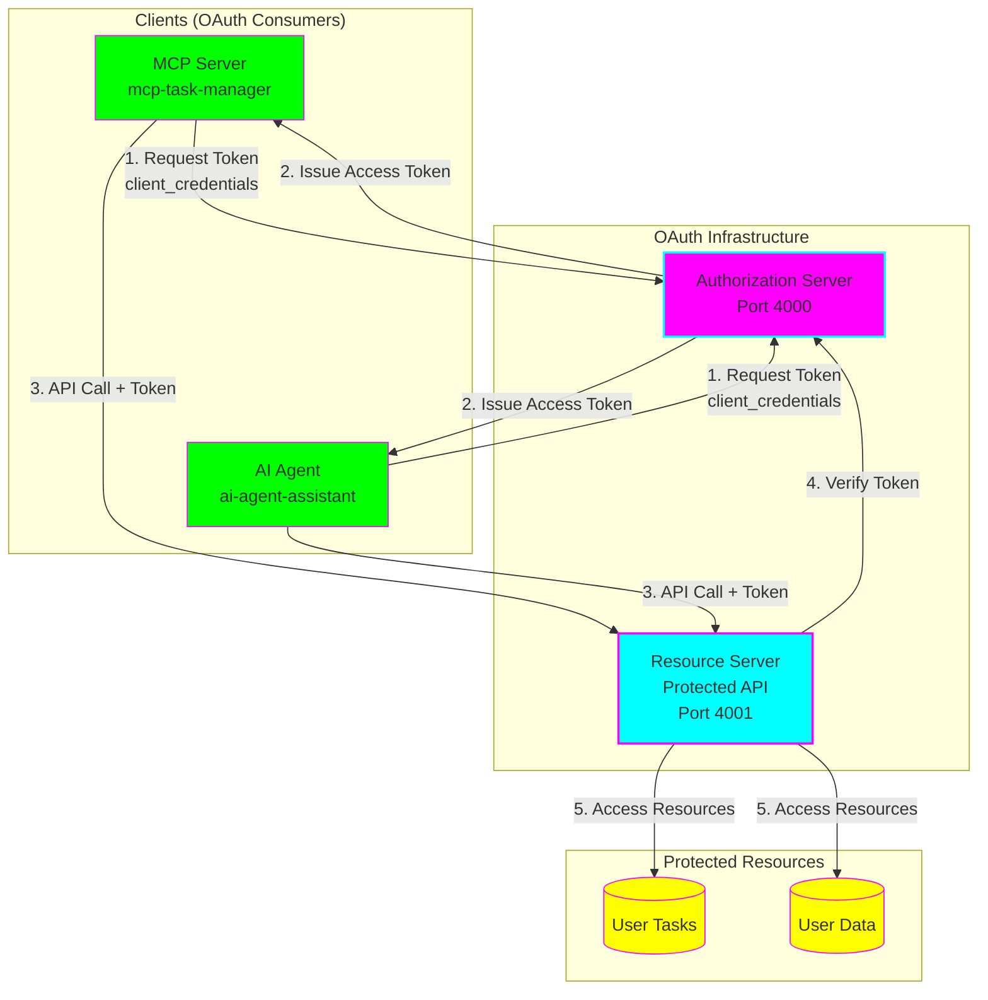
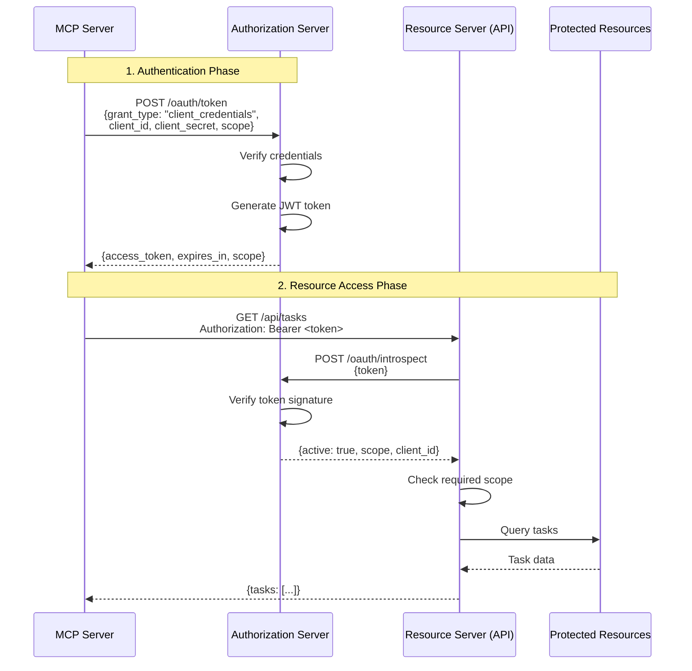

# 🔐 OAuth 2.0 for MCP and AI Agents

**Status:** 🧪 Experimental | **Tech Stack:** Node.js 20.11+, TypeScript, Express

A complete demonstration of OAuth 2.0 authentication for MCP (Model Context Protocol) servers and AI agents, showing how they can securely access user resources on behalf of the user.

## 🎯 What You'll Learn

- How OAuth 2.0 works (in practical terms!)
- The `client_credentials` grant type (used by MCP/agents)
- The `authorization_code` grant type (used by web apps)
- How to implement an OAuth authorization server
- How to protect APIs with OAuth tokens
- How MCP servers and agents use tokens to act on behalf of users

## 🏗️ Architecture



## 🔄 OAuth 2.0 Flow (Client Credentials)

This is the flow used by MCP servers and AI agents:



## 📁 Project Structure

```
oauth2-mcp-exploration/
├── shared/                    # Shared types and utilities
│   ├── types.ts              # OAuth types, Task, User interfaces
│   └── jwt-utils.ts          # JWT token utilities
│
├── auth-server/              # OAuth 2.0 Authorization Server
│   └── src/
│       ├── index.ts          # Token endpoint, authorization
│       └── storage.ts        # Client & code storage
│
├── resource-server/          # Protected API (requires OAuth)
│   └── src/
│       ├── index.ts          # Task management endpoints
│       ├── middleware.ts     # OAuth verification middleware
│       └── storage.ts        # Task storage
│
├── mcp-client/               # MCP Server with OAuth
│   └── src/
│       ├── index.ts          # MCP server implementation
│       └── oauth-client.ts   # OAuth token management
│
└── agent-client/             # AI Agent with OAuth
    └── src/
        ├── agent.ts          # Agent implementation
        ├── oauth-client.ts   # OAuth token management
        └── demo.ts           # Demo script
```

## 🚀 Quick Start

### Prerequisites

```bash
# Check Node.js version
node --version  # Should be >= 20.11.0

# If using nvm:
nvm use
```

### Installation

```bash
# From project root
cd projects/oauth2-mcp-exploration

# Install all dependencies
npm install
```

### Running the Demo

**Terminal 1: Start Authorization Server**
```bash
npm run dev:auth
```

**Terminal 2: Start Resource Server**
```bash
npm run dev:resource
```

**Terminal 3: Run AI Agent Demo**
```bash
npm run dev:agent
```

You should see the agent:
1. ✓ Authenticate with OAuth
2. ✓ Get user information
3. ✓ List tasks
4. ✓ Create a new task
5. ✓ Update task status
6. ✓ Get task summary

## 🔑 OAuth Concepts Explained

### Grant Types

This project demonstrates two grant types:

#### 1. Client Credentials (for MCP/Agents)

**Use case:** Service-to-service authentication

**Flow:**
```
Client → Auth Server: "Here are my credentials"
Auth Server → Client: "Here's your token"
Client → API: "Here's my token"
API → Client: "Here's the data"
```

**When to use:**
- MCP servers accessing APIs
- AI agents performing automated tasks
- Backend services communicating
- No user interaction needed

#### 2. Authorization Code (for Web Apps)

**Use case:** User-delegated access

**Flow:**
```
User → App: "I want to use this"
App → Auth Server: "User wants access"
Auth Server → User: "Do you approve?"
User → Auth Server: "Yes, I approve"
Auth Server → App: "Here's a code"
App → Auth Server: "Exchange code for token"
Auth Server → App: "Here's the token"
```

**When to use:**
- Web applications
- Mobile apps
- User needs to grant permission
- Access to user-specific resources

### Scopes

Scopes define what a token can access:

| Scope | Description | Example Use |
|-------|-------------|-------------|
| `tasks:read` | Read tasks | List all tasks, get task details |
| `tasks:write` | Create/update tasks | Create task, update status |
| `user:read` | Read user info | Get user profile |
| `user:write` | Update user info | Update email, preferences |

### Tokens (JWT)

Access tokens are JWTs (JSON Web Tokens) containing:

```json
{
  "sub": "ai-agent-assistant",    // Subject (who this token is for)
  "client_id": "ai-agent-assistant",
  "scope": ["tasks:read", "tasks:write", "user:read"],
  "iat": 1699564800,               // Issued at (timestamp)
  "exp": 1699568400,               // Expires (timestamp)
  "iss": "oauth2-auth-server"      // Issuer
}
```

## 🎮 Testing the Components

### Test Authorization Server

```bash
# Get token for MCP client
curl -X POST http://localhost:4000/oauth/token \
  -H "Content-Type: application/json" \
  -d '{
    "grant_type": "client_credentials",
    "client_id": "mcp-task-manager",
    "client_secret": "mcp-secret-12345",
    "scope": "tasks:read tasks:write"
  }'

# Response:
# {
#   "access_token": "eyJhbGciOiJIUzI1NiIsInR5cCI6IkpXVCJ9...",
#   "token_type": "Bearer",
#   "expires_in": 3600,
#   "scope": "tasks:read tasks:write"
# }
```

### Test Resource Server

```bash
# First, get a token (see above)
export TOKEN="your-token-here"

# List tasks
curl http://localhost:4001/api/tasks \
  -H "Authorization: Bearer $TOKEN"

# Create task
curl -X POST http://localhost:4001/api/tasks \
  -H "Authorization: Bearer $TOKEN" \
  -H "Content-Type: application/json" \
  -d '{
    "title": "Test task from curl",
    "description": "Testing OAuth API"
  }'

# Update task
curl -X PUT http://localhost:4001/api/tasks/task-1 \
  -H "Authorization: Bearer $TOKEN" \
  -H "Content-Type: application/json" \
  -d '{
    "status": "completed"
  }'
```

### Test Without Token (Should Fail)

```bash
# This should return 401 Unauthorized
curl http://localhost:4001/api/tasks
```

## 🧩 How Each Component Works

### Authorization Server (`auth-server/`)

**Responsibilities:**
- Register OAuth clients
- Issue access tokens
- Verify client credentials
- Validate scopes

**Key Endpoints:**
- `POST /oauth/token` - Get access token
- `POST /oauth/authorize` - Get authorization code
- `POST /oauth/introspect` - Verify token
- `GET /debug/clients` - List registered clients

### Resource Server (`resource-server/`)

**Responsibilities:**
- Protect API endpoints
- Verify OAuth tokens
- Enforce scope requirements
- Serve protected resources

**Key Middleware:**
- `requireAuth` - Verify token is valid
- `requireScope` - Check specific scope
- `requireAnyScope` - Check for any of multiple scopes

### MCP Server (`mcp-client/`)

**Responsibilities:**
- Provide tools for AI assistants
- Manage OAuth tokens
- Make authenticated API calls
- Handle token refresh

**Available Tools:**
- `list_tasks` - List all tasks
- `create_task` - Create new task
- `update_task` - Update task status
- `get_task` - Get task details

### AI Agent (`agent-client/`)

**Responsibilities:**
- Perform automated actions
- Manage OAuth tokens
- Execute complex workflows
- Handle errors gracefully

**Actions:**
- List and create tasks
- Update task statuses
- Get user information
- Summarize task status
- Auto-complete pending tasks

## 🔒 Security Considerations

### ✅ Implemented

- JWT signature verification
- Scope-based access control
- Token expiration
- Client authentication
- One-time authorization codes

### ⚠️ For Production (Not in Demo)

- Use environment variables for secrets
- Implement refresh tokens
- Add rate limiting
- Use HTTPS everywhere
- Rotate JWT secrets regularly
- Implement proper user authentication
- Add PKCE for public clients
- Store tokens securely (encrypted)
- Implement token revocation
- Add audit logging

## 📚 Learning Path

### Beginner Level
1. Read `docs/learning-guide.md`
2. Run the demo (`npm run dev:agent`)
3. Examine the console output
4. Try the curl commands

### Intermediate Level
1. Modify scopes in `auth-server/src/storage.ts`
2. Add a new endpoint to `resource-server`
3. Add a new tool to `mcp-client`
4. Implement token refresh

### Advanced Level
1. Add user authentication
2. Implement authorization_code flow UI
3. Add PKCE support
4. Implement token revocation
5. Add OpenID Connect layer

## 🎓 Additional Resources

- [OAuth 2.0 RFC 6749](https://datatracker.ietf.org/doc/html/rfc6749)
- [JWT RFC 7519](https://datatracker.ietf.org/doc/html/rfc7519)
- [OAuth 2.0 Simplified](https://www.oauth.com/)
- [MCP Documentation](https://modelcontextprotocol.io/)

## 🐛 Troubleshooting

### "Invalid token" errors
- Check that auth server is running
- Verify token hasn't expired
- Ensure correct client credentials

### "Insufficient scope" errors
- Check requested scopes match client registration
- Verify token includes required scope
- Check middleware scope requirements

### Connection errors
- Ensure all servers are running
- Check port numbers (4000, 4001)
- Verify URLs in environment variables

## 📦 Graduation Criteria

- [ ] Add refresh token support
- [ ] Implement proper user authentication
- [ ] Add comprehensive error handling
- [ ] Create test suite (unit + integration)
- [ ] Add API documentation (OpenAPI/Swagger)
- [ ] Implement PKCE for public clients
- [ ] Add token revocation
- [ ] Create production deployment guide

## 🤝 Contributing

This is a learning project! Feel free to:
- Add new features
- Improve documentation
- Fix bugs
- Add tests
- Share your learnings

---

**Built with** 💜 **for learning OAuth 2.0 with MCP and AI Agents**
