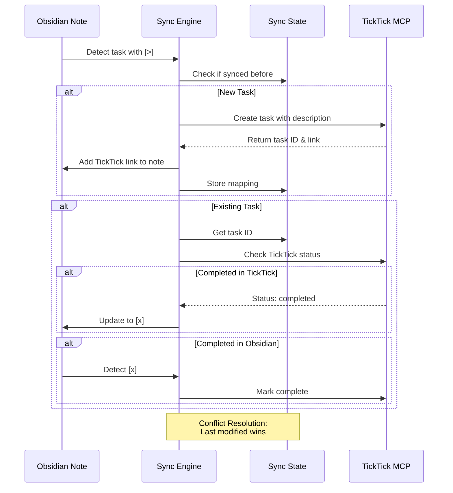

# 🔄 Obsidian-TickTick Sync

**Status:** 🧪 Experimental
**Tech Stack:** Python 3.11+, TickTick MCP Server, Obsidian API
**Purpose:** Bidirectional synchronization between Obsidian tasks and TickTick

## 🎯 ADHD Benefits

- **🧠 Single Source of Truth:** No more wondering which task list is current
- **⚡ Reduced Context Switching:** Update in either app, syncs automatically
- **✅ Completion Tracking:** Check off tasks anywhere, status syncs everywhere
- **🔗 Cross-Linking:** Direct links from TickTick back to Obsidian notes
- **📊 Hierarchy Preservation:** Parent-child task relationships maintained

## 📋 Overview

This tool provides bidirectional synchronization between Obsidian markdown files and TickTick tasks, allowing you to:

1. Mark tasks in Obsidian with `[>]` to sync to TickTick
2. Automatically create TickTick tasks with full descriptions
3. Add TickTick links back to Obsidian for quick access
4. Sync completion status in both directions
5. Maintain parent-child task hierarchies

## 🏗️ Architecture

```mermaid
graph TB
    A[Obsidian Vault] --> B[Sync Engine]
    C[TickTick MCP Server] --> B
    B --> D{Change Detection}

    D -->|New Task [>]| E[Create in TickTick]
    D -->|Completed in Obsidian| F[Mark Done in TickTick]
    D -->|Completed in TickTick| G[Update Obsidian [x]]
    D -->|Modified in Either| H[Sync Changes]

    E --> I[Add TickTick Link to Obsidian]

    B --> J[(Sync State DB)]
    J --> K[Conflict Resolution]

    style A fill:#9370db,stroke:#00ffff,stroke-width:2px
    style C fill:#ff6b6b,stroke:#00ffff,stroke-width:2px
    style B fill:#00ff00,stroke:#00ffff,stroke-width:2px
    style J fill:#ffd700,stroke:#00ffff,stroke-width:2px
```

## 🔄 Sync Workflow



## 📁 Project Structure

```
obsidian-ticktick-sync/
├── README.md
├── requirements.txt
├── .env.example
├── .python-version
├── config/
│   ├── sync_config.yaml          # Sync rules & preferences
│   └── mcp_config.json            # TickTick MCP server config
├── src/
│   ├── __init__.py
│   ├── main.py                    # Main sync orchestrator
│   ├── obsidian_parser.py         # Parse Obsidian markdown
│   ├── ticktick_client.py         # TickTick MCP client
│   ├── sync_engine.py             # Bidirectional sync logic
│   ├── conflict_resolver.py       # Handle sync conflicts
│   └── state_manager.py           # Track sync state (SQLite)
├── examples/
│   ├── before_sync.md             # Example Obsidian note before sync
│   ├── after_sync.md              # Example after sync with links
│   └── hierarchy_example.md       # Parent-child task example
├── tests/
│   ├── test_parser.py
│   ├── test_sync.py
│   └── fixtures/
└── sync_state.db                  # SQLite database for sync state
```

## 🚀 Getting Started

### Prerequisites

1. **Obsidian** with a vault set up
2. **TickTick MCP Server** running locally
3. **Python 3.11+** installed

### Installation

```bash
# Navigate to project
cd /home/user/fantastic-engine/projects/obsidian-ticktick-sync

# Create virtual environment
uv venv
source .venv/bin/activate  # or `.venv\Scripts\activate` on Windows

# Install dependencies
pip install -r requirements.txt

# Copy environment template
cp .env.example .env

# Edit .env with your settings
nano .env
```

### Configuration

Edit `.env`:

```bash
# Obsidian vault path
OBSIDIAN_VAULT_PATH=/path/to/your/obsidian/vault

# TickTick MCP Server
TICKTICK_MCP_URL=http://localhost:3000

# Sync settings
SYNC_INTERVAL_SECONDS=300  # Check every 5 minutes
AUTO_SYNC=true

# Conflict resolution
CONFLICT_STRATEGY=last_modified  # Options: last_modified, obsidian_wins, ticktick_wins
```

Edit `config/sync_config.yaml`:

```yaml
sync_rules:
  # Which files to include
  include_paths:
    - "Daily Notes/**/*.md"
    - "Projects/**/*.md"
    - "Tasks.md"

  # Which files to exclude
  exclude_paths:
    - "Archive/**"
    - "Templates/**"

  # Task markers
  markers:
    sync_to_ticktick: "[>]"      # Sync this task
    completed: "[x]"              # Completed task
    cancelled: "[-]"              # Cancelled (won't sync)

  # TickTick settings
  ticktick:
    default_list: "Inbox"
    default_priority: 0           # 0=None, 1=Low, 3=Medium, 5=High
    sync_tags: true
    sync_due_dates: true

  # Hierarchy
  preserve_hierarchy: true
  max_depth: 3                    # Max nesting level
```

## 🎮 Usage

### Manual Sync

```bash
# One-time sync
python src/main.py --sync-once

# Dry run (see what would change)
python src/main.py --dry-run

# Sync specific file
python src/main.py --file "Daily Notes/2025-11-16.md"
```

### Automatic Sync

```bash
# Start sync daemon
python src/main.py --daemon

# Start with logging
python src/main.py --daemon --log-level DEBUG
```

### In Obsidian

1. **Mark tasks to sync:**
   ```markdown
   - [>] Review pull requests #work
   - [>] Call dentist for appointment @phone
   - [ ] Regular task (won't sync)
   ```

2. **After sync:**
   ```markdown
   - [>] Review pull requests #work
     [TickTick](https://ticktick.com/task/12345)
   - [>] Call dentist for appointment @phone
     [TickTick](https://ticktick.com/task/67890)
   - [ ] Regular task (won't sync)
   ```

3. **With hierarchy:**
   ```markdown
   - [>] Plan project architecture
     - [>] Design database schema
     - [>] Create API endpoints
     - [>] Write documentation
   ```

## 📊 Example Workflows

### Workflow 1: Daily Planning


### Workflow 2: Project Planning

```mermaid
flowchart TD
    A[Brainstorm in<br/>Obsidian] --> B[Mark tasks [>]]
    B --> C[Sync creates<br/>TickTick tasks]
    C --> D[Work from<br/>TickTick app]
    D --> E[Complete tasks]
    E --> F[Sync updates<br/>Obsidian]
    F --> G[Weekly review<br/>in Obsidian]

    style A fill:#9370db,stroke:#00ffff,stroke-width:2px
    style D fill:#ff6b6b,stroke:#00ffff,stroke-width:2px
    style G fill:#ffd700,stroke:#00ffff,stroke-width:2px
```

## 🔧 Conflict Resolution

When the same task is modified in both places:

| Strategy | Behavior | Use When |
|----------|----------|----------|
| `last_modified` | Most recent change wins | Balanced approach (default) |
| `obsidian_wins` | Obsidian always wins | Obsidian is your primary tool |
| `ticktick_wins` | TickTick always wins | Mobile-first workflow |

**Manual Resolution:**

```bash
# View conflicts
python src/main.py --show-conflicts

# Resolve specific conflict
python src/main.py --resolve-conflict <task_id> --prefer obsidian
```

## 🗄️ Sync State Database

The sync state is tracked in `sync_state.db` (SQLite):

**Schema:**

```sql
CREATE TABLE sync_state (
    id INTEGER PRIMARY KEY,
    obsidian_path TEXT,
    obsidian_line_number INTEGER,
    ticktick_task_id TEXT UNIQUE,
    task_content TEXT,
    last_synced_at TIMESTAMP,
    last_modified_source TEXT,  -- 'obsidian' or 'ticktick'
    status TEXT                   -- 'active', 'completed', 'cancelled'
);

CREATE TABLE sync_log (
    id INTEGER PRIMARY KEY,
    timestamp TIMESTAMP,
    action TEXT,
    source TEXT,
    details JSON
);
```

## 🧪 Testing

```bash
# Run all tests
pytest

# Run with coverage
pytest --cov=src tests/

# Test specific component
pytest tests/test_parser.py -v
```

## 📈 Monitoring

View sync statistics:

```bash
# Show sync stats
python src/main.py --stats

# Output example:
# Total synced tasks: 127
# Active: 43
# Completed: 82
# Cancelled: 2
# Last sync: 2025-11-16 14:23:45
# Conflicts resolved: 3
```

## 🚨 Troubleshooting

### TickTick MCP Server Not Responding

```bash
# Check if server is running
curl http://localhost:3000/health

# Restart MCP server
# (Follow TickTick MCP documentation)
```

### Duplicate Tasks Created

```bash
# Reset sync state for specific file
python src/main.py --reset-file "path/to/file.md"

# Full reset (caution!)
python src/main.py --reset-all --confirm
```

### Tasks Not Syncing

1. Check task marker: `[>]` (not `[ ]` or `[x]`)
2. Verify file is in `include_paths`
3. Check logs: `tail -f sync.log`
4. Run with verbose output: `python src/main.py --sync-once -vvv`

## 🎯 Graduation Criteria

- [ ] Successfully syncs 100+ tasks without errors
- [ ] Handles all conflict scenarios correctly
- [ ] Zero data loss over 30-day period
- [ ] Performance: Sync 1000 tasks in < 10 seconds
- [ ] Complete test coverage (>90%)
- [ ] Documentation with video tutorial
- [ ] Configurable webhook support
- [ ] Mobile app integration (optional)

## 🔮 Future Enhancements

- [ ] Real-time sync using file watchers
- [ ] Support for task dependencies
- [ ] Recurring task support
- [ ] Attachment sync (images, files)
- [ ] Multi-vault support
- [ ] Web dashboard for sync status
- [ ] Integration with Obsidian Dataview
- [ ] Export sync report to CSV

## 📚 Dependencies

- `requests` - HTTP client for TickTick MCP
- `watchdog` - File system monitoring
- `pyyaml` - Configuration parsing
- `sqlalchemy` - Database ORM
- `python-dotenv` - Environment management
- `click` - CLI interface
- `rich` - Beautiful terminal output

## 📝 License

MIT License - See LICENSE file

## 🤝 Contributing

This is an experimental project. Contributions welcome!

1. Fork the repository
2. Create feature branch
3. Add tests for new features
4. Submit pull request

## 📞 Support

For issues or questions:
- Create an issue in this repository
- Check TickTick MCP server documentation
- Review Obsidian plugin documentation

---

**Remember:** Start simple with a few tasks, then scale up! 🚀
