# 🧠 Personal Knowledge RAG

**Status:** 🧪 Experimental
**Tech Stack:** Python 3.11, OpenAI API, Chroma DB, Ollama (optional)
**Purpose:** Natural language search over your Obsidian vault using RAG (Retrieval-Augmented Generation)

---

## Problem

You have hundreds of notes in your Obsidian vault. Finding relevant information requires:
- Manual searching through files
- Remembering exact keywords
- Opening multiple notes to find context

**You need:** Natural language search that understands context and semantics.

---

## Solution

A RAG system that:
1. **Chunks** your markdown notes into semantic sections
2. **Embeds** them using OpenAI or local Ollama models
3. **Stores** embeddings in Chroma vector database
4. **Searches** with natural language queries
5. **Retrieves** relevant context from your vault

```mermaid
graph LR
    A[📝 Obsidian Vault] --> B[Chunk Parser]
    B --> C{Embedding Model}
    C -->|OpenAI| D[text-embedding-3-small]
    C -->|Local| E[Ollama/nomic-embed]
    D --> F[🗄️ Chroma DB]
    E --> F
    G[💬 User Query] --> H[Embed Query]
    H --> F
    F --> I[Vector Search]
    I --> J[Top K Results]
    J --> K[📄 Context + Sources]

    style A fill:#ff00ff,stroke:#00ffff,stroke-width:2px
    style F fill:#00ffff,stroke:#ff00ff,stroke-width:2px
    style K fill:#00ff00,stroke:#ff00ff,stroke-width:2px
```



---

## Features

### Core Features
- ✅ **Semantic Search** - Find notes by meaning, not just keywords
- ✅ **Smart Chunking** - Respects markdown structure (headers, code blocks)
- ✅ **Metadata Preservation** - Tracks source file, section, tags
- ✅ **Cost Tracking** - Monitor OpenAI API usage and costs
- ✅ **Dual Mode** - OpenAI (cloud) or Ollama (local/free)

### Advanced Features
- 🔄 **Incremental Updates** - Only re-embed changed files
- 🏷️ **Tag Filtering** - Filter results by Obsidian tags
- 📊 **Relevance Scoring** - See why results matched
- 🔍 **Hybrid Search** - Combine vector + keyword search

---

## Architecture


### Components

| Component | Purpose | Technology |
|-----------|---------|------------|
| **Chunker** | Split markdown into semantic chunks | Custom parser |
| **Embedder** | Generate vector embeddings | OpenAI / Ollama |
| **Vector Store** | Store and search embeddings | ChromaDB |
| **Query Engine** | Process searches and rank results | Custom logic |
| **Cost Tracker** | Monitor API usage | SQLite |

---

## Installation

### Prerequisites
- Python 3.11
- Obsidian vault location
- OpenAI API key (for cloud mode) OR Ollama (for local mode)

### Setup

```bash
# Clone or navigate to project
cd /home/user/fantastic-engine/projects/personal-knowledge-rag

# Create virtual environment
python -m venv .venv
source .venv/bin/activate  # On Windows: .venv\Scripts\activate

# Install dependencies
pip install -r requirements.txt

# Copy environment template
cp .env.example .env

# Edit .env with your settings
nano .env
```

### Configuration

Edit `.env`:

```bash
# Required: Path to your Obsidian vault
OBSIDIAN_VAULT_PATH=/path/to/your/vault

# Embedding provider: "openai" or "ollama"
EMBEDDING_PROVIDER=openai

# For OpenAI mode
OPENAI_API_KEY=sk-your-api-key-here

# For Ollama mode (local)
OLLAMA_BASE_URL=http://localhost:11434
OLLAMA_MODEL=nomic-embed-text

# Vector DB settings
CHROMA_DB_PATH=./data/chroma_db
CHUNK_SIZE=500
CHUNK_OVERLAP=50

# Search settings
TOP_K_RESULTS=5
```

### Ollama Setup (Optional, for local mode)

```bash
# Install Ollama
curl -fsSL https://ollama.com/install.sh | sh

# Pull embedding model
ollama pull nomic-embed-text

# Verify it's running
ollama list
```

---

## Usage

### 1. Index Your Vault

```bash
# First time: index entire vault
python -m src.indexer --full

# Incremental: only changed files
python -m src.indexer --incremental
```

**Output:**
```
📚 Scanning vault: /Users/you/Documents/Obsidian
✅ Found 342 markdown files
🔄 Processing chunks...
  ├─ 1250 chunks created
  ├─ 1250 embeddings generated
  ├─ Cost: $0.15 (OpenAI)
  └─ Time: 45s
✅ Index ready!
```

### 2. Search Your Vault

```bash
# Interactive mode
python -m src.search

# Direct query
python -m src.search "How do I implement async/await in Rust?"

# With filters
python -m src.search "machine learning concepts" --tags "ai,ml" --top-k 10
```

**Example Output:**
```
🔍 Query: "How do I implement async/await in Rust?"

📄 Result 1 (Score: 0.92)
   File: rust-async-programming.md
   Section: ## Async/Await Basics

   In Rust, async/await allows you to write asynchronous code that looks
   synchronous. Use `async fn` to define async functions and `.await` to
   wait for futures...

   [View full note →]

📄 Result 2 (Score: 0.87)
   File: rust-concurrency.md
   Section: ## Tokio Runtime

   Tokio is the most popular async runtime for Rust. Here's a basic example...

💰 Cost: $0.0001 | ⏱️ Time: 0.3s
```

### 3. Python API

```python
from src.knowledge_rag import KnowledgeRAG

# Initialize
rag = KnowledgeRAG(
    vault_path="/path/to/vault",
    provider="openai"  # or "ollama"
)

# Index vault
rag.index_vault(incremental=True)

# Search
results = rag.search(
    query="explain Python decorators",
    top_k=5,
    tags=["python", "programming"]
)

for result in results:
    print(f"{result.file_path} (Score: {result.score})")
    print(f"{result.content}\n")

# Get cost stats
stats = rag.get_cost_stats()
print(f"Total cost: ${stats['total_cost']:.4f}")
print(f"Total queries: {stats['query_count']}")
```

---

## Examples

### Example 1: Find All Notes About a Topic

```python
# Find everything about "GraphQL"
results = rag.search("GraphQL schema design patterns", top_k=10)

# Export to markdown
rag.export_results(results, "graphql-research.md")
```

### Example 2: Tag-Based Research

```python
# Find project management insights from work notes
results = rag.search(
    "how to estimate software projects",
    tags=["work", "management"],
    top_k=5
)
```

### Example 3: Code Example Search

```python
# Find code examples in your vault
results = rag.search(
    "Python async context manager example",
    metadata_filter={"has_code": True}
)
```

---

## Project Structure

```
personal-knowledge-rag/
├── README.md
├── requirements.txt
├── .env.example
├── .python-version
├── src/
│   ├── __init__.py
│   ├── knowledge_rag.py      # Main RAG class
│   ├── chunker.py             # Markdown chunking logic
│   ├── embedder.py            # Embedding providers
│   ├── indexer.py             # Vault indexing CLI
│   ├── search.py              # Search CLI
│   └── cost_tracker.py        # Cost tracking
├── data/
│   └── chroma_db/             # Vector database (auto-created)
└── tests/
    └── test_chunker.py
```

---

## Cost Tracking

### OpenAI Costs (Approximate)

| Model | Cost per 1M tokens | 1000 notes cost |
|-------|-------------------|-----------------|
| text-embedding-3-small | $0.02 | ~$0.10 |
| text-embedding-3-large | $0.13 | ~$0.65 |

### Query Costs
- Each query: ~$0.0001
- 1000 queries: ~$0.10

### View Your Costs

```bash
python -m src.cost_tracker --stats

# Output:
# Total embeddings: 1,250
# Total queries: 47
# Total cost: $0.18
# Average query cost: $0.0001
```

---

## Learning Log

### What I Learned
- [ ] Vector embeddings and semantic search
- [ ] ChromaDB usage and configuration
- [ ] Markdown parsing and chunking strategies
- [ ] Cost optimization for embeddings
- [ ] Local LLM alternatives (Ollama)

### Challenges
- [ ] Handling code blocks in chunking
- [ ] Balancing chunk size vs. context
- [ ] Incremental updates and change detection
- [ ] Metadata extraction from YAML frontmatter

### Next Steps
- [ ] Add hybrid search (vector + keyword)
- [ ] Implement re-ranking with LLM
- [ ] Create Obsidian plugin for in-app search
- [ ] Add graph-based retrieval (linked notes)
- [ ] Support for images and PDFs

---

## Graduation Criteria

- [ ] Successfully indexes 1000+ notes
- [ ] Sub-second query response time
- [ ] <$1/month in API costs for typical usage
- [ ] 90%+ user satisfaction with search results
- [ ] Comprehensive test coverage
- [ ] Documentation complete
- [ ] Obsidian plugin MVP

---

## Resources

- [ChromaDB Documentation](https://docs.trychroma.com/)
- [OpenAI Embeddings Guide](https://platform.openai.com/docs/guides/embeddings)
- [Ollama Models](https://ollama.com/library)
- [RAG Best Practices](https://www.pinecone.io/learn/retrieval-augmented-generation/)

---

**Last Updated:** 2025-11-16
**Maintainer:** You (ADHD-friendly version)
