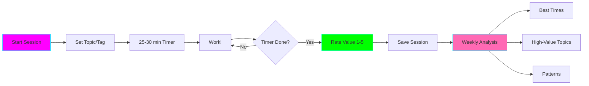

# ⏱️ Pomodoro + Time-Boxing Tracker

**Status:** 🚧 In Progress
**Tech Stack:** Python 3.11+, Rich CLI, JSON storage, Obsidian integration
**Purpose:** Smart timer that tracks time-boxed sessions and analyzes productivity patterns

## Problem

ADHD brains benefit from time-boxing but struggle with:
- Knowing how long to work on something
- Understanding what time of day is most productive
- Identifying which topics/tasks are worth the time investment
- Maintaining awareness during hyperfocus/task-switching

## Solution

A Pomodoro timer that goes beyond basic timekeeping:



## Features

### Core Timer
- ✅ Configurable session length (default 30 min for ADHD-optimized time-boxing)
- ✅ Visual countdown with progress bar
- ✅ Audio/visual alerts (gentle, not jarring)
- ✅ Pause/resume support
- ✅ Topic tagging (#coding, #learning, #admin, etc.)

### Session Tracking
- ✅ Record start/end time
- ✅ Topic/project tags
- ✅ Post-session value rating (1-5: "Was this time well spent?")
- ✅ Optional notes
- ✅ JSON storage for analysis

### Analytics & Reports
- ✅ Weekly summary dashboard
- ✅ Productive vs. unproductive patterns
- ✅ Best times of day (energy/focus peaks)
- ✅ High-value vs. low-value activities
- ✅ Time spent per topic
- ✅ Session completion rate

### Obsidian Integration
- ✅ Auto-append sessions to daily notes
- ✅ Generate weekly review notes
- ✅ Tag-based analysis

## Installation

```bash
cd projects/pomodoro-tracker

python -m venv .venv
source .venv/bin/activate

pip install -r requirements.txt
```

## Usage

### Start a Session

```bash
# Basic 30-minute session
python main.py start

# Custom duration
python main.py start --minutes 25

# With topic tag
python main.py start --tag coding

# Multiple tags
python main.py start --tag coding --tag python --tag bug-fix

# With description
python main.py start --tag learning --description "LangGraph patterns"
```

### During Session

```
╔══════════════════════════════════════════════════════════════╗
║              ⏱️  Pomodoro Session Active                      ║
║              #coding #python                                  ║
╚══════════════════════════════════════════════════════════════╝

Time Remaining: 23:45
━━━━━━━━━━━━━━━━━━━━━━━━━━━━━━━━━━━━━━━━━━━ 21% | 6:15 elapsed

[p] Pause  [q] Quit  [n] Add note
```

### End Session

```bash
# After timer completes
How valuable was this session? (1-5): 4
Any notes? (optional): Fixed authentication bug
✅ Session saved!
```

### View Stats

```bash
# Today's sessions
python main.py stats

# This week
python main.py stats --week

# Last 30 days
python main.py stats --days 30

# Specific tag
python main.py stats --tag coding
```

### Example Stats Output

```
╔══════════════════════════════════════════════════════════════╗
║              📊 Weekly Pomodoro Statistics                    ║
║              Nov 10 - Nov 16, 2025                            ║
╚══════════════════════════════════════════════════════════════╝

📈 Overview
━━━━━━━━━━━━━━━━━━━━━━━━━━━━━━━━━━━━━━━━━━━━━━━━━━━━━━━━━━━
Sessions completed:     18 / 22 (82%)
Total time:             9h 15m
Average session value:  3.8 / 5.0
Most productive time:   9:00 AM - 11:00 AM

🏆 High-Value Topics (avg rating ≥ 4.0)
━━━━━━━━━━━━━━━━━━━━━━━━━━━━━━━━━━━━━━━━━━━━━━━━━━━━━━━━━━━
#coding              6 sessions  |  4.5 avg  |  3h 00m
#learning-ai         4 sessions  |  4.3 avg  |  2h 00m
#deep-work           3 sessions  |  4.7 avg  |  1h 30m

⚠️  Low-Value Topics (avg rating < 3.0)
━━━━━━━━━━━━━━━━━━━━━━━━━━━━━━━━━━━━━━━━━━━━━━━━━━━━━━━━━━━
#meetings            3 sessions  |  2.3 avg  |  1h 30m
#admin               2 sessions  |  2.0 avg  |  1h 00m

⏰ Energy Patterns
━━━━━━━━━━━━━━━━━━━━━━━━━━━━━━━━━━━━━━━━━━━━━━━━━━━━━━━━━━━
9-11 AM     ████████████████████  4.5 avg (5 sessions)
2-4 PM      ████████████          3.8 avg (4 sessions)
4-6 PM      ████████              3.2 avg (3 sessions)
Evening     ██████                2.8 avg (6 sessions)

💡 Insights
━━━━━━━━━━━━━━━━━━━━━━━━━━━━━━━━━━━━━━━━━━━━━━━━━━━━━━━━━━━
✨ Your most productive time is morning (9-11 AM)
✨ #coding and #deep-work sessions are highly valuable
⚠️  Consider reducing #meetings and #admin time
📅 You completed 82% of started sessions (good!)
```

## Data Storage

Sessions stored in `~/.pomodoro-sessions/sessions.json`:

```json
{
  "sessions": [
    {
      "id": "2025-11-16-001",
      "start_time": "2025-11-16T09:15:00",
      "end_time": "2025-11-16T09:45:00",
      "duration_minutes": 30,
      "tags": ["coding", "python", "bug-fix"],
      "description": "Fixed authentication bug",
      "value_rating": 4,
      "completed": true,
      "notes": "Found the issue in JWT validation"
    }
  ]
}
```

## Obsidian Integration

Auto-appends to daily notes:

```markdown
## Pomodoro Sessions

- [x] 09:15-09:45 (30m) #coding #python - Fixed authentication bug ⭐️⭐️⭐️⭐️
- [x] 10:00-10:30 (30m) #learning-ai - LangGraph patterns ⭐️⭐️⭐️⭐️⭐️
- [ ] 14:00-14:20 (20m) #meeting - Team standup ⭐️⭐️
```

Generate weekly review:

```bash
python main.py review --week
# Creates: Weekly Review YYYY-MM-DD.md in Obsidian
```

## Code Structure

```
pomodoro-tracker/
├── main.py                 # CLI entry point
├── timer.py                # Timer logic
├── session_tracker.py      # Session storage and retrieval
├── analytics.py            # Stats and analysis
├── obsidian_sync.py        # Obsidian integration
├── config.py               # Configuration
├── requirements.txt
├── .env.example
└── README.md
```

## ADHD-Friendly Features

- 🧠 **30-minute default** - Optimal for ADHD focus without burnout
- 🎯 **Value rating** - Builds awareness of time ROI
- 📊 **Pattern recognition** - Shows you when you work best
- ✅ **Completion tracking** - Gamifies finishing sessions
- 🏷️ **Topic tagging** - Helps identify productive vs. toil work
- 🔔 **Gentle alerts** - No jarring sounds that trigger stress
- 📝 **Obsidian integration** - Automatic journaling without manual work

## Graduation Criteria

- [ ] Used consistently for 2+ weeks
- [ ] Identifies clear productivity patterns
- [ ] Integrates with Executive Function Dashboard
- [ ] Helps reduce time spent on low-value activities
- [ ] Well-tested and documented

## Future Enhancements

- 🔮 Predictive scheduling (suggest best times for deep work)
- 🔮 Integration with calendar (block focus time)
- 🔮 Streaks and gamification
- 🔮 Team mode (coordinate focus time with colleagues)
- 🔮 Break reminders with activity suggestions
- 🔮 Integration with Context Recovery Agent

---

**Last Updated:** 2025-11-16
