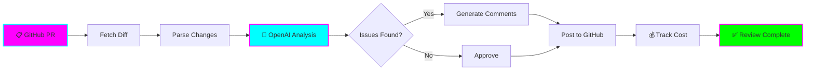
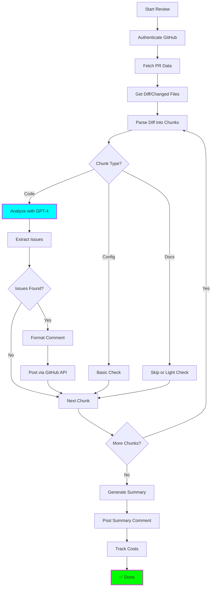

# 🤖 PR Review Agent

**Status:** 🧪 Experimental
**Tech Stack:** Python 3.11, OpenAI API, GitHub API
**Purpose:** AI-powered PR review agent that provides intelligent code review with inline comments

---

## Problem

Manual PR reviews are:
- **Time-consuming** - Takes hours to review complex PRs
- **Inconsistent** - Different reviewers focus on different things
- **Delayed** - Waiting for human reviewers blocks progress
- **Surface-level** - Easy to miss subtle bugs, security issues, or best practices

**You need:** Automated first-pass review that catches common issues and provides actionable feedback.

---

## Solution

An AI agent that:
1. **Fetches** PR diffs from GitHub
2. **Analyzes** code changes using OpenAI function calling
3. **Detects** bugs, style issues, security vulnerabilities
4. **Posts** inline comments on specific lines
5. **Suggests** improvements with code examples
6. **Tracks** cost per review



---

## Features

### Core Features
- ✅ **Automated Review** - Reviews PRs on-demand or via webhook
- ✅ **Inline Comments** - Posts comments on specific lines
- ✅ **Multi-Language** - Supports Python, JavaScript, TypeScript, Go, Rust, etc.
- ✅ **Function Calling** - Uses OpenAI structured outputs for reliable parsing
- ✅ **Cost Tracking** - Monitor API costs per review

### Review Categories
- 🐛 **Bug Detection** - Logic errors, null checks, edge cases
- 🔒 **Security** - SQL injection, XSS, secrets in code
- 🎨 **Code Style** - Naming, formatting, best practices
- 📚 **Documentation** - Missing docstrings, unclear names
- ⚡ **Performance** - Inefficient algorithms, unnecessary loops
- ♻️ **Refactoring** - Code duplication, complexity

---

## Architecture



### Components

| Component | Purpose | Technology |
|-----------|---------|------------|
| **GitHub Client** | Fetch PRs, post comments | PyGithub / requests |
| **Diff Parser** | Parse git diffs into chunks | gitdiff / custom |
| **Review Agent** | Analyze code with LLM | OpenAI function calling |
| **Comment Formatter** | Format inline comments | Markdown templates |
| **Cost Tracker** | Monitor API usage | SQLite |

---

## Installation

### Prerequisites
- Python 3.11
- GitHub Personal Access Token (PAT) with repo access
- OpenAI API key

### Setup

```bash
# Navigate to project
cd /home/user/fantastic-engine/projects/pr-review-agent

# Create virtual environment
python -m venv .venv
source .venv/bin/activate  # On Windows: .venv\Scripts\activate

# Install dependencies
pip install -r requirements.txt

# Copy environment template
cp .env.example .env

# Edit .env with your credentials
nano .env
```

### Configuration

Edit `.env`:

```bash
# GitHub Configuration
GITHUB_TOKEN=ghp_your_github_token_here
GITHUB_REPO=owner/repo

# OpenAI Configuration
OPENAI_API_KEY=sk-your-api-key-here
OPENAI_MODEL=gpt-4-turbo-preview

# Review Settings
MAX_FILES_PER_REVIEW=20
MAX_LINES_PER_CHUNK=100
REVIEW_CATEGORIES=bugs,security,style,performance

# Cost Tracking
COST_DB_PATH=./data/cost_tracking.db
MAX_COST_PER_REVIEW=1.00  # USD

# Logging
LOG_LEVEL=INFO
LOG_FILE=./logs/pr_review.log
```

---

## Usage

### 1. Review a PR (CLI)

```bash
# Review specific PR
python -m src.review_pr --pr 123

# Review with custom categories
python -m src.review_pr --pr 123 --categories bugs,security

# Dry run (don't post comments)
python -m src.review_pr --pr 123 --dry-run
```

**Output:**
```
🤖 Reviewing PR #123: Add user authentication

📥 Fetching PR data...
  ├─ Files changed: 8
  ├─ Lines added: 245
  └─ Lines deleted: 12

🔍 Analyzing changes...
  ├─ auth/user.py: ⚠️  3 issues found
  ├─ auth/middleware.py: ⚠️  1 issue found
  ├─ tests/test_auth.py: ✅ No issues
  └─ ...

💬 Posting comments...
  ├─ Posted 4 inline comments
  └─ Posted summary comment

💰 Cost: $0.42 | ⏱️ Time: 23s
✅ Review complete!
```

### 2. Review via Python API

```python
from src.pr_review_agent import PRReviewAgent

# Initialize agent
agent = PRReviewAgent(
    github_token="ghp_xxx",
    openai_api_key="sk-xxx",
    repo="owner/repo"
)

# Review PR
review = agent.review_pr(
    pr_number=123,
    categories=["bugs", "security", "performance"],
    dry_run=False
)

# View results
print(f"Issues found: {review.issue_count}")
print(f"Comments posted: {review.comment_count}")
print(f"Cost: ${review.cost:.2f}")

for issue in review.issues:
    print(f"\n{issue.severity} - {issue.file}:{issue.line}")
    print(f"  {issue.message}")
    print(f"  Suggestion: {issue.suggestion}")
```

### 3. GitHub Actions Integration

Create `.github/workflows/ai-review.yml`:

```yaml
name: AI PR Review

on:
  pull_request:
    types: [opened, synchronize]

jobs:
  ai-review:
    runs-on: ubuntu-latest
    steps:
      - uses: actions/checkout@v3

      - name: Set up Python
        uses: actions/setup-python@v4
        with:
          python-version: '3.11'

      - name: Install dependencies
        run: |
          pip install -r requirements.txt

      - name: Run AI Review
        env:
          GITHUB_TOKEN: ${{ secrets.GITHUB_TOKEN }}
          OPENAI_API_KEY: ${{ secrets.OPENAI_API_KEY }}
        run: |
          python -m src.review_pr --pr ${{ github.event.pull_request.number }}
```

### 4. Webhook Server (Optional)

```bash
# Start webhook server
python -m src.webhook_server --port 8080

# GitHub webhook URL: http://your-server:8080/webhook
# Events: Pull request (opened, synchronize)
```

---

## Examples

### Example 1: Security Issue Detection

**Code:**
```python
# In PR: auth/login.py
def login(username, password):
    query = f"SELECT * FROM users WHERE username='{username}' AND password='{password}'"
    return db.execute(query)
```

**AI Comment:**
```
⚠️ Security Issue: SQL Injection Vulnerability

This code is vulnerable to SQL injection. An attacker could inject malicious SQL.

Suggestion:
```python
def login(username, password):
    query = "SELECT * FROM users WHERE username=? AND password=?"
    return db.execute(query, (username, password))
```

Or better, use an ORM like SQLAlchemy.

Severity: HIGH
Category: Security
```

### Example 2: Bug Detection

**Code:**
```javascript
// In PR: utils/array.js
function getFirst(arr) {
  return arr[0];
}
```

**AI Comment:**
```
🐛 Bug: Missing Null Check

This function will throw an error if `arr` is null or undefined.

Suggestion:
```javascript
function getFirst(arr) {
  if (!arr || arr.length === 0) {
    return null;
  }
  return arr[0];
}
```

Severity: MEDIUM
Category: Bugs
```

### Example 3: Performance Issue

**Code:**
```python
# In PR: data/processor.py
def process_items(items):
    result = []
    for item in items:
        if item.is_valid():
            result.append(item.process())
    return result
```

**AI Comment:**
```
⚡ Performance: Consider List Comprehension

This can be simplified and made more Pythonic with a list comprehension.

Suggestion:
```python
def process_items(items):
    return [item.process() for item in items if item.is_valid()]
```

Severity: LOW
Category: Performance
```

---

## Project Structure

```
pr-review-agent/
├── README.md
├── requirements.txt
├── .env.example
├── .python-version
├── src/
│   ├── __init__.py
│   ├── pr_review_agent.py    # Main agent class
│   ├── github_client.py       # GitHub API wrapper
│   ├── diff_parser.py         # Parse git diffs
│   ├── review_engine.py       # LLM-based review logic
│   ├── comment_formatter.py   # Format inline comments
│   ├── cost_tracker.py        # Cost tracking
│   ├── review_pr.py           # CLI for reviewing PRs
│   └── webhook_server.py      # Optional webhook server
├── data/
│   └── cost_tracking.db       # Cost database (auto-created)
└── tests/
    └── test_review_engine.py
```

---

## Cost Tracking

### OpenAI Costs (Approximate)

| Model | Cost per 1M tokens (input) | Cost per 1M tokens (output) |
|-------|---------------------------|----------------------------|
| GPT-4 Turbo | $10.00 | $30.00 |
| GPT-3.5 Turbo | $0.50 | $1.50 |

### Typical PR Review Costs

| PR Size | Lines Changed | Estimated Cost (GPT-4) | Estimated Cost (GPT-3.5) |
|---------|--------------|----------------------|------------------------|
| Small | <100 | $0.05 - $0.15 | $0.01 - $0.03 |
| Medium | 100-500 | $0.15 - $0.50 | $0.03 - $0.10 |
| Large | 500-1000 | $0.50 - $1.00 | $0.10 - $0.25 |
| Extra Large | >1000 | $1.00+ | $0.25+ |

### View Your Costs

```bash
python -m src.cost_tracker --stats

# Output:
# Total PRs reviewed: 47
# Total issues found: 203
# Total cost: $18.42
# Average cost per PR: $0.39
```

---

## Learning Log

### What I Learned
- [ ] OpenAI function calling for structured outputs
- [ ] GitHub API for PR operations
- [ ] Git diff parsing and analysis
- [ ] Inline comment formatting
- [ ] Webhook setup for GitHub Apps

### Challenges
- [ ] Handling large PRs (chunking strategy)
- [ ] Reducing false positives
- [ ] Context awareness across files
- [ ] Rate limiting (GitHub + OpenAI)
- [ ] Cost optimization

### Next Steps
- [ ] Add code understanding via AST parsing
- [ ] Implement learning from feedback (thumbs up/down)
- [ ] Multi-file context (understand imports)
- [ ] Custom rule engine (team-specific checks)
- [ ] Integration with Linear/Jira for issue creation
- [ ] Support for GitLab and Bitbucket

---

## Graduation Criteria

- [ ] Successfully reviewed 50+ PRs
- [ ] <5% false positive rate
- [ ] <$0.50 average cost per PR
- [ ] Sub-30 second review time
- [ ] GitHub Actions integration working
- [ ] Positive feedback from team
- [ ] Documentation complete

---

## Resources

- [OpenAI Function Calling Guide](https://platform.openai.com/docs/guides/function-calling)
- [GitHub REST API - Pull Requests](https://docs.github.com/en/rest/pulls)
- [PyGithub Documentation](https://pygithub.readthedocs.io/)
- [Git Diff Format](https://git-scm.com/docs/diff-format)

---

**Last Updated:** 2025-11-16
**Maintainer:** You (ADHD-friendly version)
