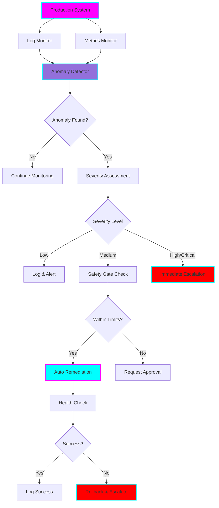
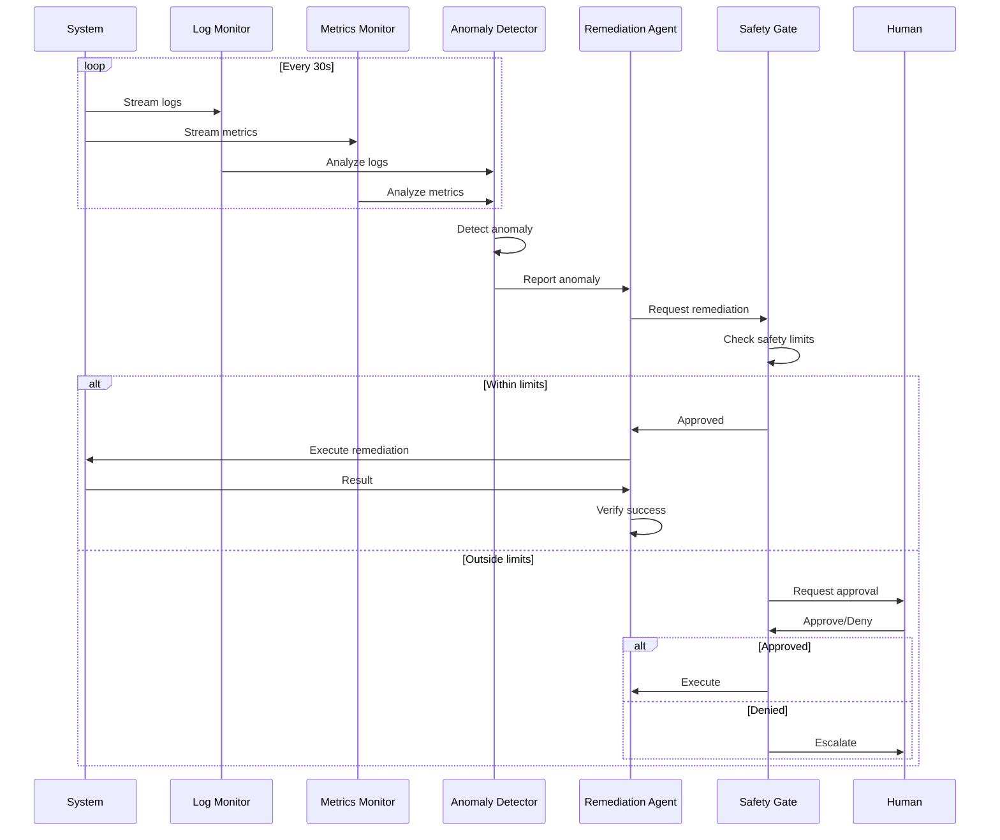

# 🛡️ Production Guardian Agent (MVP)

**Status:** 🧪 Experimental

**Tech Stack:** Python 3.11+, LangGraph, LangChain, OpenAI API

**Purpose:** An autonomous agent that monitors production systems, detects anomalies, and performs automated remediation with comprehensive safety guardrails.

## Architecture Overview



## Monitoring Workflow



## Features

### 1. Log Monitoring
- **Real-time streaming:** Tails application logs continuously
- **Pattern detection:** Identifies error patterns, stack traces, warnings
- **Anomaly detection:** Detects unusual log volumes or patterns
- **Structured logging:** Parses JSON logs for better analysis

### 2. Metrics Monitoring
- **System metrics:** CPU, memory, disk usage
- **Application metrics:** Response times, error rates, throughput
- **Custom metrics:** Business-specific KPIs
- **Threshold detection:** Alerts on threshold breaches

### 3. Automated Remediation
- **Service restart:** Restart failing services
- **Cache clearing:** Clear problematic caches
- **Traffic routing:** Reroute traffic away from failing instances
- **Resource scaling:** Scale resources up/down based on load
- **Database operations:** Kill long-running queries, optimize tables

### 4. Safety Guardrails
- **Action limits:** Max actions per hour/day
- **Approval workflows:** Human approval for critical actions
- **Blast radius limits:** Limit impact to single service/region
- **Rollback capability:** Automatic rollback on remediation failure
- **Dry-run mode:** Test remediation without executing

### 5. Incident Management
- **Automatic escalation:** Escalate based on severity and time
- **Incident tracking:** Track incidents from detection to resolution
- **Runbook execution:** Execute predefined runbooks
- **Post-mortem generation:** Auto-generate incident reports

## Safety Protocols

### Action Limits

```python
SAFETY_LIMITS = {
    "max_actions_per_hour": 10,
    "max_actions_per_day": 50,
    "max_service_restarts": 3,
    "cooldown_period": 300,  # 5 minutes
    "require_approval_for": [
        "database_operations",
        "traffic_routing",
        "instance_termination"
    ]
}
```

### Severity Levels

| Level | Actions | Approval | Example |
|-------|---------|----------|---------|
| **Low** | Log only | None | Warning log volume increase |
| **Medium** | Auto-remediate | If within limits | Single service error rate spike |
| **High** | Auto-remediate + Alert | Required if outside limits | Multiple services failing |
| **Critical** | Immediate escalation | Always required | Database down, data loss |

### Blast Radius Control

- **Single service:** Limit actions to one service at a time
- **Single region:** Don't perform actions across regions simultaneously
- **Percentage limits:** Max 20% of instances affected
- **Time delays:** Minimum 5-minute gap between major actions

## LangGraph Patterns

### Monitoring State

```python
class MonitoringState(TypedDict):
    current_logs: list[str]
    current_metrics: dict
    anomalies_detected: list[dict]
    remediation_actions: list[dict]
    safety_checks_passed: bool
    requires_approval: bool
    incident_id: str
```

### Decision Flow

```python
def should_remediate(state: MonitoringState) -> str:
    """Decide if remediation should proceed"""
    if not state["anomalies_detected"]:
        return "continue_monitoring"

    if state["safety_checks_passed"] and not state["requires_approval"]:
        return "auto_remediate"
    elif state["requires_approval"]:
        return "request_approval"
    else:
        return "escalate"
```

## Runbook Examples

### Runbook 1: High Error Rate

```yaml
name: High Error Rate Remediation
trigger:
  metric: error_rate
  threshold: 5%  # 5% error rate
  duration: 5m   # Sustained for 5 minutes

steps:
  - name: Check service health
    action: health_check
    timeout: 30s

  - name: Clear application cache
    action: clear_cache
    requires_approval: false

  - name: Restart service
    action: restart_service
    requires_approval: true  # Requires approval
    rollback_on_failure: true

  - name: Verify fix
    action: verify_metrics
    success_criteria:
      error_rate: "<1%"
    timeout: 5m
```

### Runbook 2: High Memory Usage

```yaml
name: Memory Leak Remediation
trigger:
  metric: memory_usage
  threshold: 90%
  duration: 10m

steps:
  - name: Identify memory-intensive processes
    action: analyze_memory

  - name: Dump heap for analysis
    action: heap_dump
    requires_approval: false

  - name: Restart application
    action: rolling_restart
    requires_approval: true
    blast_radius:
      max_instances: 1
      wait_between: 5m

  - name: Monitor memory post-restart
    action: verify_metrics
    success_criteria:
      memory_usage: "<70%"
```

## Environment Setup

### Prerequisites
- Python 3.11+
- OpenAI API key
- Access to production logs and metrics
- Permissions for remediation actions

### Installation

```bash
# Navigate to project
cd /home/user/fantastic-engine/projects/production-guardian

# Create virtual environment
uv venv
source .venv/bin/activate

# Install dependencies
pip install -r requirements.txt

# Configure environment
cp .env.example .env
# Edit .env with your configuration
```

### Configuration

Create `.env` file with:

```env
OPENAI_API_KEY=your-api-key-here
MODEL_NAME=gpt-4-turbo-preview

# Monitoring configuration
LOG_FILE_PATH=/var/log/application/app.log
METRICS_ENDPOINT=http://prometheus:9090
CHECK_INTERVAL=30  # seconds

# Safety limits
MAX_ACTIONS_PER_HOUR=10
MAX_ACTIONS_PER_DAY=50
REQUIRE_APPROVAL_THRESHOLD=medium
DRY_RUN=true  # Start in dry-run mode

# Notification configuration
SLACK_WEBHOOK_URL=your-slack-webhook
PAGERDUTY_API_KEY=your-pagerduty-key
```

## Usage Examples

### Basic Monitoring

```python
from production_guardian import GuardianAgent

# Initialize agent
agent = GuardianAgent(dry_run=True)

# Start monitoring
agent.start_monitoring(
    log_file="/var/log/app.log",
    metrics_endpoint="http://localhost:9090"
)

# Monitor runs indefinitely until stopped
```

### With Custom Runbooks

```python
from production_guardian import GuardianAgent, Runbook

# Define custom runbook
high_cpu_runbook = Runbook(
    name="High CPU Remediation",
    trigger={"metric": "cpu_usage", "threshold": 80},
    steps=[
        {"action": "identify_cpu_intensive_processes"},
        {"action": "restart_service", "requires_approval": True}
    ]
)

# Initialize with runbooks
agent = GuardianAgent(
    runbooks=[high_cpu_runbook],
    dry_run=False
)

agent.start_monitoring()
```

### Manual Intervention

```python
# Get current incidents
incidents = agent.get_active_incidents()

for incident in incidents:
    print(f"Incident: {incident.description}")
    print(f"Severity: {incident.severity}")
    print(f"Proposed Actions: {incident.proposed_actions}")

    # Approve/deny actions
    if incident.requires_approval:
        agent.approve_action(incident.id, approved=True)
```

### Testing with Synthetic Errors

```python
from production_guardian.testing import SyntheticErrorGenerator

# Generate synthetic errors for testing
generator = SyntheticErrorGenerator()

# Inject errors
generator.inject_error_logs(
    error_rate=0.1,  # 10% error rate
    duration=300     # for 5 minutes
)

generator.inject_high_cpu(
    cpu_percent=85,
    duration=180
)

# Agent should detect and remediate
```

## Project Structure

```
production-guardian/
├── README.md
├── requirements.txt
├── .env.example
├── .python-version
├── production_guardian/
│   ├── __init__.py
│   ├── agent.py              # Main Guardian Agent
│   ├── monitors/
│   │   ├── __init__.py
│   │   ├── log_monitor.py    # Log monitoring
│   │   └── metrics_monitor.py # Metrics monitoring
│   ├── detectors/
│   │   ├── __init__.py
│   │   └── anomaly_detector.py # Anomaly detection
│   ├── remediators/
│   │   ├── __init__.py
│   │   ├── base.py           # Base remediation actions
│   │   └── runbooks.py       # Runbook execution
│   ├── safety/
│   │   ├── __init__.py
│   │   ├── gates.py          # Safety gates
│   │   └── limits.py         # Action limits
│   ├── incidents/
│   │   ├── __init__.py
│   │   └── tracker.py        # Incident tracking
│   └── testing/
│       ├── __init__.py
│       └── synthetic.py      # Synthetic error generation
├── runbooks/
│   ├── high_error_rate.yaml
│   ├── high_memory.yaml
│   └── high_cpu.yaml
└── examples/
    ├── basic_monitoring.py
    ├── custom_runbooks.py
    └── synthetic_testing.py
```

## Evaluation Metrics

### Detection Metrics
- **True Positive Rate:** Correctly identified anomalies
- **False Positive Rate:** False alarms
- **Detection Latency:** Time from issue to detection
- **Coverage:** Percentage of issues detected

### Remediation Metrics
- **Success Rate:** Percentage of successful remediations
- **Time to Remediate:** Average time from detection to fix
- **Rollback Rate:** Percentage requiring rollback
- **Manual Intervention Rate:** Percentage requiring human action

### Safety Metrics
- **Safety Gate Triggers:** How often limits are hit
- **Approval Wait Time:** Time waiting for approval
- **Blast Radius:** Number of services/instances affected
- **Incident Escalation Rate:** Percentage escalated to humans

### System Metrics
- **MTTR (Mean Time to Recovery):** Average recovery time
- **MTBF (Mean Time Between Failures):** Average uptime
- **Availability:** System uptime percentage
- **Cost Savings:** Automation vs manual intervention cost

## Learning Log

### Concepts to Master
- [ ] Real-time log streaming and parsing
- [ ] Time-series metrics analysis
- [ ] Anomaly detection algorithms
- [ ] Circuit breaker patterns
- [ ] Incident management workflows
- [ ] Safe automation practices

### Challenges & Solutions
- **Challenge:** Preventing runaway automation
  - **Solution:** Strict action limits, cooldown periods, blast radius controls
- **Challenge:** Determining when to escalate vs auto-remediate
  - **Solution:** Severity-based decision tree with safety thresholds
- **Challenge:** Testing without production access
  - **Solution:** Synthetic error generation and dry-run mode

### Next Steps
- [ ] Implement basic log monitoring
- [ ] Add metrics collection from Prometheus/CloudWatch
- [ ] Build anomaly detection with statistical methods
- [ ] Create runbook execution engine
- [ ] Add safety gates and approval workflows
- [ ] Implement incident tracking
- [ ] Build synthetic error generator for testing
- [ ] Add comprehensive alerting (Slack, PagerDuty)

## Graduation Criteria

- [ ] Successfully monitors logs and metrics
- [ ] Detects anomalies with <5% false positive rate
- [ ] Auto-remediates common issues successfully
- [ ] Safety gates prevent dangerous actions
- [ ] Incident tracking working end-to-end
- [ ] Tested with synthetic errors in staging
- [ ] Documentation includes runbooks for common scenarios
- [ ] Monitoring dashboard available
- [ ] On-call team trained on approval workflow

## Resources

- [Anomaly Detection Techniques](https://github.com/yzhao062/pyod)
- [Prometheus Monitoring](https://prometheus.io/docs/)
- [LangGraph for Autonomous Agents](https://langchain-ai.github.io/langgraph/)
- [SRE Best Practices](https://sre.google/)
- [Incident Management](https://www.atlassian.com/incident-management)

## Safety Warnings

**CRITICAL SAFETY NOTES:**

1. **Always start in dry-run mode** - Never run in production immediately
2. **Set strict action limits** - Max 10 actions per hour initially
3. **Require approval for critical actions** - Database ops, instance termination
4. **Monitor the monitor** - Have alerts for guardian agent failures
5. **Human escalation path** - Always have humans in the loop for high severity
6. **Test thoroughly** - Use synthetic errors extensively before production
7. **Gradual rollout** - Start with read-only monitoring, then limited actions

## License

MIT

---

**Remember:** This agent has the power to affect production systems. Test extensively, start conservatively, and always have human oversight. 🛡️
