# RAG Learning Project

**Status:** 🚧 In Progress

**Tech Stack:** Python 3.12, LangChain, ChromaDB, OpenAI/Ollama

**Started:** 2025-11-04

## Overview

This project is a hands-on learning experience for **Retrieval-Augmented Generation (RAG)**. It's designed to help you understand RAG concepts from the ground up, with clear explanations and beginner-friendly code.

### What is RAG?

RAG combines two powerful concepts:
1. **Retrieval** - Finding relevant information from a knowledge base
2. **Generation** - Using an LLM to generate answers based on that information

Think of it like an open-book exam: instead of memorizing everything, you can look up information when needed!


## Why RAG?

**Problems RAG Solves:**
- ✅ LLMs have knowledge cutoff dates
- ✅ LLMs can hallucinate facts
- ✅ Your private data isn't in the LLM's training set
- ✅ Fine-tuning is expensive and inflexible

**RAG Solution:**
- ✅ Always up-to-date with latest information
- ✅ Grounded in real documents (less hallucination)
- ✅ Works with your private data
- ✅ Easy to update (just add new documents)

## Architecture

```mermaid
graph TD
    A[📄 Documents] --> B[🔪 Text Splitter]
    B --> C[🧮 Embedding Model]
    C --> D[💾 Vector Database]

    E[❓ User Query] --> F[🧮 Query Embedding]
    F --> G[🔍 Similarity Search]
    D --> G

    G --> H[📋 Retrieved Chunks]
    H --> I[🤖 LLM with Context]
    E --> I
    I --> J[✨ Final Answer]

    style A fill:#ff69b4
    style D fill:#00ffff
    style E fill:#ff00ff
    style J fill:#00ff00
```



## Key Concepts You'll Learn

### 1. **Embeddings** 🧮
- Converting text into numerical vectors
- Similar meanings = similar vectors
- How vector similarity works

### 2. **Vector Databases** 💾
- Storing and searching embeddings efficiently
- ChromaDB basics
- Distance metrics (cosine, euclidean)

### 3. **Text Chunking** 🔪
- Why we split documents
- Chunk size vs. retrieval quality
- Overlap strategies

### 4. **Retrieval Strategies** 🔍
- Simple similarity search
- Top-K results
- Metadata filtering
- Hybrid search (bonus)

### 5. **Prompt Engineering** 📝
- Structuring context for LLMs
- System prompts for RAG
- Handling retrieved context

## Environment Setup

This project uses Python 3.12. The environment is configured via `.python-version`.

### Quick Start

```bash
# Navigate to project
cd projects/rag-learning-project

# Create virtual environment (using uv - fast!)
uv venv
source .venv/bin/activate  # On Windows: .venv\Scripts\activate

# Install dependencies
pip install -r requirements.txt

# Run the basic RAG example
python src/basic_rag.py

# Run the interactive RAG
python src/interactive_rag.py
```

### Environment Variables

Create a `.env` file in this directory:

```bash
# Option 1: Use OpenAI (requires API key)
OPENAI_API_KEY=your_key_here
USE_OLLAMA=false

# Option 2: Use Ollama (free, local)
USE_OLLAMA=true
OLLAMA_MODEL=llama2  # or mistral, etc.
```

## Project Structure

```
rag-learning-project/
├── .python-version          # Python version (3.12)
├── requirements.txt         # Python dependencies
├── .env                     # Environment variables (create this)
├── README.md               # This file
├── data/                   # Sample documents
│   ├── sample_docs.txt     # Example: AI history
│   └── create_sample_data.py
├── src/
│   ├── basic_rag.py        # Step 1: Simplest RAG
│   ├── interactive_rag.py  # Step 2: Interactive Q&A
│   ├── advanced_rag.py     # Step 3: Advanced features
│   └── utils.py            # Helper functions
└── notebooks/              # Jupyter notebooks for learning
    └── rag_walkthrough.ipynb
```

## Learning Path

Follow these steps in order:

### 📚 Step 1: Understanding the Basics
Read this README and the concept explanations.

### 🔧 Step 2: Run Basic RAG (`basic_rag.py`)
- Loads sample documents
- Creates embeddings
- Performs simple retrieval
- Generates answers

**Key Learnings:**
- How embeddings are created
- How similarity search works
- How context is passed to LLM

### 💬 Step 3: Interactive RAG (`interactive_rag.py`)
- Ask your own questions
- See retrieved chunks
- Understand relevance scoring

**Key Learnings:**
- Query reformulation
- Result ranking
- Context window management

### 🚀 Step 4: Advanced Features (`advanced_rag.py`)
- Metadata filtering
- Hybrid search (BM25 + vector)
- Re-ranking strategies
- Source attribution

**Key Learnings:**
- When to use different retrieval methods
- Improving answer quality
- Production considerations

## Dependencies

See `requirements.txt` for full list:

- **LangChain** - RAG orchestration framework
- **ChromaDB** - Vector database
- **OpenAI** - Embeddings and LLM (optional)
- **Sentence-Transformers** - Local embeddings (alternative)
- **Python-dotenv** - Environment management

## Sample Data

The project includes sample documents about:
- 📖 History of Artificial Intelligence
- 🤖 Machine Learning fundamentals
- 💬 Natural Language Processing basics

Perfect for testing RAG concepts!

## Common Questions & Gotchas

### Q: OpenAI API vs. Ollama?

**OpenAI:**
- ✅ Better quality embeddings/responses
- ✅ No setup required
- ❌ Costs money
- ❌ Data sent to external API

**Ollama:**
- ✅ Free and private
- ✅ Runs locally
- ❌ Requires installation
- ❌ Slower than cloud APIs

**Recommendation:** Start with Ollama for learning, consider OpenAI for production.

### Q: How big should my chunks be?

**Rule of thumb:**
- Small chunks (200-400 tokens) = More precise retrieval, but less context
- Large chunks (800-1200 tokens) = More context, but less precise

**This project uses:** 500 tokens with 50 token overlap (good starting point)

### Q: How many chunks should I retrieve?

**Depends on:**
- LLM context window size
- Document similarity
- Answer complexity

**This project uses:** Top 3-5 chunks (balance between context and noise)

### Q: My RAG gives wrong answers!

**Common issues:**
1. ❌ Documents don't contain the answer → Add more docs
2. ❌ Chunks too small/large → Adjust chunk size
3. ❌ Poor embeddings → Use better embedding model
4. ❌ Retrieval not working → Check vector DB connection
5. ❌ LLM ignoring context → Improve system prompt

## Learning Log

### What I'll Learn
- [ ] How embeddings work mathematically
- [ ] Vector similarity search algorithms
- [ ] When RAG is better than fine-tuning
- [ ] Prompt engineering for RAG
- [ ] Evaluation metrics for RAG systems

### Challenges
- Understanding vector space mathematics
- Choosing right chunk size
- Balancing retrieval quality vs. speed
- Handling multi-hop questions

### Next Steps
- [ ] Add more sample data sources
- [ ] Implement evaluation metrics
- [ ] Try different embedding models
- [ ] Build a web UI for the RAG system
- [ ] Experiment with graph RAG

## Graduation Criteria

Before moving to its own repository:
- [ ] All three examples working (basic, interactive, advanced)
- [ ] Works with both OpenAI and Ollama
- [ ] Comprehensive inline documentation
- [ ] Jupyter notebook walkthrough complete
- [ ] Evaluation framework implemented
- [ ] Performance benchmarks documented

## References

### Essential Reading
- [LangChain RAG Tutorial](https://python.langchain.com/docs/use_cases/question_answering/)
- [Pinecone: What is RAG?](https://www.pinecone.io/learn/retrieval-augmented-generation/)
- [ChromaDB Documentation](https://docs.trychroma.com/)

### Academic Papers
- [Retrieval-Augmented Generation for Knowledge-Intensive NLP Tasks](https://arxiv.org/abs/2005.11401)

### Video Tutorials
- Search YouTube for "RAG tutorial" + "LangChain"

### Advanced Topics
- [Advanced RAG Techniques](https://github.com/ray-project/llm-applications)
- [RAG Evaluation](https://docs.ragas.io/)

---

**Remember:** RAG is powerful but not magic. Start simple, understand each component, then add complexity! 🚀
