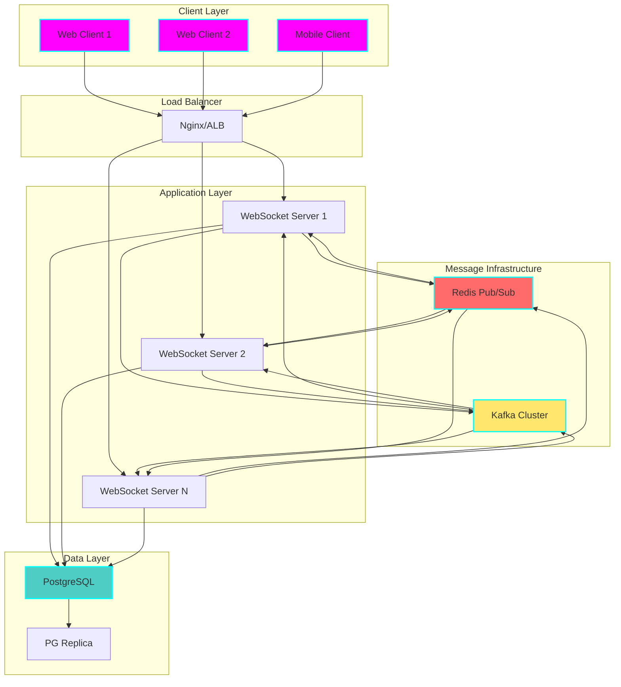
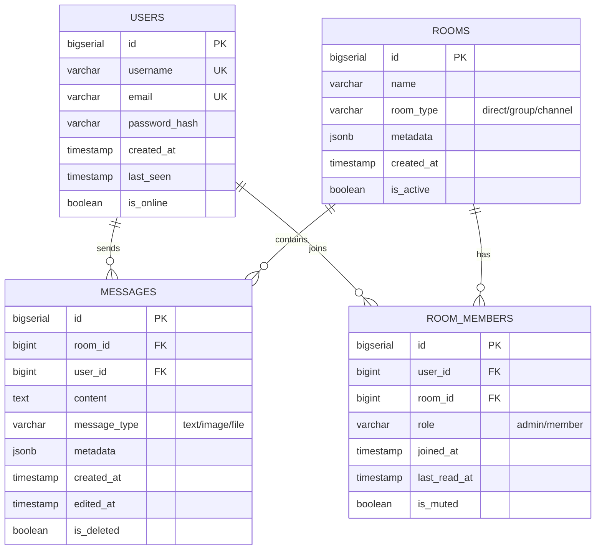
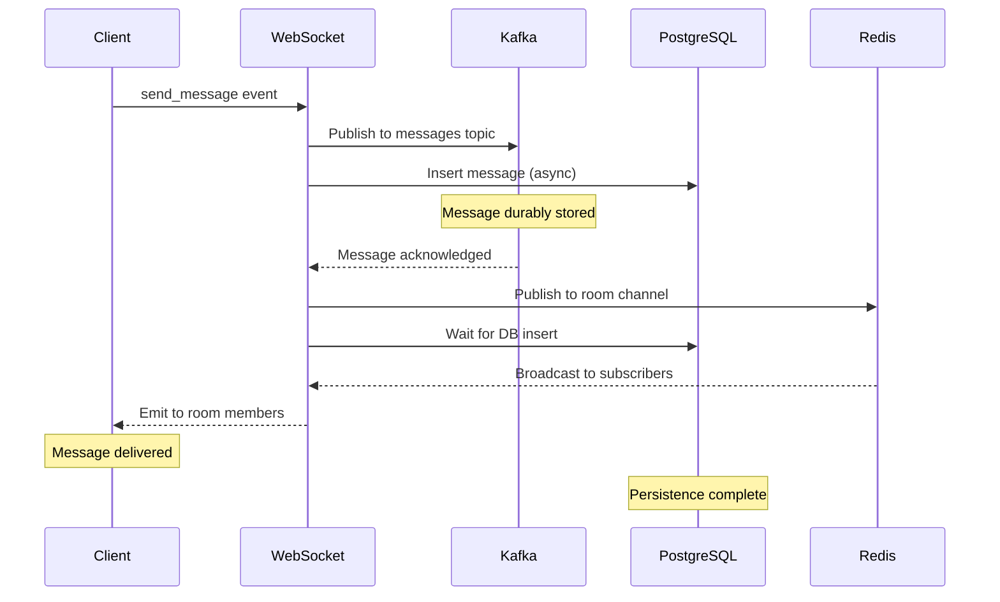

# 💬 Real-Time Chat System

**Status:** 🧪 Experimental

**Tech Stack:**
- **Backend:** Node.js 20+ / Express
- **WebSockets:** Socket.IO
- **Message Queue:** Apache Kafka
- **Database:** PostgreSQL 15+
- **Cache/Pub-Sub:** Redis 7+
- **Containerization:** Docker & Docker Compose

**Performance Requirements:**
- ✅ Support 100+ concurrent users per instance
- ✅ Message delivery latency < 100ms
- ✅ Message persistence and delivery guarantees
- ✅ Typing indicators and presence
- ✅ Horizontal scalability

---

## 📋 Table of Contents

- [Architecture Overview](#architecture-overview)
- [Database Schema](#database-schema)
- [WebSocket Events](#websocket-events)
- [Message Flow](#message-flow)
- [Scalability Considerations](#scalability-considerations)
- [Environment Setup](#environment-setup)
- [Running the Application](#running-the-application)
- [Client Example](#client-example)
- [Graduation Criteria](#graduation-criteria)

---

## 🏗️ Architecture Overview



### System Components

1. **WebSocket Servers** - Handle real-time bidirectional communication
2. **Redis Pub/Sub** - Broadcast messages across server instances
3. **Kafka** - Durable message queue for delivery guarantees
4. **PostgreSQL** - Persistent message storage
5. **Load Balancer** - Sticky sessions for WebSocket connections

### Why This Architecture?

**Redis Pub/Sub:**
- Instant message broadcasting across server instances
- Presence tracking (online/offline status)
- Typing indicators (ephemeral data)
- Low latency (<10ms)

**Kafka:**
- Message durability and replay capability
- At-least-once delivery guarantee
- Message ordering per partition
- Audit trail and compliance

**PostgreSQL:**
- Long-term message storage
- User management and authentication
- Message search and history
- Relational data integrity

---

## 📊 Database Schema



### Indexes for Performance

```sql
-- User lookups
CREATE INDEX idx_users_username ON users(username);
CREATE INDEX idx_users_email ON users(email);
CREATE INDEX idx_users_online ON users(is_online) WHERE is_online = true;

-- Room member queries
CREATE INDEX idx_room_members_user ON room_members(user_id);
CREATE INDEX idx_room_members_room ON room_members(room_id);
CREATE INDEX idx_room_members_composite ON room_members(user_id, room_id);

-- Message retrieval (most important!)
CREATE INDEX idx_messages_room_time ON messages(room_id, created_at DESC);
CREATE INDEX idx_messages_user ON messages(user_id);

-- Unread message count optimization
CREATE INDEX idx_messages_room_time_id ON messages(room_id, created_at, id)
WHERE is_deleted = false;
```

---

## 🔌 WebSocket Events

### Client → Server Events

| Event | Payload | Description |
|-------|---------|-------------|
| `join_room` | `{roomId, userId}` | Join a chat room |
| `leave_room` | `{roomId, userId}` | Leave a chat room |
| `send_message` | `{roomId, content, type}` | Send a message |
| `typing_start` | `{roomId, userId}` | User started typing |
| `typing_stop` | `{roomId, userId}` | User stopped typing |
| `mark_read` | `{roomId, messageId}` | Mark message as read |
| `edit_message` | `{messageId, content}` | Edit a message |
| `delete_message` | `{messageId}` | Delete a message |

### Server → Client Events

| Event | Payload | Description |
|-------|---------|-------------|
| `message` | `{id, roomId, userId, content, timestamp}` | New message received |
| `user_joined` | `{roomId, userId, username}` | User joined room |
| `user_left` | `{roomId, userId}` | User left room |
| `typing` | `{roomId, userId, username}` | User is typing |
| `message_read` | `{roomId, messageId, userId}` | Message read receipt |
| `presence_update` | `{userId, status}` | User online/offline |
| `error` | `{code, message}` | Error occurred |

---

## 🔄 Message Flow

### Sending a Message



### Message Delivery Guarantees

**At-Least-Once Delivery:**
1. Message published to Kafka topic
2. Kafka confirms message stored
3. Consumer (WebSocket server) processes message
4. Acknowledge to Kafka only after delivery
5. Failed deliveries retried automatically

**Exactly-Once Processing (with deduplication):**
```javascript
// Use message ID to prevent duplicates
const messageId = generateUUID();
const exists = await redis.get(`msg:${messageId}`);

if (!exists) {
    await processMessage(message);
    await redis.setex(`msg:${messageId}`, 3600, '1');
}
```

---

## 🚀 Scalability Considerations

### 1. WebSocket Connection Management

**Sticky Sessions:**
```nginx
upstream websocket_backends {
    ip_hash;  # Route same client to same server
    server ws1:3000;
    server ws2:3000;
    server ws3:3000;
}
```

**Connection Limits:**
```javascript
// Per server instance
const MAX_CONNECTIONS = 10000;
const CONNECTIONS_PER_ROOM = 1000;

// Implement backpressure
if (io.sockets.sockets.size >= MAX_CONNECTIONS) {
    socket.emit('error', { code: 'SERVER_FULL' });
    socket.disconnect();
}
```

---

### 2. Redis Pub/Sub for Inter-Server Communication

```javascript
// Publisher (WebSocket server that received message)
await redisPub.publish(`room:${roomId}`, JSON.stringify({
    event: 'message',
    data: message
}));

// Subscriber (All WebSocket servers)
redisSub.on('message', (channel, message) => {
    const data = JSON.parse(message);
    io.to(channel).emit(data.event, data.data);
});
```

**Why not just Kafka?**
- Redis Pub/Sub: Low latency (<10ms) for real-time events
- Kafka: Durability and replay for message history
- **Use both:** Redis for speed, Kafka for reliability

---

### 3. Kafka Topics and Partitioning

```javascript
// Topic: chat-messages
// Partitions: 10 (by room_id hash)
// Replication: 3

const partition = hashCode(roomId) % NUM_PARTITIONS;

await producer.send({
    topic: 'chat-messages',
    messages: [{
        key: roomId,  // Messages in same room → same partition
        value: JSON.stringify(message),
        partition: partition
    }]
});
```

**Benefits:**
- Message ordering per room guaranteed
- Parallel processing across rooms
- Replay capability for debugging

---

### 4. Database Optimization

**Connection Pooling:**
```javascript
const pool = new Pool({
    max: 20,              // Max connections
    idleTimeoutMillis: 30000,
    connectionTimeoutMillis: 2000,
});
```

**Batch Inserts:**
```javascript
// Insert messages in batches (reduce DB round trips)
const messages = [];
const flushInterval = 100; // ms

async function bufferMessage(msg) {
    messages.push(msg);
    if (messages.length >= 10) {
        await flushMessages();
    }
}

async function flushMessages() {
    if (messages.length === 0) return;
    await db.query('INSERT INTO messages (...) VALUES $1', [messages]);
    messages.length = 0;
}

setInterval(flushMessages, flushInterval);
```

**Read Replicas:**
- Write messages → Primary DB
- Read message history → Replica DB
- Reduce primary DB load

---

### 5. Presence and Typing Indicators

**Ephemeral Redis Keys:**
```javascript
// User online status
await redis.setex(`user:${userId}:online`, 30, '1');

// Heartbeat every 15 seconds
setInterval(() => {
    socket.emit('heartbeat');
}, 15000);

// Typing indicator (TTL 5 seconds)
await redis.setex(`room:${roomId}:typing:${userId}`, 5, username);

// Get who's typing
const typingUsers = await redis.keys(`room:${roomId}:typing:*`);
```

---

## ⚙️ Environment Setup

### Prerequisites

- Node.js 20+
- Docker & Docker Compose
- PostgreSQL 15+ (or use Docker)
- Redis 7+ (or use Docker)
- Apache Kafka (or use Docker)

### Installation Steps

1. **Clone and Navigate:**
```bash
cd /home/user/fantastic-engine/projects/realtime-chat
```

2. **Install Dependencies:**
```bash
npm install
```

3. **Configure Environment:**
```bash
cp .env.example .env
# Edit .env with your configuration
```

4. **Start Infrastructure:**
```bash
docker-compose up -d
```

5. **Initialize Database:**
```bash
npm run db:migrate
```

6. **Start Application:**
```bash
npm run dev
```

---

## 🏃 Running the Application

### Development Mode

```bash
npm run dev
```

**Access:**
- WebSocket Server: ws://localhost:3000
- API: http://localhost:3000/api
- Health Check: http://localhost:3000/health

---

### Production Mode (Docker Compose)

```bash
docker-compose up -d
```

**Services:**
- `chat-server` - Node.js WebSocket server (3 replicas)
- `postgres` - PostgreSQL database
- `redis` - Redis cache and pub/sub
- `kafka` - Message queue
- `zookeeper` - Kafka coordination
- `nginx` - Load balancer

---

## 💻 Client Example

### JavaScript/TypeScript Client

```typescript
import { io } from 'socket.io-client';

const socket = io('http://localhost:3000', {
    auth: {
        token: 'your-jwt-token'
    }
});

// Connect to server
socket.on('connect', () => {
    console.log('Connected:', socket.id);

    // Join a room
    socket.emit('join_room', {
        roomId: 'room-123',
        userId: 'user-456'
    });
});

// Send a message
function sendMessage(content: string) {
    socket.emit('send_message', {
        roomId: 'room-123',
        content: content,
        type: 'text'
    });
}

// Receive messages
socket.on('message', (data) => {
    console.log('New message:', data);
    // Update UI
    displayMessage(data);
});

// Typing indicators
let typingTimeout: NodeJS.Timeout;

function onTyping() {
    socket.emit('typing_start', {
        roomId: 'room-123',
        userId: 'user-456'
    });

    clearTimeout(typingTimeout);
    typingTimeout = setTimeout(() => {
        socket.emit('typing_stop', {
            roomId: 'room-123',
            userId: 'user-456'
        });
    }, 3000);
}

socket.on('typing', (data) => {
    console.log(`${data.username} is typing...`);
    // Show typing indicator
});

// Presence updates
socket.on('presence_update', (data) => {
    console.log(`${data.userId} is ${data.status}`);
    // Update user status in UI
});

// Error handling
socket.on('error', (error) => {
    console.error('Socket error:', error);
});

// Disconnect
socket.on('disconnect', (reason) => {
    console.log('Disconnected:', reason);
    // Handle reconnection
    if (reason === 'io server disconnect') {
        socket.connect();
    }
});
```

### React Hook Example

```typescript
import { useEffect, useState } from 'react';
import { io, Socket } from 'socket.io-client';

export function useChat(roomId: string) {
    const [socket, setSocket] = useState<Socket | null>(null);
    const [messages, setMessages] = useState<Message[]>([]);
    const [typing, setTyping] = useState<string[]>([]);

    useEffect(() => {
        const newSocket = io('http://localhost:3000');
        setSocket(newSocket);

        newSocket.on('connect', () => {
            newSocket.emit('join_room', { roomId });
        });

        newSocket.on('message', (message) => {
            setMessages(prev => [...prev, message]);
        });

        newSocket.on('typing', (data) => {
            setTyping(prev => [...prev, data.username]);
            setTimeout(() => {
                setTyping(prev => prev.filter(u => u !== data.username));
            }, 3000);
        });

        return () => {
            newSocket.close();
        };
    }, [roomId]);

    const sendMessage = (content: string) => {
        socket?.emit('send_message', { roomId, content, type: 'text' });
    };

    return { messages, typing, sendMessage };
}
```

---

## 🧪 Testing

### Load Testing with Artillery

```yaml
# artillery.yml
config:
  target: 'http://localhost:3000'
  phases:
    - duration: 60
      arrivalRate: 10
      name: Warm up
    - duration: 300
      arrivalRate: 50
      name: Sustained load
  engines:
    socketio:
      transports: ['websocket']

scenarios:
  - engine: socketio
    flow:
      - emit:
          channel: 'join_room'
          data:
            roomId: 'test-room'
            userId: '{{ $uuid }}'
      - think: 2
      - emit:
          channel: 'send_message'
          data:
            roomId: 'test-room'
            content: 'Hello from {{ $uuid }}'
            type: 'text'
      - think: 5
```

**Run Load Test:**
```bash
artillery run artillery.yml
```

**Performance Targets:**
- ✅ 100+ concurrent connections per instance
- ✅ Message delivery latency p95 < 100ms
- ✅ Message throughput 1000+ msg/sec
- ✅ CPU usage < 70% under load
- ✅ Memory usage stable (no leaks)

---

## 🎓 Graduation Criteria

**This project is ready to graduate when:**

### ✅ Functionality
- [x] WebSocket connection management
- [x] Room-based messaging
- [x] Typing indicators
- [x] Presence tracking
- [x] Message persistence
- [x] Message delivery guarantees (Kafka)
- [x] Read receipts
- [x] Message editing and deletion

### ✅ Performance
- [ ] Load tested with 100+ concurrent users
- [ ] Message latency < 100ms verified
- [ ] Kafka consumer lag < 100 messages
- [ ] Redis pub/sub latency < 10ms
- [ ] Database connection pooling optimized

### ✅ Production Readiness
- [ ] Horizontal scaling tested (3+ instances)
- [ ] Sticky session configuration
- [ ] Message deduplication
- [ ] Reconnection handling
- [ ] Rate limiting per user
- [ ] Input validation and sanitization
- [ ] XSS protection

### ✅ Reliability
- [ ] Kafka replication configured (factor 3)
- [ ] PostgreSQL replication setup
- [ ] Redis persistence enabled
- [ ] Health checks implemented
- [ ] Graceful shutdown handling
- [ ] Circuit breaker for DB/Kafka

### ✅ Monitoring
- [ ] WebSocket connection metrics
- [ ] Message delivery metrics
- [ ] Kafka lag monitoring
- [ ] Error rate tracking
- [ ] Alerting configured

### ✅ Documentation
- [x] Architecture diagrams
- [x] WebSocket event documentation
- [x] Client examples
- [x] Deployment guide

---

## 📚 Learning Resources

**Real-Time Systems:**
- WebSocket protocol and connection lifecycle
- Socket.IO rooms and namespaces
- Redis Pub/Sub patterns
- Kafka topics and partitions

**Message Delivery:**
- At-least-once delivery guarantees
- Message deduplication strategies
- Idempotent operations
- Consumer group management

**Scalability:**
- Sticky sessions for WebSocket
- Horizontal scaling with Redis Pub/Sub
- Database connection pooling
- Load balancing WebSocket connections

---

## 🔗 Related Projects

- **url-shortener** - Redis caching patterns
- **graphql-api** - Real-time subscriptions (alternative approach)

---

## 📝 Learning Log

### What I Learned
- (Document your learnings here)

### Challenges Faced
- (Document challenges and solutions)

### Next Steps
- (Document future improvements)

---

**Created:** 2025-11-16
**Last Updated:** 2025-11-16
**Owner:** Backend Engineering Practice
