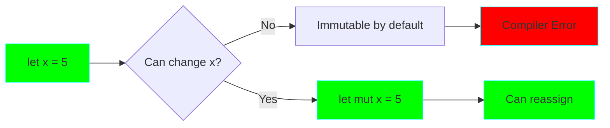
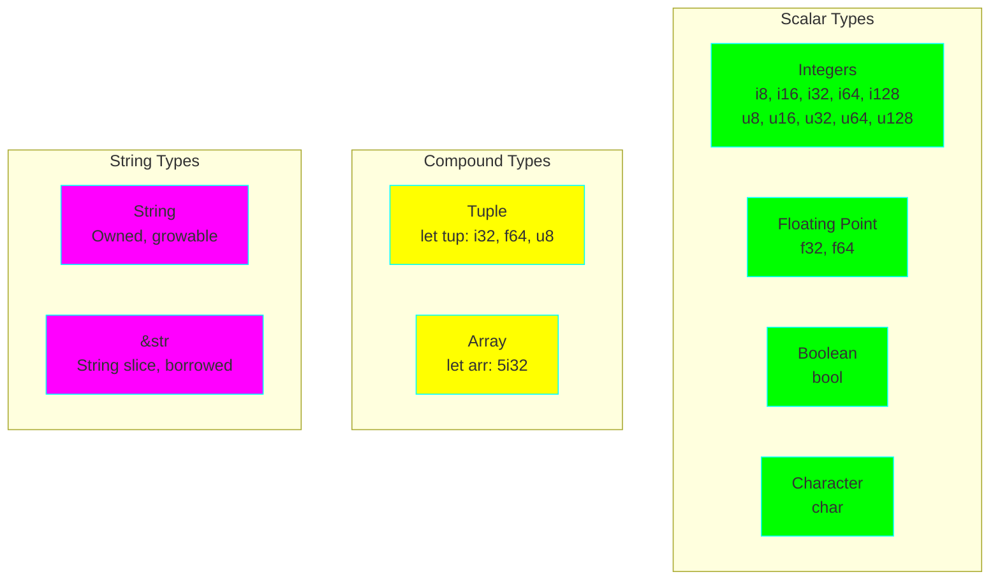
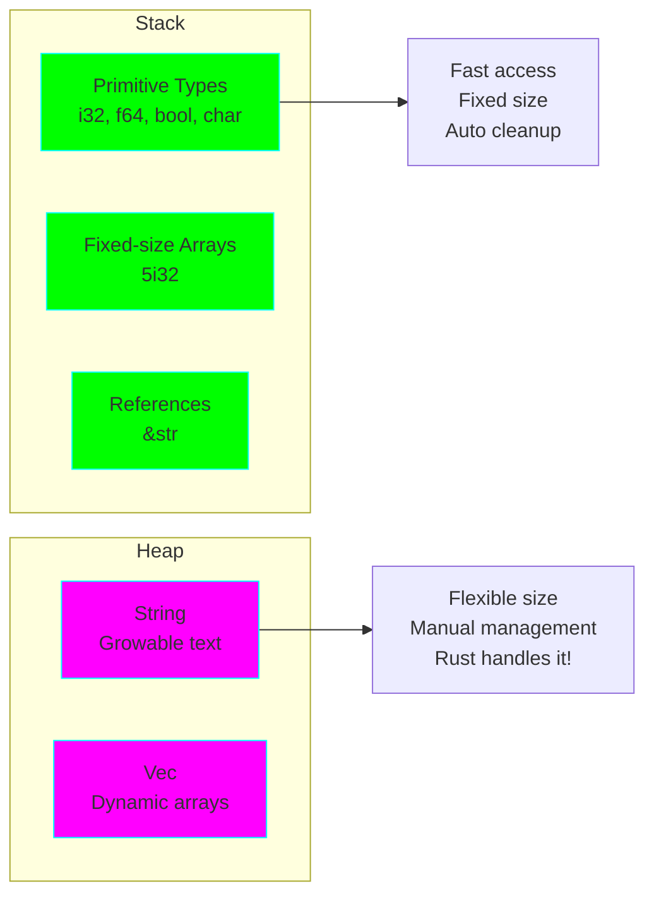
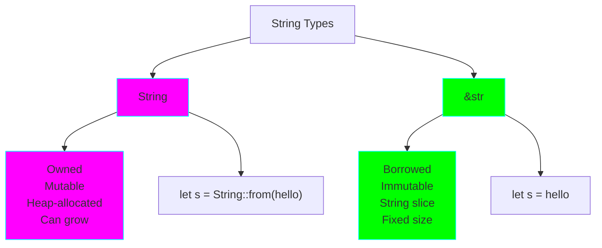

# Project 01: Hello Rust - Variables & Types

**Difficulty:** ⭐ Beginner
**Estimated Time:** 3-5 hours
**Prerequisites:** None - Start here!

## 🎯 Learning Objectives

By the end of this project, you will understand:

- ✅ Rust's basic syntax and program structure
- ✅ Variable declarations and mutability
- ✅ Primitive data types (integers, floats, booleans, chars)
- ✅ Type inference and explicit typing
- ✅ Functions and control flow (if/else, loops)
- ✅ String types (String vs &str)
- ✅ Compound types (tuples and arrays)

## 📚 Core Concepts

### 1. Variables and Mutability

In Rust, variables are **immutable by default**. This is a key design choice that helps prevent bugs.



**Key Insight:** Immutability by default encourages safer code. You must explicitly opt-in to mutability with `mut`.

### 2. Type System

Rust is **statically typed** with powerful **type inference**.



### 3. Memory Model Preview

Understanding where data lives is crucial in Rust:



## 🔬 Detailed Explanations

### Variables: Immutable vs Mutable

**Immutable (Default):**
```rust
let x = 5;  // x cannot be changed
// x = 6;   // This would cause a compile error!
```

**Why immutable by default?**
- Prevents accidental changes
- Makes code easier to reason about
- Enables compiler optimizations
- Safer concurrent code (we'll see this later)

**Mutable (Explicit):**
```rust
let mut y = 5;  // y can be changed
y = 6;          // This is fine!
```

**Shadowing:**
```rust
let x = 5;
let x = x + 1;  // New variable, same name
let x = x * 2;  // Another new variable
// x is now 12
```

**When to use each:**
- **Immutable:** Default choice for most variables
- **Mutable:** When you need to change a value in place (counters, accumulators)
- **Shadowing:** When transforming a value through stages or changing its type

### Integer Types

Rust has multiple integer types for different use cases:

| Length | Signed | Unsigned |
|--------|--------|----------|
| 8-bit | i8 | u8 |
| 16-bit | i16 | u16 |
| 32-bit | i32 (default) | u32 |
| 64-bit | i64 | u64 |
| 128-bit | i128 | u128 |
| arch | isize | usize |

**Signed vs Unsigned:**
- **Signed (i):** Can be positive or negative (-128 to 127 for i8)
- **Unsigned (u):** Only positive (0 to 255 for u8)

**Which to choose?**
- **i32:** Default, good for most cases
- **usize:** For indexing collections (size of memory addresses)
- **u8:** For bytes, RGB values, small positive numbers
- **i64:** For large numbers, timestamps

**Number Literals:**
```rust
let decimal = 98_222;        // Underscores for readability
let hex = 0xff;              // Hexadecimal
let octal = 0o77;            // Octal
let binary = 0b1111_0000;    // Binary
let byte = b'A';             // Byte (u8 only)
```

### Floating-Point Types

Rust has two floating-point types:
- **f32:** 32-bit, single precision
- **f64:** 64-bit, double precision (default)

```rust
let x = 2.0;      // f64 (default)
let y: f32 = 3.0; // f32 (explicit)
```

**Nuance:** Floating-point arithmetic can be imprecise due to how computers represent decimals.

```rust
let result = 0.1 + 0.2;
// result is 0.30000000000000004 (not exactly 0.3!)
```

### Boolean Type

Simple true/false values:

```rust
let t = true;
let f: bool = false;
```

**Common uses:**
- Conditions in if statements
- Loop continuation flags
- State toggles

### Character Type

Rust's `char` type is 4 bytes and represents a Unicode Scalar Value:

```rust
let c = 'z';
let z = 'ℤ';
let heart = '😻';
```

**Important:** `char` is different from a string! It's a single Unicode character.

### Tuple Type

Group multiple values of different types:

```rust
let tup: (i32, f64, u8) = (500, 6.4, 1);

// Destructuring
let (x, y, z) = tup;

// Access by index
let first = tup.0;
let second = tup.1;
```

**Use cases:**
- Returning multiple values from functions
- Grouping related but different types
- Fixed-size heterogeneous collections

### Array Type

Fixed-length collection of the same type:

```rust
let arr: [i32; 5] = [1, 2, 3, 4, 5];

// Initialize with same value
let zeros = [0; 10];  // [0, 0, 0, 0, 0, 0, 0, 0, 0, 0]

// Access elements
let first = arr[0];
let second = arr[1];
```

**Arrays vs Vectors:**
- **Array:** Fixed size, stack-allocated, fast
- **Vector:** Dynamic size, heap-allocated (we'll learn in Project 04)

### String vs &str

This is one of Rust's most confusing concepts for beginners:



**String:**
```rust
let mut s = String::from("hello");
s.push_str(", world!");  // Can be modified
```

**&str (string slice):**
```rust
let s = "hello, world!";  // String literal, stored in binary
```

**When to use:**
- **String:** When you need to own and modify text
- **&str:** For string literals or when borrowing text (more in Project 02)

### Functions

Functions are the building blocks of Rust programs:

```rust
fn function_name(param1: Type1, param2: Type2) -> ReturnType {
    // Function body
    // Last expression is returned (no semicolon)
}
```

**Example:**
```rust
fn add(a: i32, b: i32) -> i32 {
    a + b  // No semicolon = return value
}

fn greet(name: &str) {
    println!("Hello, {}!", name);  // No return value
}
```

**Key points:**
- Must specify parameter types
- Must specify return type (unless no return)
- Last expression without semicolon is returned
- Early returns use `return` keyword

### Control Flow

**If Expressions:**
```rust
let number = 6;

if number % 4 == 0 {
    println!("divisible by 4");
} else if number % 3 == 0 {
    println!("divisible by 3");
} else {
    println!("not divisible by 4 or 3");
}
```

**If as an expression:**
```rust
let condition = true;
let number = if condition { 5 } else { 6 };
```

**Loops:**

```rust
// Infinite loop
loop {
    // Break to exit
    break;
}

// While loop
while condition {
    // Code
}

// For loop
for element in array.iter() {
    // Code
}

// Range-based for
for number in 1..4 {  // 1, 2, 3 (4 is exclusive)
    println!("{}", number);
}
```

## 💻 Code Examples

See `src/main.rs` for comprehensive examples covering all concepts.

## 🏋️ Exercises

### Exercise 1: Temperature Converter
Write a program that converts temperatures between Fahrenheit and Celsius.

**Hint:**
- Celsius to Fahrenheit: (C × 9/5) + 32
- Fahrenheit to Celsius: (F - 32) × 5/9

### Exercise 2: Fibonacci Numbers
Generate the first n Fibonacci numbers using a loop.

### Exercise 3: Type Explorer
Create variables of each primitive type and print them with their sizes using `std::mem::size_of::<Type>()`.

### Exercise 4: Array Operations
Write functions to:
- Find the sum of an array
- Find the maximum value
- Reverse an array (return a new one)

### Exercise 5: String Manipulation
Create a function that takes a &str and returns a String with:
- First letter capitalized
- Rest in lowercase

## 🎯 Practice Challenges

1. **FizzBuzz:** Print numbers 1-100, but:
   - "Fizz" for multiples of 3
   - "Buzz" for multiples of 5
   - "FizzBuzz" for multiples of both

2. **Prime Checker:** Write a function that checks if a number is prime.

3. **ASCII Art:** Use nested loops to print patterns (triangle, square, diamond).

4. **Calculator:** Build a simple calculator with functions for +, -, ×, ÷.

## 🔍 Common Mistakes & Gotchas

### 1. Integer Overflow
```rust
let x: u8 = 255;
// let y = x + 1;  // Panic in debug mode!
```

**Solution:** Use checked arithmetic or larger types:
```rust
let y = x.checked_add(1);  // Returns Option<u8>
```

### 2. Type Mismatch
```rust
let x = 5;      // i32
let y = 5.0;    // f64
// let z = x + y;  // Error! Can't add i32 and f64
```

**Solution:** Cast explicitly:
```rust
let z = x as f64 + y;
```

### 3. Forgetting mut
```rust
let x = 5;
// x = 6;  // Error!
```

**Solution:** Use `let mut`:
```rust
let mut x = 5;
x = 6;  // OK!
```

### 4. Shadowing Confusion
```rust
let x = 5;
let x = "hello";  // Different type, same name - this is OK!
```

**Remember:** Shadowing creates a NEW variable; it doesn't modify the old one.

## 🚀 Going Further

After mastering these concepts:

1. **Read Chapters 1-3** of [The Rust Book](https://doc.rust-lang.org/book/)
2. **Experiment** with the [Rust Playground](https://play.rust-lang.org/)
3. **Try Exercism** [Rust Track](https://exercism.org/tracks/rust) exercises
4. **Explore** the standard library docs for primitive types

## ✅ Checklist

Before moving to Project 02, make sure you can:

- [ ] Explain the difference between `let` and `let mut`
- [ ] Choose appropriate integer types for different scenarios
- [ ] Understand when to use String vs &str
- [ ] Write functions with parameters and return values
- [ ] Use if/else and loops effectively
- [ ] Access tuple and array elements
- [ ] Explain what type inference is
- [ ] Read and understand basic compiler errors

## 📝 Key Takeaways

1. **Immutability by default** makes code safer and easier to reason about
2. **Type inference** is powerful, but explicit types can improve clarity
3. **String vs &str** is your first encounter with ownership (more in Project 02!)
4. **Fixed-size types** (arrays, tuples) live on the stack
5. **Rust's compiler** is strict but helpful - read error messages carefully!

---

**Next:** [Project 02: Ownership & Borrowing](../02-ownership-borrowing/README.md)

Ready to tackle Rust's most unique feature? Let's go! 🦀
