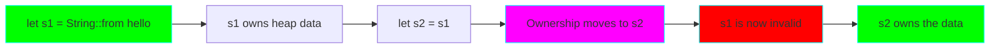

# Project 02: Ownership & Borrowing

**Difficulty:** ⭐⭐ Beginner-Intermediate
**Estimated Time:** 6-8 hours
**Prerequisites:** Project 01

## 🎯 Learning Objectives

- ✅ Understand Rust's ownership system and memory management
- ✅ Master borrowing rules (immutable & mutable references)
- ✅ Learn about lifetimes and the borrow checker
- ✅ Understand move semantics vs copy semantics
- ✅ Work with slices and string slices
- ✅ Avoid common ownership pitfalls

## 📚 Core Concepts

### 1. Ownership Rules

Rust's ownership system is its most unique feature. It enables memory safety without garbage collection.


### 2. Move Semantics



### 3. Borrowing System


### 4. The Borrow Checker


## 🔬 Detailed Explanations

### Ownership in Depth

**Why ownership matters:**
- **No garbage collection:** Zero runtime overhead
- **Memory safety:** Prevents use-after-free, double-free
- **Thread safety:** Prevents data races at compile time

**Stack vs Heap:**

```rust
// Stack: Fixed size, fast, auto cleanup
let x = 5;  // i32 stored on stack

// Heap: Dynamic size, slower, manual cleanup (Rust automates this!)
let s = String::from("hello");  // Data on heap, pointer on stack
```

**Copy vs Move:**

```rust
// Copy (stack-only data): i32, f64, bool, char, tuples of Copy types
let x = 5;
let y = x;  // x is copied, both valid
println!("{}, {}", x, y);  // OK!

// Move (heap data): String, Vec, custom types
let s1 = String::from("hello");
let s2 = s1;  // s1 is moved, s1 now invalid
// println!("{}", s1);  // ERROR!
println!("{}", s2);  // OK
```

### Borrowing Rules

**Immutable References (&T):**
- Can have multiple immutable references
- Cannot modify the value
- Original owner cannot modify while borrowed

```rust
let s = String::from("hello");
let r1 = &s;  // OK
let r2 = &s;  // OK - multiple immutable refs
println!("{}, {}", r1, r2);
```

**Mutable References (&mut T):**
- Can only have ONE mutable reference in a scope
- Cannot have immutable refs while mutable ref exists
- Can modify the value

```rust
let mut s = String::from("hello");
let r1 = &mut s;  // OK
// let r2 = &mut s;  // ERROR - can't have two mutable refs!
r1.push_str(", world");
```

**The Rules (Enforced at Compile Time):**
1. At any time, you can have EITHER:
   - One mutable reference, OR
   - Any number of immutable references
2. References must always be valid (no dangling pointers)

### Lifetimes

Lifetimes ensure references are always valid:

```rust
// Explicit lifetime annotation
fn longest<'a>(x: &'a str, y: &'a str) -> &'a str {
    if x.len() > y.len() { x } else { y }
}

// The 'a lifetime says: "the returned reference
// lives as long as the shorter of x or y"
```

**Common lifetime scenarios:**
- Function parameters and returns
- Struct fields that hold references
- Most of the time, lifetimes are inferred!

### Slices

Slices let you reference a contiguous sequence without taking ownership:

```rust
let s = String::from("hello world");
let hello = &s[0..5];    // String slice
let world = &s[6..11];

let arr = [1, 2, 3, 4, 5];
let slice = &arr[1..3];  // Array slice: &[i32]
```

## 💻 Code Examples

See `src/main.rs` for comprehensive examples.

## 🏋️ Exercises

### Exercise 1: Fix the Ownership Errors
Debug these code snippets:
```rust
// 1. Move error
let s1 = String::from("hello");
let s2 = s1;
println!("{}", s1);  // Fix this!

// 2. Borrowing error
let mut s = String::from("hello");
let r1 = &s;
let r2 = &mut s;  // Fix this!
println!("{}, {}", r1, r2);
```

### Exercise 2: Implement a String Processor
Write a function that takes a string slice and returns:
- The first word
- Without taking ownership

### Exercise 3: Vector Ownership
Write functions that:
- Take ownership of a Vec and return it modified
- Borrow a Vec mutably and modify in place
- Borrow a Vec immutably and return a computed value

### Exercise 4: Reference Counting
Research `Rc<T>` and `Arc<T>` and explain when you'd use them.

## 🚀 Going Further

- Read Chapter 4 of The Rust Book (Ownership)
- Read Chapter 10.3 (Lifetimes)
- Explore `Rc`, `Arc`, `RefCell` for shared ownership

## ✅ Checklist

- [ ] Explain the three ownership rules
- [ ] Understand when values are moved vs copied
- [ ] Know the borrowing rules by heart
- [ ] Can fix borrow checker errors
- [ ] Understand what lifetimes are (basics)
- [ ] Know how to use slices effectively

## 📝 Key Takeaways

1. **Ownership = automatic memory management** without GC overhead
2. **Borrow checker** prevents memory bugs at compile time
3. **References don't take ownership**, they borrow
4. **One mutable XOR many immutable** references
5. **The compiler is your friend** - read error messages!

---

**Next:** [Project 03: Error Handling CLI Tool](../03-error-handling-cli/README.md)
