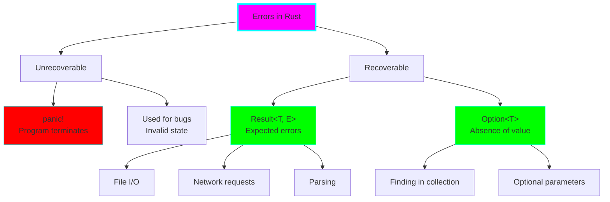
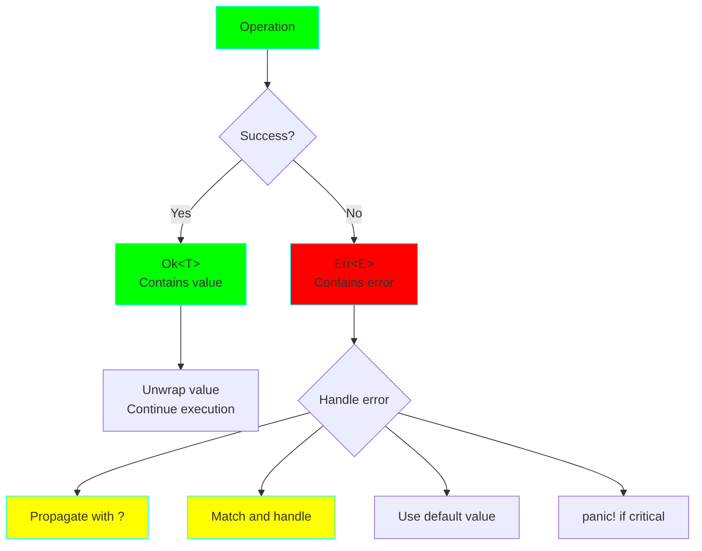
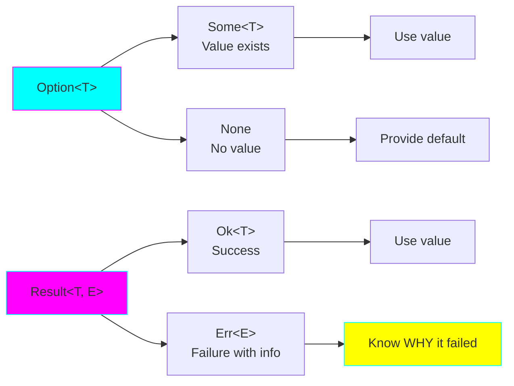
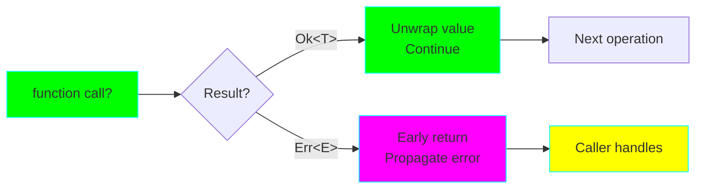
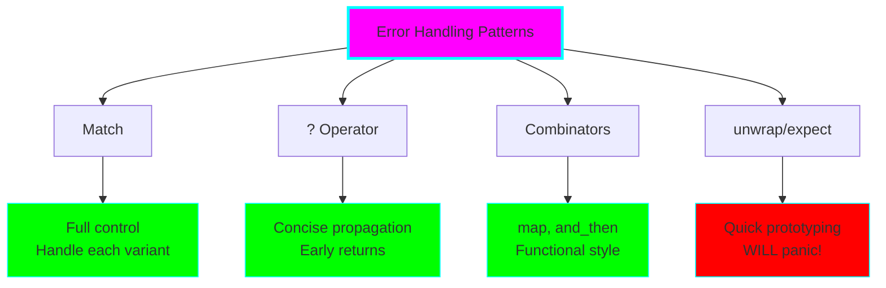

# Project 03: Error Handling & CLI Tool

**Difficulty:** ⭐⭐ Beginner-Intermediate
**Estimated Time:** 6-8 hours
**Prerequisites:** Projects 01 & 02

## 🎯 Learning Objectives

By the end of this project, you will understand:

- ✅ Result<T, E> and Option<T> types for error handling
- ✅ The `?` operator for error propagation
- ✅ Custom error types and error handling patterns
- ✅ Using `anyhow` and `thiserror` crates
- ✅ Building CLI tools with argument parsing
- ✅ panic! vs recoverable errors
- ✅ Combinators: map, and_then, unwrap_or, etc.

## 📚 Core Concepts

### 1. Error Handling Philosophy

Rust's approach to error handling is explicit and type-safe:



### 2. Result<T, E> Flow



### 3. Option<T> vs Result<T, E>



### 4. The ? Operator



### 5. Error Handling Patterns



## 🔬 Detailed Explanations

### Result<T, E> in Depth

Result is an enum with two variants:

```rust
enum Result<T, E> {
    Ok(T),   // Success with value of type T
    Err(E),  // Failure with error of type E
}
```

**Common operations:**

```rust
// Creating Results
let success: Result<i32, String> = Ok(42);
let failure: Result<i32, String> = Err("something went wrong".to_string());

// Pattern matching
match divide(10, 2) {
    Ok(result) => println!("Result: {}", result),
    Err(e) => println!("Error: {}", e),
}

// Using ? operator (propagates error)
fn process() -> Result<i32, String> {
    let value = might_fail()?;  // Returns Err early if fails
    Ok(value * 2)
}
```

**When to use Result:**
- File I/O operations
- Network requests
- Parsing user input
- Any operation that might fail in expected ways

### Option<T> in Depth

Option represents the presence or absence of a value:

```rust
enum Option<T> {
    Some(T),  // Value exists
    None,     // No value
}
```

**Common uses:**

```rust
// Finding in a collection
let numbers = vec![1, 2, 3];
let first = numbers.get(0);  // Some(&1)
let tenth = numbers.get(10); // None

// Optional function parameters
fn greet(name: Option<&str>) {
    match name {
        Some(n) => println!("Hello, {}!", n),
        None => println!("Hello, stranger!"),
    }
}
```

**When to use Option:**
- Optional function parameters
- Searching/finding operations
- Values that may or may not exist
- Avoiding null pointer issues

### The ? Operator

The `?` operator is syntactic sugar for error propagation:

```rust
// Without ?
fn read_file() -> Result<String, std::io::Error> {
    let file = match File::open("test.txt") {
        Ok(f) => f,
        Err(e) => return Err(e),
    };

    let mut contents = String::new();
    match file.read_to_string(&mut contents) {
        Ok(_) => Ok(contents),
        Err(e) => Err(e),
    }
}

// With ? (much cleaner!)
fn read_file() -> Result<String, std::io::Error> {
    let mut file = File::open("test.txt")?;
    let mut contents = String::new();
    file.read_to_string(&mut contents)?;
    Ok(contents)
}
```

**Rules for ?:**
- Can only be used in functions returning `Result` or `Option`
- Automatically converts error types if compatible
- Makes error handling concise and readable

### Custom Error Types

For complex applications, define custom error types:

```rust
use std::fmt;

#[derive(Debug)]
enum MyError {
    IoError(std::io::Error),
    ParseError(String),
    NotFound,
}

impl fmt::Display for MyError {
    fn fmt(&self, f: &mut fmt::Formatter) -> fmt::Result {
        match self {
            MyError::IoError(e) => write!(f, "I/O error: {}", e),
            MyError::ParseError(s) => write!(f, "Parse error: {}", s),
            MyError::NotFound => write!(f, "Not found"),
        }
    }
}

impl std::error::Error for MyError {}
```

### Using anyhow and thiserror

**anyhow** - For application code (easy error handling):

```rust
use anyhow::{Result, Context};

fn process_file(path: &str) -> Result<String> {
    let content = std::fs::read_to_string(path)
        .context(format!("Failed to read file: {}", path))?;

    let parsed = parse_content(&content)
        .context("Failed to parse content")?;

    Ok(parsed)
}
```

**thiserror** - For library code (structured errors):

```rust
use thiserror::Error;

#[derive(Error, Debug)]
pub enum DataError {
    #[error("Invalid format: {0}")]
    InvalidFormat(String),

    #[error("IO error")]
    Io(#[from] std::io::Error),

    #[error("Not found")]
    NotFound,
}
```

### Combinators

Transform Options and Results without explicit matching:

```rust
// map: Transform the value if present
let num: Option<i32> = Some(5);
let doubled = num.map(|n| n * 2);  // Some(10)

// and_then: Chain operations that return Option/Result
let result = parse_int("42")
    .and_then(|n| divide(100, n))
    .map(|n| n + 1);

// unwrap_or: Provide a default value
let value = some_option.unwrap_or(0);

// ok_or: Convert Option to Result
let result: Result<i32, &str> = Some(5).ok_or("No value");
```

### panic! vs Recoverable Errors

**Use panic! when:**
- There's a bug in your code
- The program is in an invalid state
- Continuing would be dangerous
- During prototyping/testing

**Use Result when:**
- Error is expected and recoverable
- Caller should decide how to handle
- Building libraries
- Production code

```rust
// panic! - for programmer errors
fn get_item(index: usize, items: &[i32]) -> i32 {
    if index >= items.len() {
        panic!("Index out of bounds!");  // Bug in caller's code
    }
    items[index]
}

// Result - for expected errors
fn read_config(path: &str) -> Result<Config, std::io::Error> {
    // File might not exist - that's expected, return Result
    std::fs::read_to_string(path)?;
    // ...
}
```

### Building CLI Tools

Use `std::env::args()` for simple CLIs:

```rust
use std::env;

fn main() {
    let args: Vec<String> = env::args().collect();

    if args.len() < 2 {
        eprintln!("Usage: {} <filename>", args[0]);
        std::process::exit(1);
    }

    let filename = &args[1];
    // Process file...
}
```

For more complex CLIs, use the `clap` crate (not covered in this project).

## 💻 Code Examples

See `src/main.rs` for comprehensive examples covering:
- Option and Result basics
- Error propagation with ?
- Custom error types
- anyhow and thiserror usage
- Combinators
- Building a simple CLI tool

## 🏋️ Exercises

### Exercise 1: Safe Division
Write a function that safely divides two numbers:
```rust
fn safe_divide(a: i32, b: i32) -> Result<i32, String> {
    // Return Err if b is 0
    // Return Ok(a / b) otherwise
}
```

### Exercise 2: Parse and Validate
Write a function that:
- Takes a string
- Parses it as a number
- Validates it's between 1 and 100
- Returns Result with appropriate error messages

### Exercise 3: File Reader
Create a program that:
- Takes a filename as CLI argument
- Reads the file
- Counts the number of lines
- Handles all errors gracefully with helpful messages

### Exercise 4: Custom Error Type
Create a custom error type for a user validation system:
- `InvalidEmail` - email format is wrong
- `TooShort` - username too short
- `TooLong` - username too long
Implement Display and Error traits.

### Exercise 5: Option Combinators
Given `Option<String>`, use combinators to:
- Convert to uppercase
- Get the first 5 characters
- Provide a default if None
Do this in a single chain without unwrap.

## 🎯 Practice Challenges

1. **Configuration Parser:**
   - Read a config file (key=value format)
   - Parse it into a HashMap
   - Handle missing file, invalid format, duplicate keys
   - Use custom error types

2. **CLI Calculator:**
   - Accept operation and numbers as arguments
   - Support +, -, ×, ÷
   - Handle invalid operations and division by zero
   - Use anyhow for errors

3. **JSON Validator:**
   - Read a JSON file
   - Validate required fields exist
   - Check value types
   - Return detailed error messages

4. **Multiple File Processor:**
   - Accept multiple filenames
   - Process each file
   - Collect all errors (don't stop on first)
   - Report which files succeeded/failed

## 🔍 Common Mistakes & Gotchas

### 1. Overusing unwrap()
```rust
// DON'T: Will panic if file doesn't exist
let content = std::fs::read_to_string("file.txt").unwrap();

// DO: Handle the error
let content = std::fs::read_to_string("file.txt")
    .expect("Config file should exist");
// Or better: propagate with ?
```

### 2. Ignoring Error Types
```rust
// DON'T: Losing error information
let result = some_operation().ok();  // Converts Result to Option

// DO: Keep the error information
let result = some_operation()?;  // Propagate the actual error
```

### 3. Not Using ? Operator
```rust
// DON'T: Verbose and error-prone
match operation1() {
    Ok(v1) => match operation2(v1) {
        Ok(v2) => match operation3(v2) {
            Ok(v3) => Ok(v3),
            Err(e) => Err(e),
        },
        Err(e) => Err(e),
    },
    Err(e) => Err(e),
}

// DO: Use ? operator
let v1 = operation1()?;
let v2 = operation2(v1)?;
let v3 = operation3(v2)?;
Ok(v3)
```

### 4. Wrong Error Type for Context
```rust
// Library code: Use thiserror for structured errors
#[derive(Error, Debug)]
pub enum LibError {
    #[error("Parse failed")]
    ParseError,
}

// Application code: Use anyhow for easy handling
use anyhow::Result;
fn main() -> Result<()> {
    // Can work with any error type
    Ok(())
}
```

## 🚀 Going Further

After mastering error handling:

1. **Read Chapter 9** of [The Rust Book](https://doc.rust-lang.org/book/ch09-00-error-handling.html)
2. **Explore crates:**
   - `anyhow` - Easy error handling for applications
   - `thiserror` - Derive macros for error types
   - `clap` - Full-featured CLI argument parsing
   - `color-eyre` - Beautiful error reports
3. **Learn about:**
   - Error trait and error chains
   - Backtrace support
   - Custom error contexts

## ✅ Checklist

Before moving to Project 04, make sure you can:

- [ ] Explain the difference between Option and Result
- [ ] Use the ? operator effectively
- [ ] Create custom error types
- [ ] Use map, and_then, and other combinators
- [ ] Decide when to use panic! vs Result
- [ ] Handle errors from multiple sources
- [ ] Build a simple CLI tool
- [ ] Use anyhow or thiserror appropriately
- [ ] Write helpful error messages

## 📝 Key Takeaways

1. **Result and Option** encode success/failure in the type system
2. **The ? operator** makes error propagation clean and readable
3. **Custom error types** provide context and structure
4. **anyhow** for apps, **thiserror** for libraries
5. **Combinators** enable functional-style error handling
6. **Don't overuse unwrap()** - handle errors properly
7. **Error messages** should be helpful to users

---

**Next:** [Project 04: Collections & Data Processing](../04-collections-processing/README.md)

Ready to master Rust's powerful collections and iterators? Let's continue! 🦀
