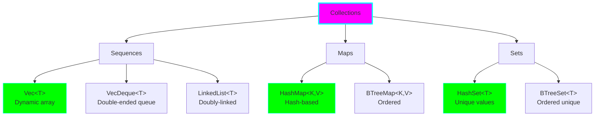
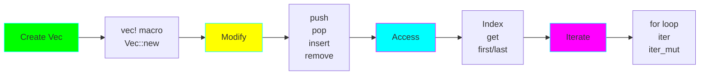
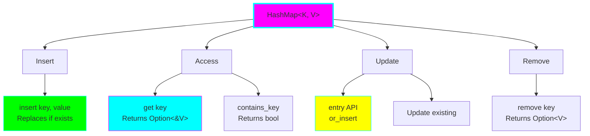
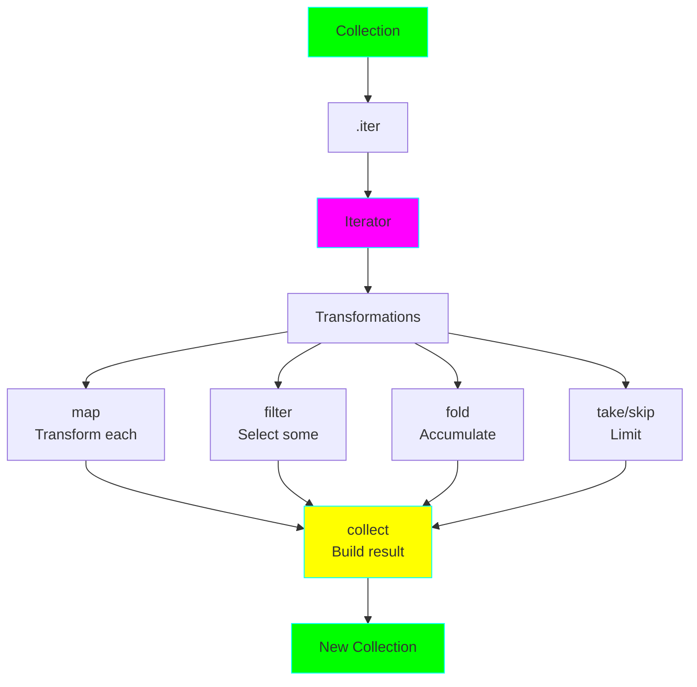
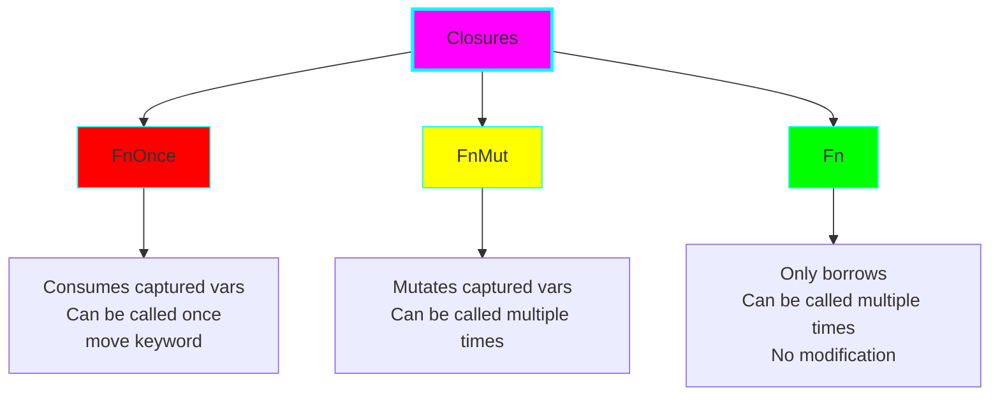

# Project 04: Collections & Data Processing

**Difficulty:** ⭐⭐⭐ Intermediate
**Estimated Time:** 8-10 hours
**Prerequisites:** Projects 01, 02, 03

## 🎯 Learning Objectives

By the end of this project, you will understand:

- ✅ Vec<T> - dynamic arrays and vector operations
- ✅ HashMap<K, V> and HashSet<T> for key-value storage and unique sets
- ✅ Iterator trait and lazy evaluation
- ✅ Iterator combinators: map, filter, fold, collect, etc.
- ✅ Closures and capture modes (move, borrow, mut borrow)
- ✅ Chaining operations for data transformation pipelines
- ✅ Performance considerations and when to use each collection

## 📚 Core Concepts

### 1. Collections Overview



### 2. Vec<T> Operations Flow



### 3. HashMap<K, V> Operations



### 4. Iterator Pattern



### 5. Closure Capture Modes



### 6. Data Processing Pipeline


## 🔬 Detailed Explanations

### Vec<T> in Depth

Vec is Rust's most commonly used collection - a growable array:

```rust
// Creating vectors
let v1: Vec<i32> = Vec::new();
let v2 = vec![1, 2, 3, 4, 5];
let v3 = Vec::with_capacity(10);  // Pre-allocate space

// Adding elements
let mut v = Vec::new();
v.push(1);
v.push(2);
v.push(3);

// Accessing elements
let third = v[2];           // Panics if out of bounds
let third = v.get(2);       // Returns Option<&i32>

// Modifying
v[0] = 10;
v.pop();                    // Removes last element
v.insert(1, 100);          // Insert at index
v.remove(0);               // Remove at index

// Iteration
for item in &v {            // Immutable borrow
    println!("{}", item);
}

for item in &mut v {        // Mutable borrow
    *item *= 2;
}
```

**When to use Vec:**
- Dynamic arrays that grow/shrink
- When you need indexed access
- Most common collection choice
- Default for lists of items

**Performance:**
- O(1) indexed access
- O(1) amortized push to end
- O(n) insert/remove in middle
- Contiguous memory (cache-friendly)

### HashMap<K, V> in Depth

HashMap stores key-value pairs with fast lookups:

```rust
use std::collections::HashMap;

// Creating
let mut scores = HashMap::new();

// Inserting
scores.insert("Blue", 10);
scores.insert("Red", 50);

// Accessing
let score = scores.get("Blue");  // Option<&i32>

// Checking existence
if scores.contains_key("Blue") {
    println!("Blue team exists");
}

// Updating
scores.insert("Blue", 25);  // Replaces old value

// Insert only if key doesn't exist
scores.entry("Yellow").or_insert(50);

// Update based on old value
let score = scores.entry("Blue").or_insert(0);
*score += 10;

// Iteration
for (key, value) in &scores {
    println!("{}: {}", key, value);
}
```

**When to use HashMap:**
- Fast lookups by key
- Key-value associations
- Counting occurrences
- Caching results

**Performance:**
- O(1) average insert/lookup/delete
- O(n) worst case (rare)
- No ordering guarantee

### HashSet<T> in Depth

HashSet stores unique values:

```rust
use std::collections::HashSet;

let mut set = HashSet::new();

// Adding
set.insert(1);
set.insert(2);
set.insert(2);  // Duplicate - won't be added

// Checking
if set.contains(&1) {
    println!("Has 1");
}

// Set operations
let a: HashSet<_> = [1, 2, 3].iter().collect();
let b: HashSet<_> = [2, 3, 4].iter().collect();

let union: HashSet<_> = a.union(&b).collect();
let intersection: HashSet<_> = a.intersection(&b).collect();
let difference: HashSet<_> = a.difference(&b).collect();
```

**When to use HashSet:**
- Ensure uniqueness
- Fast membership testing
- Set operations (union, intersection)
- Removing duplicates

### Iterators - The Rust Way

Iterators are lazy and composable:

```rust
let numbers = vec![1, 2, 3, 4, 5, 6];

// Lazy - nothing happens yet
let iter = numbers.iter()
    .filter(|&&x| x % 2 == 0)
    .map(|&x| x * x);

// Now it executes
let result: Vec<i32> = iter.collect();
// result: [4, 16, 36]
```

**Common iterator methods:**

**Consumers (execute the iterator):**
- `collect()` - Build a collection
- `fold()` - Accumulate a value
- `sum()`, `product()` - Math operations
- `any()`, `all()` - Boolean tests
- `find()` - Find first matching
- `count()` - Count items

**Adapters (transform the iterator):**
- `map()` - Transform each element
- `filter()` - Keep only matching
- `take()` - Limit to n items
- `skip()` - Skip n items
- `enumerate()` - Add indices
- `zip()` - Combine two iterators
- `flat_map()` - Map and flatten
- `chain()` - Concatenate iterators

### Closures

Closures are anonymous functions that can capture their environment:

```rust
// Basic closure
let add_one = |x| x + 1;
let result = add_one(5);  // 6

// Multiple parameters
let add = |x, y| x + y;
let sum = add(2, 3);  // 5

// Capturing environment
let multiplier = 2;
let multiply = |x| x * multiplier;  // Captures multiplier
let result = multiply(5);  // 10

// move keyword (takes ownership)
let text = String::from("hello");
let printer = move || println!("{}", text);
printer();  // text is now owned by closure
// println!("{}", text);  // Error: text was moved

// Closure types
fn apply_fn<F: Fn(i32) -> i32>(f: F, x: i32) -> i32 {
    f(x)
}

fn apply_fn_mut<F: FnMut(i32) -> i32>(mut f: F, x: i32) -> i32 {
    f(x)
}

fn apply_fn_once<F: FnOnce(i32) -> i32>(f: F, x: i32) -> i32 {
    f(x)
}
```

**Closure traits:**
- **Fn:** Borrows captured values immutably
- **FnMut:** Borrows captured values mutably
- **FnOnce:** Takes ownership of captured values

### Chaining Operations

The power of iterators comes from chaining:

```rust
let numbers = vec![1, 2, 3, 4, 5, 6, 7, 8, 9, 10];

let result: i32 = numbers.iter()
    .filter(|&&x| x % 2 == 0)      // [2, 4, 6, 8, 10]
    .map(|&x| x * x)                // [4, 16, 36, 64, 100]
    .take(3)                        // [4, 16, 36]
    .sum();                         // 56

println!("Result: {}", result);
```

**Real-world example:**
```rust
// Process text data
let words = "the quick brown fox jumps over the lazy dog";

let word_counts: HashMap<&str, usize> = words
    .split_whitespace()
    .fold(HashMap::new(), |mut acc, word| {
        *acc.entry(word).or_insert(0) += 1;
        acc
    });
```

### Performance Considerations

**Vec vs other collections:**
```rust
// Vec: Best for most cases
let v = vec![1, 2, 3];  // Contiguous memory, cache-friendly

// VecDeque: When you need both ends
use std::collections::VecDeque;
let mut deque = VecDeque::new();
deque.push_front(1);
deque.push_back(2);

// LinkedList: Rarely needed (poor cache performance)
use std::collections::LinkedList;
let list = LinkedList::new();
```

**HashMap vs BTreeMap:**
```rust
use std::collections::{HashMap, BTreeMap};

// HashMap: Fast, unordered
let hash_map = HashMap::new();  // O(1) operations

// BTreeMap: Ordered, slightly slower
let btree_map = BTreeMap::new();  // O(log n) operations
```

**Collecting vs accumulating:**
```rust
// Collect: Creates new collection
let doubled: Vec<_> = vec![1, 2, 3].iter().map(|x| x * 2).collect();

// fold: Single accumulated value
let sum: i32 = vec![1, 2, 3].iter().fold(0, |acc, x| acc + x);
```

## 💻 Code Examples

See `src/main.rs` for comprehensive examples covering:
- Vec operations and manipulation
- HashMap and HashSet usage
- Iterator combinators
- Closures and capture modes
- Real-world data processing pipelines
- Performance comparisons

## 🏋️ Exercises

### Exercise 1: Vector Manipulation
Write functions that:
- Remove duplicates from a Vec (preserve order)
- Rotate a Vec left by n positions
- Partition a Vec into two Vecs based on a predicate

### Exercise 2: Word Frequency Counter
Create a program that:
- Takes a text string
- Counts frequency of each word
- Returns the top 5 most frequent words
- Use HashMap and iterators

### Exercise 3: Data Pipeline
Given a Vec of integers, use iterator chaining to:
- Filter out numbers less than 10
- Square each remaining number
- Take only the first 5
- Sum them

### Exercise 4: Custom Iterator
Implement a custom iterator that generates the Fibonacci sequence:
```rust
struct Fibonacci {
    curr: u32,
    next: u32,
}

impl Iterator for Fibonacci {
    type Item = u32;
    fn next(&mut self) -> Option<Self::Item> {
        // Your implementation
    }
}
```

### Exercise 5: Closure Practice
Write a function that:
- Takes a Vec<i32> and a closure
- Applies the closure to each element
- Returns a new Vec with results
```rust
fn map_vec<F>(vec: Vec<i32>, f: F) -> Vec<i32>
where
    F: Fn(i32) -> i32,
{
    // Your implementation
}
```

## 🎯 Practice Challenges

1. **Student Grade Analyzer:**
   - Store student names and grades in HashMap
   - Calculate average grade
   - Find students above average
   - Group students by grade range (A, B, C, etc.)

2. **Log File Parser:**
   - Read a log file (simulate with Vec of strings)
   - Count error messages
   - Find most common error type
   - Extract timestamps and sort by time

3. **Set Operations Tool:**
   - Create two HashSets from user input
   - Compute union, intersection, difference
   - Find symmetric difference
   - Check if one is subset of another

4. **Data Transformation Pipeline:**
   - Start with Vec of (String, i32) tuples
   - Filter by value
   - Transform strings to uppercase
   - Collect into HashMap
   - Use only iterator methods

## 🔍 Common Mistakes & Gotchas

### 1. Borrowing While Iterating
```rust
// DON'T: Can't modify while iterating
let mut v = vec![1, 2, 3];
for i in &v {
    v.push(*i);  // Error!
}

// DO: Collect indices first or use iter_mut
let mut v = vec![1, 2, 3];
let indices: Vec<_> = v.iter().map(|&x| x).collect();
for i in indices {
    v.push(i);
}
```

### 2. HashMap Ownership
```rust
// DON'T: Key is moved
let mut map = HashMap::new();
let key = String::from("hello");
map.insert(key, 10);
// println!("{}", key);  // Error: key was moved

// DO: Use &str or clone
let mut map = HashMap::new();
let key = String::from("hello");
map.insert(key.clone(), 10);
println!("{}", key);  // OK
```

### 3. Iterator Consumption
```rust
// DON'T: Iterator consumed
let v = vec![1, 2, 3];
let iter = v.iter();
let sum: i32 = iter.sum();
// let count = iter.count();  // Error: iter already consumed

// DO: Create new iterator or clone
let v = vec![1, 2, 3];
let sum: i32 = v.iter().sum();
let count = v.iter().count();  // OK
```

### 4. Unnecessary collect()
```rust
// DON'T: Wasteful intermediate collection
let sum: i32 = vec![1, 2, 3]
    .iter()
    .map(|x| x * 2)
    .collect::<Vec<_>>()  // Unnecessary
    .iter()
    .sum();

// DO: Chain directly
let sum: i32 = vec![1, 2, 3]
    .iter()
    .map(|x| x * 2)
    .sum();
```

### 5. Index Out of Bounds
```rust
// DON'T: May panic
let v = vec![1, 2, 3];
let x = v[10];  // Panic!

// DO: Use get()
let v = vec![1, 2, 3];
match v.get(10) {
    Some(&x) => println!("Value: {}", x),
    None => println!("Index out of bounds"),
}
```

## 🚀 Going Further

After mastering collections and iterators:

1. **Read Chapter 8** of [The Rust Book](https://doc.rust-lang.org/book/ch08-00-common-collections.html)
2. **Read Chapter 13** on [Iterators and Closures](https://doc.rust-lang.org/book/ch13-00-functional-features.html)
3. **Explore advanced collections:**
   - `BTreeMap` and `BTreeSet` for ordered data
   - `VecDeque` for double-ended queues
   - `BinaryHeap` for priority queues
4. **Learn about:**
   - Custom iterators
   - Iterator adapters
   - Parallel iterators with `rayon` crate

## ✅ Checklist

Before moving to Project 05, make sure you can:

- [ ] Create and manipulate Vecs confidently
- [ ] Use HashMap and HashSet effectively
- [ ] Chain iterator operations fluently
- [ ] Understand when to use map vs filter vs fold
- [ ] Write and use closures with different capture modes
- [ ] Avoid common borrowing issues with collections
- [ ] Choose the right collection for the task
- [ ] Write efficient data processing pipelines
- [ ] Understand iterator laziness

## 📝 Key Takeaways

1. **Vec is your default collection** - use it unless you need something specific
2. **Iterators are lazy** - nothing happens until you consume them
3. **Chaining is powerful** - compose operations for readable pipelines
4. **Closures capture environment** - understand Fn, FnMut, FnOnce
5. **HashMap for lookups**, HashSet for uniqueness
6. **avoid collect() when unnecessary** - work directly with iterators
7. **get() is safer than indexing** - returns Option instead of panicking

---

**Next:** [Project 05: Type System & Pattern Matching](../05-type-system-matching/README.md)

Ready to master Rust's powerful type system? Let's go! 🦀
