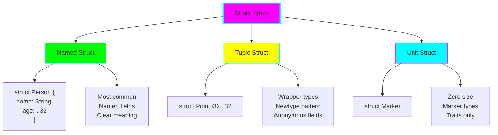
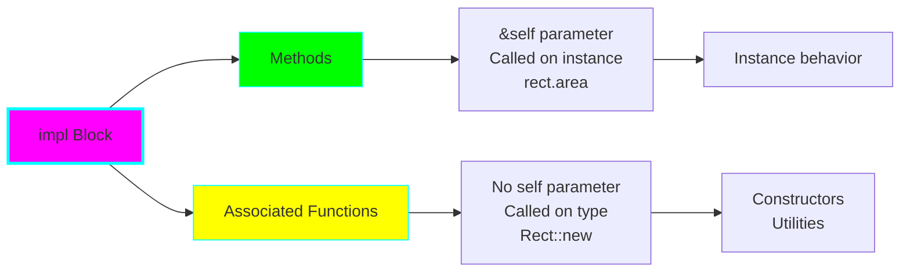
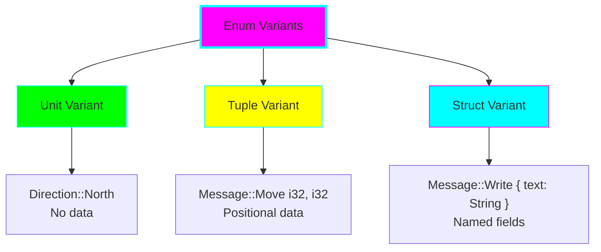
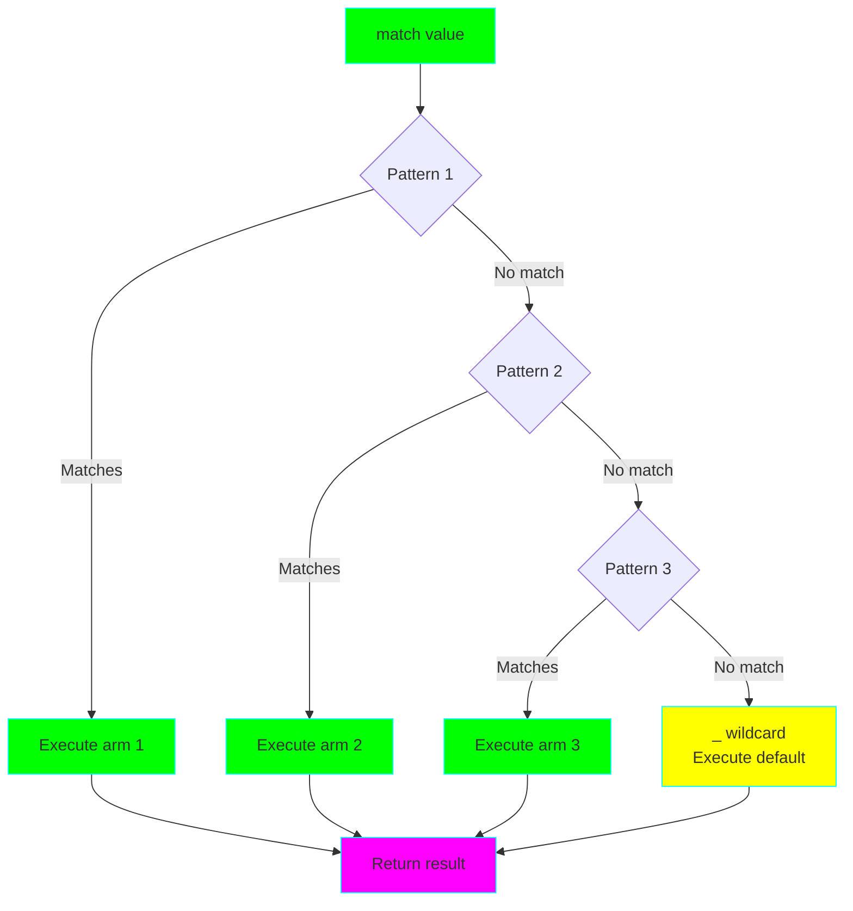
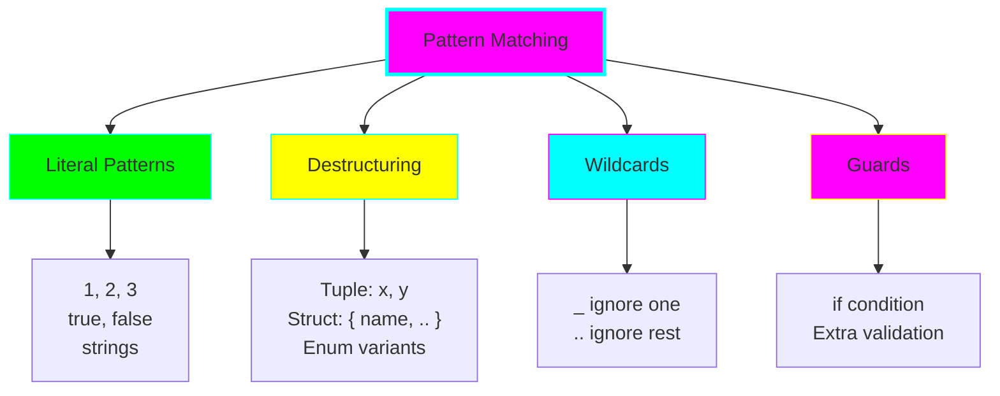
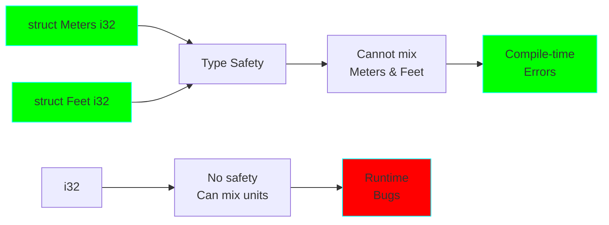

# Project 05: Type System & Pattern Matching

**Difficulty:** ⭐⭐⭐ Intermediate
**Estimated Time:** 8-10 hours
**Prerequisites:** Projects 01, 02, 03, 04

## 🎯 Learning Objectives

By the end of this project, you will understand:

- ✅ Struct types: named structs, tuple structs, unit structs
- ✅ Implementing methods and associated functions
- ✅ Enum types and variants with data
- ✅ Pattern matching with `match` expressions
- ✅ `if let` and `while let` for concise matching
- ✅ Destructuring patterns for structs, enums, and tuples
- ✅ Match guards and binding modes
- ✅ The newtype pattern and type safety

## 📚 Core Concepts

### 1. Struct Types



### 2. Methods vs Associated Functions



### 3. Enum Variants



### 4. Match Expression Flow



### 5. Pattern Matching Types



### 6. Type Safety with Newtypes



## 🔬 Detailed Explanations

### Structs - Organizing Data

Structs group related data together:

**Named Struct (most common):**
```rust
struct Person {
    name: String,
    age: u32,
    email: String,
}

// Creating instances
let person = Person {
    name: String::from("Alice"),
    age: 30,
    email: String::from("alice@example.com"),
};

// Field access
println!("{} is {} years old", person.name, person.age);

// Field shorthand
fn create_person(name: String, age: u32) -> Person {
    let email = format!("{}@example.com", name.to_lowercase());
    Person { name, age, email }  // Shorthand when variable name matches field
}

// Struct update syntax
let person2 = Person {
    name: String::from("Bob"),
    ..person  // Copy remaining fields from person
};
```

**Tuple Struct:**
```rust
struct Point(i32, i32);
struct Color(u8, u8, u8);

let origin = Point(0, 0);
let black = Color(0, 0, 0);

// Access by index
println!("x: {}, y: {}", origin.0, origin.1);
```

**Unit Struct:**
```rust
struct AlwaysEqual;

let subject = AlwaysEqual;
// Useful for traits without data
```

### Methods and Associated Functions

Methods are defined in `impl` blocks:

```rust
struct Rectangle {
    width: u32,
    height: u32,
}

impl Rectangle {
    // Associated function (constructor)
    fn new(width: u32, height: u32) -> Self {
        Rectangle { width, height }
    }

    // Method - takes &self
    fn area(&self) -> u32 {
        self.width * self.height
    }

    // Method - takes &mut self
    fn scale(&mut self, factor: u32) {
        self.width *= factor;
        self.height *= factor;
    }

    // Method - takes self (consumes)
    fn into_square(self) -> Rectangle {
        let size = std::cmp::max(self.width, self.height);
        Rectangle::new(size, size)
    }

    // Method with parameters
    fn can_hold(&self, other: &Rectangle) -> bool {
        self.width > other.width && self.height > other.height
    }
}

// Usage
let mut rect = Rectangle::new(30, 50);  // Associated function
let area = rect.area();                  // Method
rect.scale(2);                           // Mutating method
let square = rect.into_square();         // Consuming method
```

**When to use each:**
- **&self:** Read-only access to instance data
- **&mut self:** Modify instance data
- **self:** Transform/consume the instance
- **No self:** Constructor or utility function

### Enums - Type with Variants

Enums define a type that can be one of several variants:

```rust
// Simple enum
enum Direction {
    North,
    South,
    East,
    West,
}

// Enum with data
enum Message {
    Quit,                       // Unit variant
    Move { x: i32, y: i32 },    // Struct variant
    Write(String),              // Tuple variant
    ChangeColor(u8, u8, u8),    // Tuple variant
}

// Creating enum values
let msg1 = Message::Quit;
let msg2 = Message::Move { x: 10, y: 20 };
let msg3 = Message::Write(String::from("Hello"));
let msg4 = Message::ChangeColor(255, 0, 0);
```

**Why enums are powerful:**
- Each variant can have different types/amounts of data
- Exhaustive matching ensures you handle all cases
- More type-safe than using separate types or constants

### Pattern Matching with match

`match` is Rust's primary pattern matching construct:

```rust
enum Coin {
    Penny,
    Nickel,
    Dime,
    Quarter,
}

fn value_in_cents(coin: Coin) -> u8 {
    match coin {
        Coin::Penny => 1,
        Coin::Nickel => 5,
        Coin::Dime => 10,
        Coin::Quarter => 25,
    }
}

// Matching with data
enum Message {
    Move { x: i32, y: i32 },
    Write(String),
}

fn process_message(msg: Message) {
    match msg {
        Message::Move { x, y } => {
            println!("Move to ({}, {})", x, y);
        }
        Message::Write(text) => {
            println!("Write: {}", text);
        }
    }
}

// Matching Option and Result
fn divide(a: i32, b: i32) -> Option<i32> {
    if b == 0 {
        None
    } else {
        Some(a / b)
    }
}

match divide(10, 2) {
    Some(result) => println!("Result: {}", result),
    None => println!("Cannot divide by zero"),
}
```

**Match must be exhaustive:**
```rust
// This won't compile - missing None case!
let x = Some(5);
match x {
    Some(val) => println!("{}", val),
}

// Use _ for default case
match x {
    Some(val) => println!("{}", val),
    _ => println!("No value"),
}
```

### Destructuring Patterns

Extract data from complex types:

```rust
// Tuple destructuring
let point = (3, 5);
let (x, y) = point;

// Struct destructuring
struct Point { x: i32, y: i32 }
let p = Point { x: 0, y: 7 };

match p {
    Point { x: 0, y } => println!("On y-axis at {}", y),
    Point { x, y: 0 } => println!("On x-axis at {}", x),
    Point { x, y } => println!("On neither axis: ({}, {})", x, y),
}

// Shorthand
let Point { x, y } = p;

// Ignore parts
let Point { x, .. } = p;  // Only care about x

// Enum destructuring
enum Message {
    Move { x: i32, y: i32 },
    Write(String),
}

let msg = Message::Move { x: 10, y: 20 };
match msg {
    Message::Move { x, y } => println!("Move to ({}, {})", x, y),
    Message::Write(s) => println!("Write: {}", s),
}

// Nested destructuring
enum Event {
    Message(Message),
    Click { x: i32, y: i32 },
}

match Event::Message(Message::Write(String::from("hi"))) {
    Event::Message(Message::Write(text)) => println!("Text: {}", text),
    Event::Message(Message::Move { x, y }) => println!("Move: {}, {}", x, y),
    Event::Click { x, y } => println!("Click: {}, {}", x, y),
}
```

### Match Guards

Add extra conditions to patterns:

```rust
let num = Some(4);

match num {
    Some(x) if x < 5 => println!("Less than five: {}", x),
    Some(x) => println!("Five or more: {}", x),
    None => (),
}

// Multiple patterns with guard
let x = 4;
let y = false;

match x {
    4 | 5 | 6 if y => println!("yes"),  // Guard applies to all patterns
    _ => println!("no"),
}
```

### if let and while let

Concise pattern matching for single cases:

```rust
// Without if let (verbose)
let some_value = Some(3);
match some_value {
    Some(3) => println!("three"),
    _ => (),
}

// With if let (concise)
if let Some(3) = some_value {
    println!("three");
}

// if let with else
let some_value = Some(5);
if let Some(3) = some_value {
    println!("three");
} else {
    println!("not three");
}

// while let - loop while pattern matches
let mut stack = Vec::new();
stack.push(1);
stack.push(2);
stack.push(3);

while let Some(top) = stack.pop() {
    println!("{}", top);
}
```

### The Newtype Pattern

Wrap existing types for type safety:

```rust
// Without newtype - can accidentally mix up
fn calculate_distance(meters: i32, feet: i32) -> i32 {
    // Oops, might add meters and feet!
    meters + feet
}

// With newtype - type safe!
struct Meters(i32);
struct Feet(i32);

fn calculate_distance(meters: Meters, feet: Feet) -> i32 {
    // meters.0 + feet.0  // Won't compile - different types!
    // Must explicitly convert
    meters.0 + (feet.0 * 3048) / 10000
}

// Other uses for newtype
struct Wrapper(Vec<String>);  // Implement external traits

impl Wrapper {
    fn len(&self) -> usize {
        self.0.len()
    }
}
```

## 💻 Code Examples

See `src/main.rs` for comprehensive examples covering:
- All three struct types with methods
- Enums with various data patterns
- Exhaustive pattern matching
- Destructuring complex types
- Match guards and if let
- Real-world modeling examples
- The newtype pattern

## 🏋️ Exercises

### Exercise 1: Rectangle Calculator
Create a `Rectangle` struct with:
- Fields: width, height
- Methods: area(), perimeter(), is_square()
- Associated function: square(size) constructor

### Exercise 2: Traffic Light System
Model a traffic light:
```rust
enum TrafficLight {
    Red,
    Yellow,
    Green,
}
```
Implement:
- Duration for each light (Red: 60s, Yellow: 5s, Green: 45s)
- Next light in sequence

### Exercise 3: Shape Calculator
Create an enum for different shapes:
```rust
enum Shape {
    Circle { radius: f64 },
    Rectangle { width: f64, height: f64 },
    Triangle { base: f64, height: f64 },
}
```
Write a function to calculate area using match.

### Exercise 4: Option Transformer
Write a function that takes `Option<i32>` and:
- Returns double the value if Some and even
- Returns None if Some and odd
- Returns Some(0) if None
Use pattern matching with guards.

### Exercise 5: Message Parser
Create an enum for different message types:
```rust
enum Message {
    Text(String),
    Image { url: String, width: u32, height: u32 },
    Video { url: String, duration: u32 },
}
```
Write a function that processes messages and returns a description string.

## 🎯 Practice Challenges

1. **Playing Card System:**
   - Define Suit and Rank enums
   - Define Card struct
   - Create a Deck type
   - Implement shuffle, deal, and display methods

2. **JSON-like Data Structure:**
   - Create an enum that can represent JSON values
   - Support: Null, Bool, Number, String, Array, Object
   - Implement display and parsing

3. **State Machine:**
   - Model a door (Open, Closed, Locked)
   - Implement transitions with validation
   - Use enums and pattern matching

4. **Expression Evaluator:**
   ```rust
   enum Expr {
       Number(i32),
       Add(Box<Expr>, Box<Expr>),
       Subtract(Box<Expr>, Box<Expr>),
       Multiply(Box<Expr>, Box<Expr>),
   }
   ```
   - Implement eval() function using pattern matching

## 🔍 Common Mistakes & Gotchas

### 1. Forgetting Exhaustive Matching
```rust
// DON'T: Missing cases
enum Status { Success, Failure, Pending }
let status = Status::Success;

match status {
    Status::Success => println!("OK"),
    Status::Failure => println!("Error"),
    // Error: Pending not covered!
}

// DO: Handle all cases or use _
match status {
    Status::Success => println!("OK"),
    Status::Failure => println!("Error"),
    Status::Pending => println!("Waiting"),
}
```

### 2. Moving Out of Borrowed Content
```rust
// DON'T: Can't move out of reference
struct Container { value: String }
let container = Container { value: String::from("hello") };

match &container {
    Container { value } => {
        // value is &String, can't move
        // let owned = value;  // Error!
    }
}

// DO: Use ref or clone
match &container {
    Container { value } => {
        let cloned = value.clone();  // OK
    }
}
```

### 3. Struct Update Syntax Moves
```rust
// DON'T: Partial move
let user1 = User {
    username: String::from("alice"),
    email: String::from("alice@example.com"),
};

let user2 = User {
    email: String::from("bob@example.com"),
    ..user1  // Moves username!
};

// println!("{}", user1.username);  // Error: username was moved

// DO: Clone or use Copy types
```

### 4. Match Order Matters
```rust
// DON'T: Unreachable pattern
let x = 5;
match x {
    _ => println!("anything"),
    5 => println!("five"),  // Warning: unreachable!
}

// DO: Specific patterns first
match x {
    5 => println!("five"),
    _ => println!("anything"),
}
```

### 5. if let Without Else
```rust
// Sometimes you need else
let some_value = Some(3);

if let Some(x) = some_value {
    println!("Got {}", x);
}
// If None, nothing happens - might be a bug!

// Consider match for clarity
match some_value {
    Some(x) => println!("Got {}", x),
    None => println!("Got nothing"),  // Explicit
}
```

## 🚀 Going Further

After mastering structs, enums, and pattern matching:

1. **Read Chapters 5 & 6** of [The Rust Book](https://doc.rust-lang.org/book/)
   - Chapter 5: Structs
   - Chapter 6: Enums and Pattern Matching
2. **Explore advanced patterns:**
   - @ bindings
   - Range patterns (1..=5)
   - Reference patterns
3. **Study enum-based design:**
   - State machines
   - Parser combinators
   - Type-safe APIs

## ✅ Checklist

Before moving to Project 06, make sure you can:

- [ ] Define structs with named and tuple syntax
- [ ] Implement methods and associated functions
- [ ] Create enums with different variant types
- [ ] Use match expressions exhaustively
- [ ] Destructure structs, enums, and tuples
- [ ] Apply match guards when needed
- [ ] Use if let and while let appropriately
- [ ] Understand when to use newtype pattern
- [ ] Model real-world domains with enums and structs

## 📝 Key Takeaways

1. **Structs group related data**, enums represent alternatives
2. **Methods use &self**, associated functions don't
3. **Enums can have data** in each variant
4. **Match must be exhaustive** - compiler ensures you handle all cases
5. **Destructuring** extracts data elegantly
6. **if let** for single-case matching
7. **Newtype pattern** adds type safety to primitives
8. **Pattern matching** is central to Rust's expressiveness

---

**Next:** [Project 06: Traits & Generics](../06-traits-generics/README.md)

Ready to explore Rust's powerful trait system? Let's continue! 🦀
