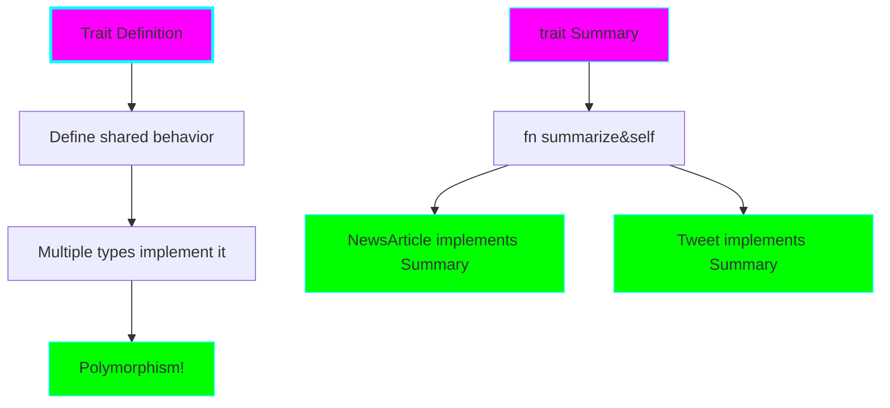
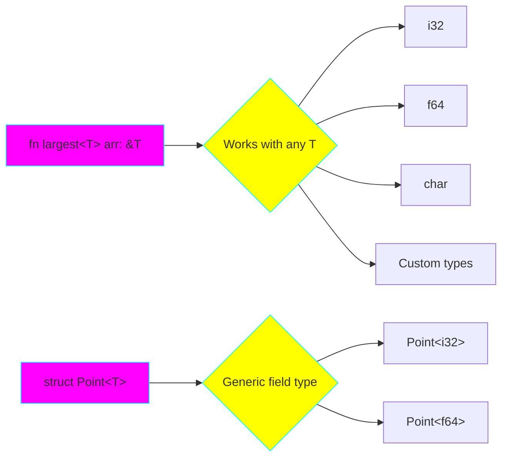
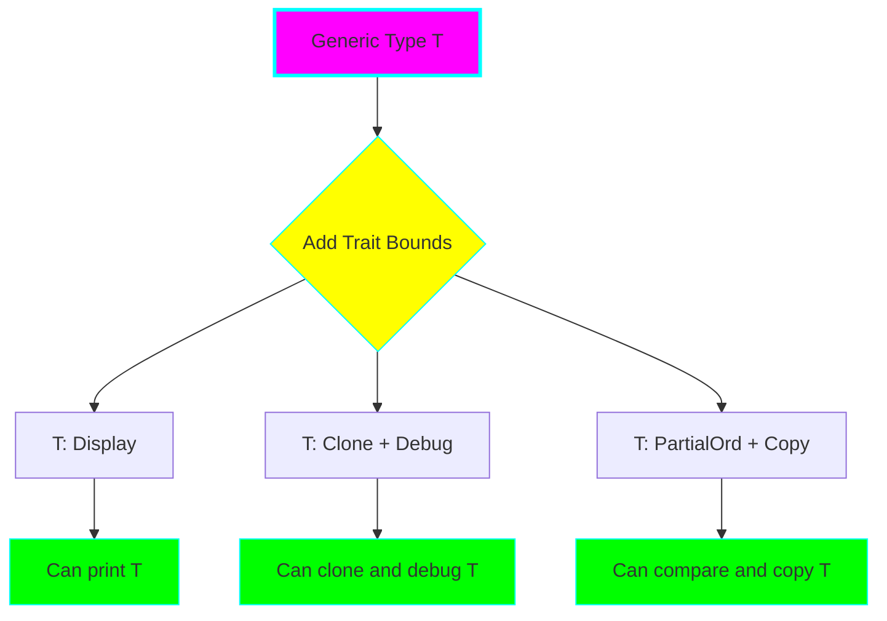
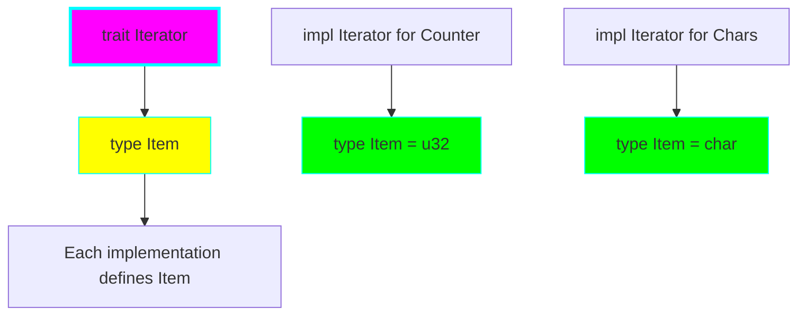

# Project 06: Traits & Generics

**Difficulty:** ⭐⭐⭐⭐ Advanced
**Estimated Time:** 8-12 hours
**Prerequisites:** Projects 01-05

## 🎯 Learning Objectives

By the end of this project, you will understand:

- ✅ Define and implement traits (interfaces)
- ✅ Create generic functions and structs
- ✅ Use trait bounds to constrain generics
- ✅ Understand static vs dynamic dispatch
- ✅ Work with trait objects (dyn Trait)
- ✅ Use associated types and constants
- ✅ Implement default trait methods
- ✅ Understand marker traits (Send, Sync, Copy, Clone)
- ✅ Apply orphan rules and coherence

## 📚 Core Concepts

### 1. Traits as Interfaces

Traits define shared behavior across types. Think of them as interfaces or contracts.



### 2. Generic Types

Generics let you write code that works with multiple types without duplication.



### 3. Trait Bounds

Constrain generics to types that implement specific traits.



### 4. Static vs Dynamic Dispatch

```mermaid
graph TB
    subgraph "Static Dispatch impl Trait"
        A1[Compile Time] --> B1[Monomorphization]
        B1 --> C1[Fast: No runtime cost]
        C1 --> D1[Large: Code duplication]
    end

    subgraph "Dynamic Dispatch dyn Trait"
        A2[Runtime] --> B2[Virtual Table vtable]
        B2 --> C2[Slower: Indirect call]
        C2 --> D2[Small: Single code copy]
    end

    style A1 fill:#00ff00,stroke:#00ffff
    style C1 fill:#00ff00,stroke:#00ffff
    style D1 fill:#ffff00,stroke:#00ffff
    style A2 fill:#ff00ff,stroke:#00ffff
    style C2 fill:#ffff00,stroke:#00ffff
    style D2 fill:#00ff00,stroke:#00ffff
```



### 5. Associated Types

Associated types are type placeholders in traits.



## 🔬 Detailed Explanations

### Defining and Implementing Traits

**Trait Definition:**
```rust
trait Summary {
    fn summarize(&self) -> String;

    // Default implementation
    fn author(&self) -> String {
        String::from("Anonymous")
    }
}
```

**Trait Implementation:**
```rust
struct NewsArticle {
    headline: String,
    content: String,
}

impl Summary for NewsArticle {
    fn summarize(&self) -> String {
        format!("{} - {}", self.headline, self.content)
    }

    // Can override default
    fn author(&self) -> String {
        String::from("News Corp")
    }
}
```

**Why Traits?**
- **Polymorphism:** Different types with the same interface
- **Code reuse:** Default implementations
- **Constraints:** Trait bounds ensure type safety
- **Extensibility:** Add behavior to external types (with restrictions)

### Generic Functions

**Without Generics (Duplication):**
```rust
fn largest_i32(list: &[i32]) -> i32 { /* ... */ }
fn largest_f64(list: &[f64]) -> f64 { /* ... */ }
fn largest_char(list: &[char]) -> char { /* ... */ }
```

**With Generics (DRY):**
```rust
fn largest<T: PartialOrd + Copy>(list: &[T]) -> T {
    let mut largest = list[0];
    for &item in list {
        if item > largest {
            largest = item;
        }
    }
    largest
}
```

**Generic Syntax:**
- `<T>`: Generic type parameter
- `T: PartialOrd`: Trait bound (T must implement PartialOrd)
- `T: PartialOrd + Copy`: Multiple bounds (+ separator)

### Generic Structs and Enums

**Structs:**
```rust
struct Point<T> {
    x: T,
    y: T,
}

struct Point2D<T, U> {
    x: T,
    y: U,
}

impl<T> Point<T> {
    fn x(&self) -> &T {
        &self.x
    }
}

// Specific implementation for f64
impl Point<f64> {
    fn distance_from_origin(&self) -> f64 {
        (self.x.powi(2) + self.y.powi(2)).sqrt()
    }
}
```

**Enums:**
```rust
enum Option<T> {
    Some(T),
    None,
}

enum Result<T, E> {
    Ok(T),
    Err(E),
}
```

### Trait Bounds

**Where Clauses:**
```rust
// Inline syntax
fn some_function<T: Display + Clone, U: Clone + Debug>(t: T, u: U) -> i32 {
    // ...
}

// Where clause (cleaner for complex bounds)
fn some_function<T, U>(t: T, u: U) -> i32
where
    T: Display + Clone,
    U: Clone + Debug,
{
    // ...
}
```

**Conditional Implementation:**
```rust
// Only implement this method if T implements Display
impl<T: Display> ToString for Point<T> {
    fn to_string(&self) -> String {
        format!("({}, {})", self.x, self.y)
    }
}
```

### Static Dispatch (impl Trait)

**As Parameter:**
```rust
fn notify(item: &impl Summary) {
    println!("Breaking news! {}", item.summarize());
}

// Equivalent trait bound syntax
fn notify<T: Summary>(item: &T) {
    println!("Breaking news! {}", item.summarize());
}
```

**As Return Type:**
```rust
fn returns_summarizable() -> impl Summary {
    NewsArticle {
        headline: String::from("Rust 2.0 Released!"),
        content: String::from("Amazing features..."),
    }
}
```

**Limitation:** Can only return a single concrete type.

### Dynamic Dispatch (dyn Trait)

**Trait Objects:**
```rust
// Box<dyn Trait> for owned trait objects
fn notify(item: &dyn Summary) {
    println!("Breaking news! {}", item.summarize());
}

// Vector of different types implementing Summary
let articles: Vec<Box<dyn Summary>> = vec![
    Box::new(NewsArticle { /* ... */ }),
    Box::new(Tweet { /* ... */ }),
];
```

**When to Use:**
- Need to store different types in a collection
- Don't know concrete type at compile time
- Accept the runtime cost (virtual dispatch)

**Object Safety:**
Not all traits can be trait objects. Requirements:
- No generic type parameters
- No Self return types (except receivers like &self)
- No associated functions (only methods)

### Associated Types

**Definition:**
```rust
trait Iterator {
    type Item;  // Associated type

    fn next(&mut self) -> Option<Self::Item>;
}
```

**Implementation:**
```rust
struct Counter {
    count: u32,
}

impl Iterator for Counter {
    type Item = u32;  // Define the type

    fn next(&mut self) -> Option<Self::Item> {
        self.count += 1;
        Some(self.count)
    }
}
```

**Associated Types vs Generics:**
- **Associated types:** One implementation per type
- **Generics:** Multiple implementations possible

```rust
// Generic version - can implement multiple times
trait GenericIterator<T> {
    fn next(&mut self) -> Option<T>;
}

// Could implement both:
impl GenericIterator<u32> for Counter { /* ... */ }
impl GenericIterator<String> for Counter { /* ... */ }

// Associated type - implement once
trait Iterator {
    type Item;
    fn next(&mut self) -> Option<Self::Item>;
}

// Can only implement once
impl Iterator for Counter {
    type Item = u32;
    // ...
}
```

### Marker Traits

Special traits with no methods that indicate capabilities:

**Copy:**
```rust
// Types that can be copied bit-by-bit
#[derive(Copy, Clone)]
struct Point {
    x: i32,
    y: i32,
}
```

**Send:**
```rust
// Types safe to send between threads
// Most types are Send (automatically implemented)
fn process<T: Send>(value: T) {
    // Can safely send value to another thread
}
```

**Sync:**
```rust
// Types safe to reference from multiple threads
// T is Sync if &T is Send
fn share<T: Sync>(value: &T) {
    // Can safely share reference across threads
}
```

### Orphan Rule

**The Rule:** You can implement a trait on a type only if:
- The trait is local to your crate, OR
- The type is local to your crate

**Why?**
Prevents conflicts between crates.

**Examples:**
```rust
// ✅ OK: Local trait on external type
trait MyTrait { }
impl MyTrait for Vec<i32> { }

// ✅ OK: External trait on local type
struct MyType;
impl Display for MyType { }

// ❌ ERROR: External trait on external type
// impl Display for Vec<i32> { }

// ✅ Workaround: Newtype pattern
struct MyVec(Vec<i32>);
impl Display for MyVec { }
```

## 💻 Code Examples

See `src/main.rs` for comprehensive examples covering all concepts.

## 🏋️ Exercises

### Exercise 1: Custom Trait
Create a `Drawable` trait with a `draw()` method. Implement it for:
- `Circle` (radius)
- `Rectangle` (width, height)
- `Triangle` (base, height)

### Exercise 2: Generic Data Structure
Implement a generic `Pair<T, U>` struct with methods:
- `new(first: T, second: U) -> Self`
- `swap() -> Pair<U, T>`
- `first(&self) -> &T`
- `second(&self) -> &U`

### Exercise 3: Trait Bounds
Write a function `print_largest<T>(list: &[T])` that prints the largest element. Use appropriate trait bounds.

### Exercise 4: Associated Types
Create a `Container` trait with:
- Associated type `Item`
- Method `get(&self, index: usize) -> Option<&Self::Item>`
- Method `len(&self) -> usize`

Implement for `Vec<T>`.

### Exercise 5: Dynamic Dispatch
Create a `Plugin` trait and implement it for 3 different types. Store them in a `Vec<Box<dyn Plugin>>` and call their methods.

## 🎯 Practice Challenges

1. **Shape Calculator:** Create a `Shape` trait with `area()` and `perimeter()` methods. Implement for multiple shapes.

2. **Generic Stack:** Implement a `Stack<T>` with `push()`, `pop()`, and `peek()` methods.

3. **Trait Composition:** Create traits `Read`, `Write`, and `ReadWrite` where `ReadWrite` inherits from both.

4. **Custom Iterator:** Implement the `Iterator` trait for a custom type that generates a sequence.

5. **Type Conversions:** Use `From` and `Into` traits to create conversions between custom types.

## 🔍 Common Mistakes & Gotchas

### 1. Forgetting Trait Bounds
```rust
// ❌ ERROR: Can't compare T without bounds
fn largest<T>(list: &[T]) -> T {
    let mut largest = list[0];  // Can't copy without Copy
    for &item in list {
        if item > largest {  // Can't compare without PartialOrd
            largest = item;
        }
    }
    largest
}

// ✅ Solution: Add trait bounds
fn largest<T: PartialOrd + Copy>(list: &[T]) -> T { /* ... */ }
```

### 2. Trait Object Safety Violations
```rust
trait Clone {
    fn clone(&self) -> Self;  // Returns Self
}

// ❌ ERROR: Can't use as trait object
// let obj: Box<dyn Clone> = /* ... */;

// Reason: Return type Self is not object-safe
```

### 3. Orphan Rule Violations
```rust
// ❌ ERROR: Can't implement external trait on external type
// impl Display for Option<String> { }

// ✅ Solution: Newtype pattern
struct MyOption(Option<String>);
impl Display for MyOption { }
```

### 4. Lifetime Issues with Trait Objects
```rust
// ❌ ERROR: Missing lifetime
fn returns_trait() -> &dyn Summary {
    &NewsArticle { /* ... */ }
}

// ✅ Solution: Return owned trait object
fn returns_trait() -> Box<dyn Summary> {
    Box::new(NewsArticle { /* ... */ })
}
```

## 🚀 Going Further

After mastering traits and generics:

1. **Read Chapter 10** of [The Rust Book](https://doc.rust-lang.org/book/)
2. **Study common traits:** Iterator, From/Into, Display, Debug, Default
3. **Explore advanced traits:** Fn, FnMut, FnOnce, Drop, Deref
4. **Learn about:** Higher-ranked trait bounds (HRTB)
5. **Practice with:** The Iterator trait and its adapters

## ✅ Checklist

Before moving to Project 07, make sure you can:

- [ ] Define traits and implement them for multiple types
- [ ] Write generic functions with trait bounds
- [ ] Create generic structs and enums
- [ ] Understand when to use impl Trait vs dyn Trait
- [ ] Explain the difference between static and dynamic dispatch
- [ ] Use associated types effectively
- [ ] Implement default trait methods
- [ ] Understand the orphan rule and coherence
- [ ] Know marker traits: Send, Sync, Copy, Clone
- [ ] Use where clauses for complex bounds

## 📝 Key Takeaways

1. **Traits are interfaces** that define shared behavior across types
2. **Generics eliminate code duplication** while maintaining type safety
3. **Trait bounds constrain generics** to types with specific capabilities
4. **Static dispatch (impl Trait)** is fast but increases code size
5. **Dynamic dispatch (dyn Trait)** is flexible but has runtime cost
6. **Associated types** provide one-to-one type relationships
7. **Marker traits** indicate type capabilities without methods
8. **Orphan rule** prevents conflicting trait implementations
9. **Traits + Generics = Powerful abstraction** without runtime overhead
10. **The compiler** ensures type safety at compile time

---

**Next:** [Project 07: Concurrent Processor](../07-concurrent-processor/README.md)

Ready to explore Rust's fearless concurrency? Let's go! 🦀⚡
