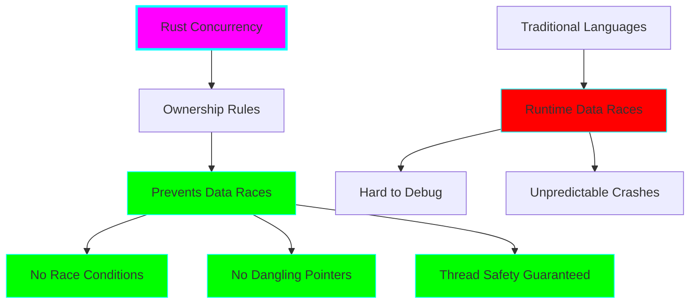
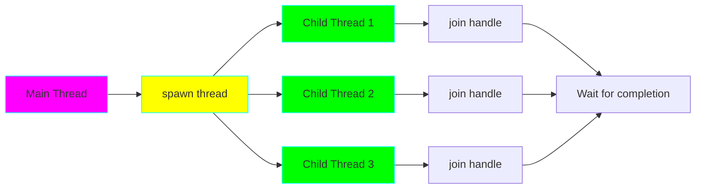
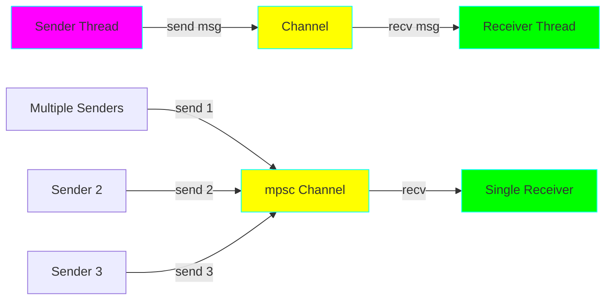
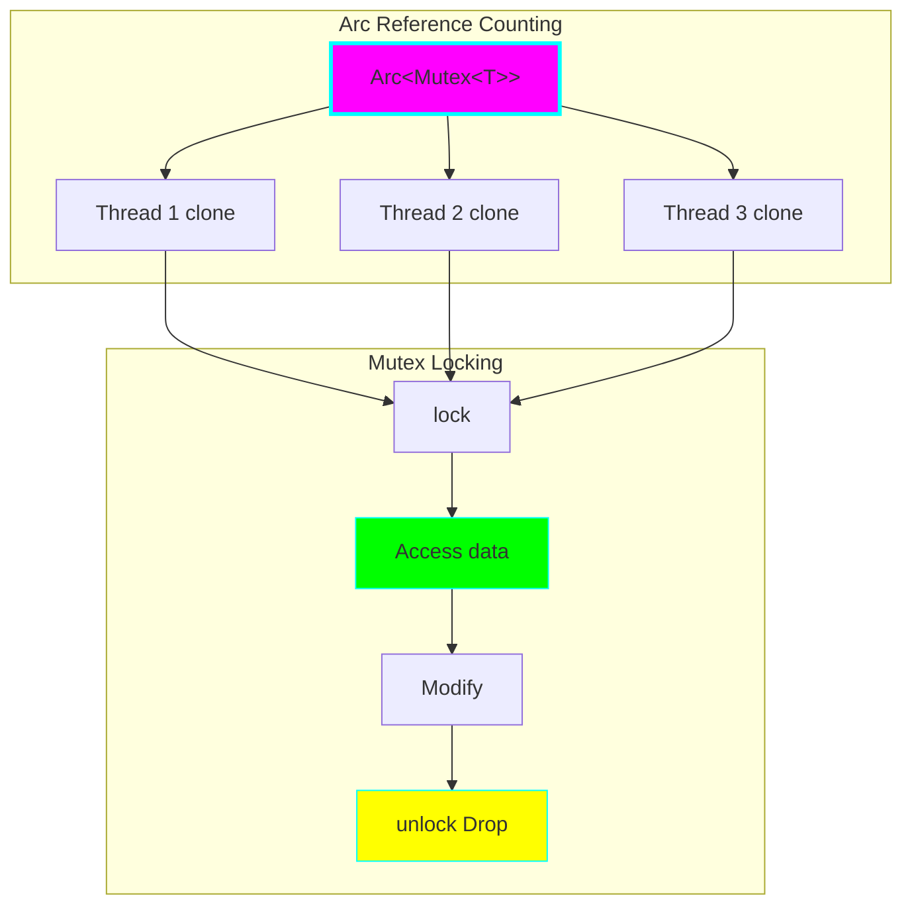
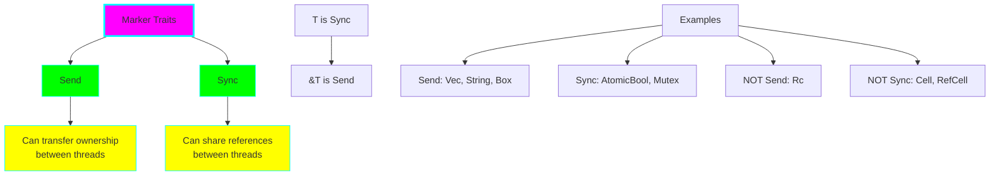
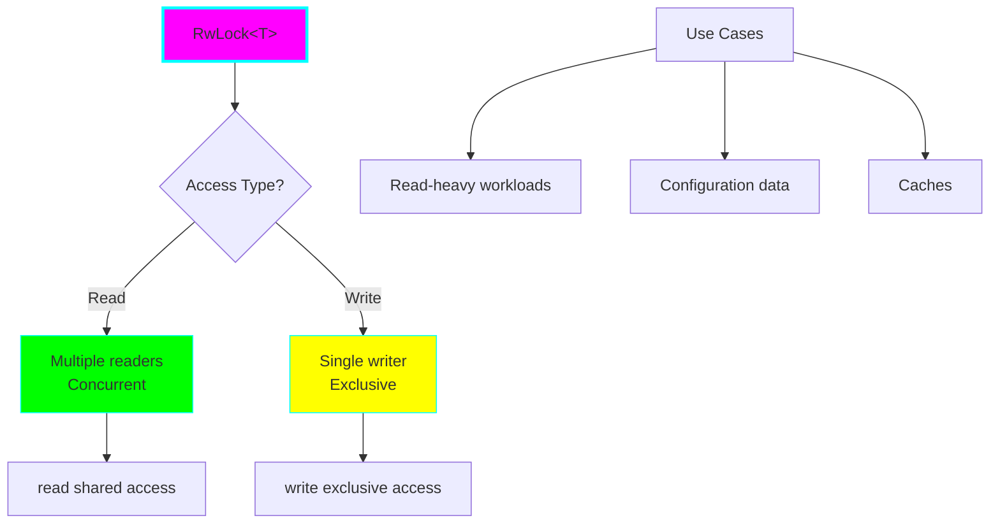

# Project 07: Concurrent Processor

**Difficulty:** ⭐⭐⭐⭐ Advanced
**Estimated Time:** 10-14 hours
**Prerequisites:** Projects 01-06

## 🎯 Learning Objectives

By the end of this project, you will understand:

- ✅ Create and manage threads in Rust
- ✅ Use message passing with channels (mpsc)
- ✅ Share state safely with Mutex and Arc
- ✅ Understand Send and Sync marker traits
- ✅ Use RwLock for read-heavy scenarios
- ✅ Prevent data races at compile time
- ✅ Handle concurrent errors gracefully
- ✅ Build thread pools and parallel processors
- ✅ Understand thread safety guarantees

## 📚 Core Concepts

### 1. Fearless Concurrency

Rust's ownership system prevents data races at compile time!



### 2. Thread Creation and Management



### 3. Message Passing (Channels)

"Do not communicate by sharing memory; share memory by communicating."



### 4. Shared State (Mutex + Arc)



### 5. Send and Sync Traits



### 6. RwLock (Read-Write Lock)



## 🔬 Detailed Explanations

### Creating Threads

**Basic Thread:**
```rust
use std::thread;
use std::time::Duration;

let handle = thread::spawn(|| {
    for i in 1..10 {
        println!("Thread: {}", i);
        thread::sleep(Duration::from_millis(1));
    }
});

// Wait for thread to finish
handle.join().unwrap();
```

**Thread with Move:**
```rust
let v = vec![1, 2, 3];

let handle = thread::spawn(move || {
    println!("Vector: {:?}", v);  // v is moved into the closure
});

handle.join().unwrap();
// v is no longer accessible here
```

**Why move?**
Rust can't guarantee the main thread won't drop `v` before the spawned thread finishes, so it requires `move` to transfer ownership.

### Message Passing with Channels

**Multiple Producer, Single Consumer (mpsc):**
```rust
use std::sync::mpsc;
use std::thread;

let (tx, rx) = mpsc::channel();

thread::spawn(move || {
    tx.send("Hello from thread").unwrap();
});

let received = rx.recv().unwrap();
println!("Got: {}", received);
```

**Multiple Senders:**
```rust
let (tx, rx) = mpsc::channel();

for i in 0..10 {
    let tx_clone = tx.clone();
    thread::spawn(move || {
        tx_clone.send(i).unwrap();
    });
}

drop(tx);  // Drop original sender

for received in rx {
    println!("Got: {}", received);
}
```

**Channel Types:**
- `send()` / `recv()`: Blocking operations
- `try_send()` / `try_recv()`: Non-blocking operations
- `recv_timeout()`: Blocking with timeout

### Shared State with Mutex

**Mutex (Mutual Exclusion):**
```rust
use std::sync::Mutex;

let m = Mutex::new(5);

{
    let mut num = m.lock().unwrap();
    *num = 6;
}  // Lock is released here (Drop)

println!("m = {:?}", m);
```

**Why Mutex?**
- Ensures only one thread can access data at a time
- Prevents data races
- Lock is released when guard goes out of scope (RAII)

### Arc (Atomic Reference Counting)

**Sharing Ownership Across Threads:**
```rust
use std::sync::{Arc, Mutex};
use std::thread;

let counter = Arc::new(Mutex::new(0));
let mut handles = vec![];

for _ in 0..10 {
    let counter_clone = Arc::clone(&counter);
    let handle = thread::spawn(move || {
        let mut num = counter_clone.lock().unwrap();
        *num += 1;
    });
    handles.push(handle);
}

for handle in handles {
    handle.join().unwrap();
}

println!("Result: {}", *counter.lock().unwrap());
```

**Arc vs Rc:**
- **Rc:** Reference counting, NOT thread-safe
- **Arc:** Atomic reference counting, thread-safe (slower)

**Pattern: Arc<Mutex<T>>**
- `Arc`: Share ownership across threads
- `Mutex`: Mutually exclusive access to inner data

### RwLock for Read-Heavy Workloads

**When to Use:**
```rust
use std::sync::RwLock;

let lock = RwLock::new(5);

// Multiple readers (concurrent)
{
    let r1 = lock.read().unwrap();
    let r2 = lock.read().unwrap();
    println!("{} {}", r1, r2);
}  // Read locks released

// Single writer (exclusive)
{
    let mut w = lock.write().unwrap();
    *w += 1;
}  // Write lock released
```

**Trade-offs:**
- **Mutex:** Simple, works for all cases, slightly faster for write-heavy
- **RwLock:** Better for read-heavy workloads, more complex

### Send and Sync Traits

**Send:**
```rust
// Types that can be transferred between threads
fn send_to_thread<T: Send>(value: T) {
    thread::spawn(move || {
        // Use value
    });
}

// Most types are Send
send_to_thread(vec![1, 2, 3]);  // Vec is Send
send_to_thread(String::from("hello"));  // String is Send

// Rc is NOT Send
// send_to_thread(Rc::new(5));  // ERROR!
```

**Sync:**
```rust
// Types whose references can be shared between threads
fn share_reference<T: Sync>(value: &T) {
    thread::spawn(move || {
        // Use reference (can't actually do this without Arc)
    });
}

// T is Sync if &T is Send
// Mutex<T> is Sync (if T is Send)
// RwLock<T> is Sync (if T is Send + Sync)
```

**Auto-implementation:**
- Most types are automatically Send and Sync
- Compiler implements them if all fields are Send/Sync
- Use `!Send` or `!Sync` to opt out (advanced)

### Common Patterns

**1. Thread Pool (Simplified):**
```rust
use std::thread;

let mut handles = vec![];

for i in 0..4 {
    let handle = thread::spawn(move || {
        // Process work
        println!("Worker {}", i);
    });
    handles.push(handle);
}

for handle in handles {
    handle.join().unwrap();
}
```

**2. Pipeline with Channels:**
```rust
let (tx1, rx1) = mpsc::channel();
let (tx2, rx2) = mpsc::channel();

// Stage 1: Producer
thread::spawn(move || {
    for i in 0..10 {
        tx1.send(i).unwrap();
    }
});

// Stage 2: Processor
thread::spawn(move || {
    for val in rx1 {
        tx2.send(val * 2).unwrap();
    }
});

// Stage 3: Consumer
for val in rx2 {
    println!("{}", val);
}
```

**3. Shared Configuration:**
```rust
use std::sync::Arc;

struct Config {
    setting: String,
}

let config = Arc::new(Config {
    setting: String::from("value"),
});

for i in 0..3 {
    let config_clone = Arc::clone(&config);
    thread::spawn(move || {
        println!("Thread {}: {}", i, config_clone.setting);
    });
}
```

## 💻 Code Examples

See `src/main.rs` for comprehensive examples covering all concepts.

## 🏋️ Exercises

### Exercise 1: Parallel Counter
Create a program that spawns 10 threads, each incrementing a shared counter 1000 times. Verify the final count is 10,000.

### Exercise 2: Producer-Consumer
Implement a producer-consumer pattern where:
- 3 producers send numbers to a channel
- 1 consumer receives and prints them
- Use proper synchronization

### Exercise 3: Parallel Map
Implement a `parallel_map` function that:
- Takes a vector and a function
- Splits work across threads
- Returns results in original order

### Exercise 4: Read-Write Cache
Build a thread-safe cache using RwLock:
- Multiple threads can read simultaneously
- Writes are exclusive
- Measure performance difference vs Mutex

### Exercise 5: Deadlock Detection
Create a scenario that would deadlock in other languages, then show how Rust prevents it at compile time.

## 🎯 Practice Challenges

1. **Download Manager:** Spawn threads to download multiple files concurrently, reporting progress.

2. **Word Counter:** Count words in multiple files in parallel, aggregate results.

3. **Web Scraper:** Fetch multiple URLs concurrently, parse results.

4. **Thread Pool:** Implement a proper thread pool that reuses threads for multiple tasks.

5. **Actor System:** Build a simple actor system using channels and threads.

## 🔍 Common Mistakes & Gotchas

### 1. Forgetting to Move Closures
```rust
let v = vec![1, 2, 3];

// ❌ ERROR: Closure may outlive current function
// thread::spawn(|| {
//     println!("{:?}", v);
// });

// ✅ Solution: Use move
thread::spawn(move || {
    println!("{:?}", v);
});
```

### 2. Deadlock with Nested Locks
```rust
// ❌ DEADLOCK: Never do this
let m1 = Mutex::new(1);
let m2 = Mutex::new(2);

let _g1 = m1.lock().unwrap();
let _g2 = m2.lock().unwrap();  // If another thread locks in reverse order...

// ✅ Solution: Always lock in same order, or use try_lock
```

### 3. Holding Lock Too Long
```rust
// ❌ BAD: Lock held during expensive operation
let guard = mutex.lock().unwrap();
expensive_operation();  // Other threads blocked!
*guard += 1;

// ✅ Solution: Minimize critical section
expensive_operation();
let mut guard = mutex.lock().unwrap();
*guard += 1;
```

### 4. Channel Sender Not Dropped
```rust
let (tx, rx) = mpsc::channel();

for i in 0..10 {
    let tx = tx.clone();
    thread::spawn(move || {
        tx.send(i).unwrap();
    });
}

// ❌ ERROR: rx.iter() blocks forever because tx is still alive
// for val in rx { /* ... */ }

// ✅ Solution: Drop original sender
drop(tx);
for val in rx { /* ... */ }
```

### 5. Using Rc Instead of Arc
```rust
use std::rc::Rc;

let rc = Rc::new(5);

// ❌ ERROR: Rc is not Send
// thread::spawn(move || {
//     println!("{}", rc);
// });

// ✅ Solution: Use Arc
use std::sync::Arc;
let arc = Arc::new(5);
thread::spawn(move || {
    println!("{}", arc);
});
```

## 🚀 Going Further

After mastering concurrency:

1. **Read Chapter 16** of [The Rust Book](https://doc.rust-lang.org/book/)
2. **Explore async/await:** `tokio` and `async-std` crates
3. **Study atomics:** `std::sync::atomic` for lock-free programming
4. **Learn about:** Crossbeam crate for advanced concurrency
5. **Practice with:** Rayon for data parallelism
6. **Understand:** Memory ordering and the happens-before relationship

## ✅ Checklist

Before moving to Project 08, make sure you can:

- [ ] Spawn and join threads
- [ ] Use move closures with threads
- [ ] Send messages through channels (mpsc)
- [ ] Share state with Arc<Mutex<T>>
- [ ] Understand when to use RwLock vs Mutex
- [ ] Explain Send and Sync traits
- [ ] Prevent deadlocks by design
- [ ] Handle thread panics gracefully
- [ ] Build basic concurrent data structures
- [ ] Debug concurrent programs effectively

## 📝 Key Takeaways

1. **Ownership prevents data races** at compile time
2. **Threads transfer ownership** with move closures
3. **Channels for message passing** (mpsc pattern)
4. **Arc for shared ownership** across threads
5. **Mutex for exclusive access** to shared data
6. **RwLock for read-heavy** workloads
7. **Send = transferable** between threads
8. **Sync = shareable references** across threads
9. **Pattern: Arc<Mutex<T>>** for shared mutable state
10. **Rust makes concurrency safe** without runtime overhead

---

**Next:** [Project 08: Macros & Metaprogramming](../08-macros-metaprogramming/README.md)

Ready to unlock Rust's compile-time superpowers? Let's go! 🦀⚙️
