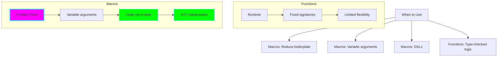
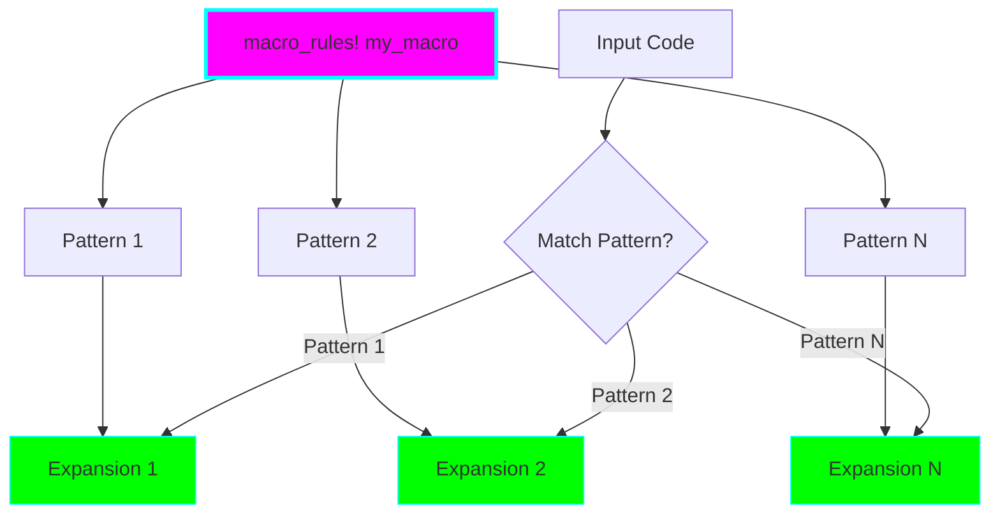
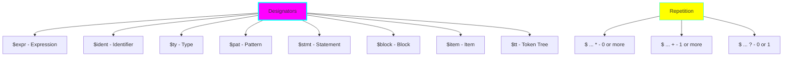
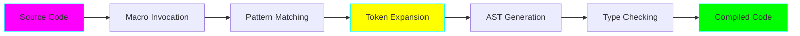
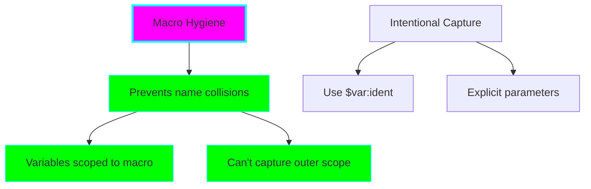

# Project 08: Macros & Metaprogramming

**Difficulty:** ⭐⭐⭐⭐⭐ Expert
**Estimated Time:** 12-16 hours
**Prerequisites:** Projects 01-07

## 🎯 Learning Objectives

By the end of this project, you will understand:

- ✅ Create declarative macros with macro_rules!
- ✅ Understand macro patterns and repetition
- ✅ Use macro hygiene and variable capture
- ✅ Build practical utility macros
- ✅ Understand procedural macros (basics)
- ✅ Create derive macros
- ✅ Use attribute macros
- ✅ Build function-like procedural macros
- ✅ Debug and expand macros
- ✅ Know when to use macros vs functions

## 📚 Core Concepts

### 1. Macros vs Functions

Macros are code that writes code at compile time!



### 2. Declarative Macros (macro_rules!)

Pattern matching on code structure.



### 3. Macro Patterns and Designators



### 4. Procedural Macros Types

```mermaid
graph TB
    A[Procedural Macros] --> B[Derive Macros]
    A --> C[Attribute Macros]
    A --> D[Function-like Macros]

    B --> E[#[derive MyTrait]]
    B --> F[Auto-implement traits]

    C --> G[#[my_attribute]]
    C --> H[Transform items]

    D --> I[my_macro! ...]
    D --> J[Custom syntax]

    style A fill:#ff00ff,stroke:#00ffff,stroke-width:3px
    style B fill:#00ff00,stroke:#00ffff
    style C fill:#ffff00,stroke:#00ffff
    style D fill:#00ffff,stroke:#ff00ff
```

### 5. Macro Expansion Process



### 6. Macro Hygiene



## 🔬 Detailed Explanations

### Declarative Macros Basics

**Simple Macro:**
```rust
macro_rules! say_hello {
    () => {
        println!("Hello, world!");
    };
}

// Usage
say_hello!();
```

**Macro with Arguments:**
```rust
macro_rules! create_function {
    ($func_name:ident) => {
        fn $func_name() {
            println!("You called {:?}()", stringify!($func_name));
        }
    };
}

// Usage
create_function!(foo);
foo();  // Prints: You called "foo"()
```

**Why macros?**
- **Code generation:** Write repetitive code once
- **Compile-time execution:** No runtime overhead
- **Variadic arguments:** Accept any number of arguments
- **Pattern matching on code:** Different expansions for different inputs

### Pattern Matching in Macros

**Designators:**
- `$x:expr` - Matches any expression
- `$x:ident` - Matches an identifier (variable/function name)
- `$x:ty` - Matches a type
- `$x:pat` - Matches a pattern
- `$x:stmt` - Matches a statement
- `$x:block` - Matches a block `{ ... }`
- `$x:item` - Matches an item (function, struct, etc.)
- `$x:tt` - Matches a single token tree (anything)

**Example:**
```rust
macro_rules! create_var {
    ($name:ident = $value:expr) => {
        let $name = $value;
    };
}

create_var!(x = 42);
```

### Repetition in Macros

**Syntax:**
- `$(...)*` - Zero or more repetitions
- `$(...)+` - One or more repetitions
- `$(...)?` - Zero or one repetition

**Example - Variadic Arguments:**
```rust
macro_rules! vec_of {
    ($($element:expr),*) => {
        {
            let mut v = Vec::new();
            $(
                v.push($element);
            )*
            v
        }
    };
}

let v = vec_of![1, 2, 3, 4, 5];
```

### Multiple Patterns

```rust
macro_rules! calculate {
    // Addition
    (add $a:expr, $b:expr) => {
        $a + $b
    };

    // Multiplication
    (mul $a:expr, $b:expr) => {
        $a * $b
    };

    // Power
    (pow $a:expr, $b:expr) => {
        $a.pow($b)
    };
}

let sum = calculate!(add 5, 3);
let product = calculate!(mul 4, 7);
```

### Macro Hygiene

Macros create their own scope to prevent variable capture:

```rust
macro_rules! using_a {
    ($e:expr) => {
        {
            let a = 42;  // Local to macro
            $e
        }
    };
}

let four = using_a!(a / 10);  // ERROR! 'a' not in scope
```

**Intentional Capture:**
```rust
macro_rules! using_value {
    ($e:expr, $v:ident) => {
        {
            let $v = 42;
            $e
        }
    };
}

let result = using_value!(value * 2, value);  // OK!
```

### Common Macro Patterns

**1. HashMap Creation:**
```rust
macro_rules! hashmap {
    ($($key:expr => $value:expr),* $(,)?) => {
        {
            let mut map = std::collections::HashMap::new();
            $(
                map.insert($key, $value);
            )*
            map
        }
    };
}

let map = hashmap! {
    "one" => 1,
    "two" => 2,
    "three" => 3,
};
```

**2. Test Case Generation:**
```rust
macro_rules! test_cases {
    ($($name:ident: $value:expr => $expected:expr),*) => {
        $(
            #[test]
            fn $name() {
                assert_eq!($value, $expected);
            }
        )*
    };
}

test_cases! {
    test_add: 2 + 2 => 4,
    test_mul: 3 * 3 => 9,
    test_sub: 10 - 5 => 5
}
```

**3. Conditional Compilation:**
```rust
macro_rules! log {
    ($($arg:tt)*) => {
        #[cfg(debug_assertions)]
        {
            println!($($arg)*);
        }
    };
}
```

### Procedural Macros Basics

**Types:**
1. **Derive macros:** `#[derive(MyTrait)]`
2. **Attribute macros:** `#[my_attribute]`
3. **Function-like macros:** `my_macro!(...)`

**Requirements:**
- Separate crate with `proc-macro = true`
- Use `proc-macro2`, `syn`, and `quote` crates
- Parse token streams
- Generate new code

**Example Structure:**
```rust
// In Cargo.toml:
// [lib]
// proc-macro = true

use proc_macro::TokenStream;

#[proc_macro_derive(MyTrait)]
pub fn derive_my_trait(input: TokenStream) -> TokenStream {
    // Parse input
    // Generate code
    // Return new TokenStream
}
```

### Derive Macros

Auto-implement traits for types:

```rust
// Definition (in proc-macro crate)
#[proc_macro_derive(Builder)]
pub fn derive_builder(input: TokenStream) -> TokenStream {
    // Generate builder pattern code
}

// Usage
#[derive(Builder)]
struct User {
    name: String,
    age: u32,
}

// Generated code allows:
let user = User::builder()
    .name("Alice".to_string())
    .age(30)
    .build();
```

### Debugging Macros

**cargo expand:**
```bash
# Install
cargo install cargo-expand

# Expand macros
cargo expand

# Expand specific module
cargo expand module_name
```

**Manual Debugging:**
```rust
macro_rules! debug_macro {
    ($($tt:tt)*) => {
        {
            println!("Macro input: {}", stringify!($($tt)*));
            // Actual macro code
        }
    };
}
```

### When to Use Macros

**✅ Good Use Cases:**
- Reducing boilerplate (derive macros)
- Variadic arguments (format!, println!)
- Domain-specific languages (DSLs)
- Conditional compilation
- Code generation from external data
- Type-level computation

**❌ Avoid Macros For:**
- Simple functions (use functions!)
- Type-checked logic (use generics)
- Runtime computation (use functions)
- When macros would be hard to understand

## 💻 Code Examples

See `src/main.rs` for comprehensive examples covering all concepts.

## 🏋️ Exercises

### Exercise 1: Struct Printer
Create a macro that prints all fields of a struct in a formatted way.

### Exercise 2: Mini Test Framework
Build a macro that generates test functions from a declarative syntax.

### Exercise 3: Type-Safe Builder
Create a macro that generates builder pattern code for structs.

### Exercise 4: Debug Logger
Build a macro that conditionally logs based on log level.

### Exercise 5: Enum Variant Counter
Create a macro that counts the number of variants in an enum.

## 🎯 Practice Challenges

1. **SQL-like DSL:** Create a macro for a simple query language.

2. **Async Test Generator:** Generate async test cases from a declarative syntax.

3. **Serialization Macro:** Build a macro that generates serialization code.

4. **Property-Based Testing:** Create macros for generating test properties.

5. **State Machine DSL:** Build a DSL for defining state machines.

## 🔍 Common Mistakes & Gotchas

### 1. Forgetting Macro Export
```rust
// ❌ Macro not accessible from other modules
macro_rules! my_macro { ... }

// ✅ Export macro
#[macro_export]
macro_rules! my_macro { ... }
```

### 2. Pattern Matching Ambiguity
```rust
// ❌ Ambiguous patterns
macro_rules! ambiguous {
    ($x:expr) => { ... };
    ($x:ty) => { ... };  // Could match same input!
}

// ✅ Use specific patterns or different syntax
macro_rules! clear {
    (expr: $x:expr) => { ... };
    (type: $x:ty) => { ... };
}
```

### 3. Variable Capture Issues
```rust
// ❌ Captures from outer scope unexpectedly
macro_rules! bad {
    () => {
        let x = 5;  // Might conflict
    };
}

// ✅ Use hygiene or explicit capture
macro_rules! good {
    ($var:ident) => {
        let $var = 5;
    };
}
```

### 4. Repetition Syntax Errors
```rust
// ❌ Wrong separator
macro_rules! wrong {
    ($($x:expr);*) => { ... };  // Uses ;
}
wrong!(1, 2, 3);  // Expects ; not ,

// ✅ Match separator or make optional
macro_rules! right {
    ($($x:expr),*) => { ... };  // Uses ,
}
```

### 5. Type Inference Issues
```rust
// ❌ Macro might not provide enough type info
macro_rules! make_vec {
    ($($x:expr),*) => {
        vec![$($x),*]
    };
}

// ✅ Let compiler infer or specify type
let v: Vec<i32> = make_vec![1, 2, 3];
```

## 🚀 Going Further

After mastering macros:

1. **Read Chapter 19.6** of [The Rust Book](https://doc.rust-lang.org/book/)
2. **Study proc-macro crates:** syn, quote, proc-macro2
3. **Explore advanced macros:** TT muncher pattern, recursive macros
4. **Build a DSL:** Create your own domain-specific language
5. **Study existing macros:** serde, diesel, rocket
6. **Learn about:** Macro 2.0 proposals and future developments

## ✅ Checklist

Before moving to Project 09, make sure you can:

- [ ] Write basic declarative macros with macro_rules!
- [ ] Use all common designators (expr, ident, ty, etc.)
- [ ] Implement repetition patterns (*, +, ?)
- [ ] Create macros with multiple patterns
- [ ] Understand macro hygiene
- [ ] Debug macros with cargo expand
- [ ] Know when to use macros vs functions
- [ ] Understand procedural macro types
- [ ] Export macros for use in other modules
- [ ] Write practical utility macros

## 📝 Key Takeaways

1. **Macros are compile-time code generation**
2. **Declarative macros** use pattern matching on code
3. **Designators** specify what kind of syntax to match
4. **Repetition** enables variadic arguments
5. **Hygiene** prevents accidental variable capture
6. **Procedural macros** offer more power and flexibility
7. **cargo expand** is essential for debugging
8. **Use macros sparingly** - prefer functions when possible
9. **Macros enable DSLs** and reduce boilerplate
10. **Type safety** is maintained through macro expansion

---

**Next:** [Project 09: Unsafe Rust & FFI](../09-unsafe-ffi/README.md)

Ready to explore the final frontier of Rust? Let's go! 🦀🔧
