# Project 09: Unsafe Rust & FFI

**Difficulty:** ⭐⭐⭐⭐⭐ Expert
**Estimated Time:** 10-15 hours
**Prerequisites:** Projects 1-8 (especially 02-Ownership, 06-Traits)

## 🎯 Learning Objectives

By the end of this project, you will understand:

- ✅ When and why to use `unsafe` Rust
- ✅ Raw pointers (*const T, *mut T)
- ✅ Unsafe functions and blocks
- ✅ FFI (Foreign Function Interface) with C
- ✅ Safety contracts and invariants
- ✅ Memory layout and ABI compatibility
- ✅ Calling C from Rust and Rust from C
- ✅ Best practices for minimizing unsafe code

## ⚠️ Important Warning

**Unsafe Rust is an escape hatch, not a daily tool!**


## 📚 Core Concepts

### 1. What is Unsafe Rust?

Unsafe Rust allows you to bypass the compiler's safety guarantees:


**The Five Unsafe Superpowers:**
1. Dereference raw pointers
2. Call unsafe functions
3. Access or modify mutable static variables
4. Implement unsafe traits
5. Access fields of unions

### 2. Raw Pointers

Rust has two raw pointer types:


### 3. FFI Architecture


### 4. Memory Layout Compatibility

For FFI to work, memory layouts must match:

```mermaid
graph TB
    A[Rust Type] --> B{Compatible with C?}
    B -->|Yes| C[repr-C]
    B -->|No| D[Compilation Error]

    C --> E[Same memory layout as C]
    C --> F[Same ABI conventions]

    G[Examples] --> H[i32 = int32_t ✅]
    G --> I[f64 = double ✅]
    G --> J[bool = ? ❌]
    G --> K[String = ? ❌]

    style A fill:#ff00ff,stroke:#00ffff
    style C fill:#00ff00,stroke:#00ffff
    style D fill:#ff0000,stroke:#00ffff
    style H fill:#00ff00,stroke:#00ffff
    style I fill:#00ff00,stroke:#00ffff
    style J fill:#ff0000,stroke:#00ffff
    style K fill:#ff0000,stroke:#00ffff
```



## 🔬 Detailed Explanations

### When to Use Unsafe

**Valid Use Cases:**
- Calling C libraries (FFI)
- Implementing low-level data structures (intrusive linked lists)
- Performance-critical code (after profiling!)
- Interfacing with hardware
- Building safe abstractions (Vec, HashMap use unsafe internally!)

**Invalid Use Cases:**
- "The borrow checker is annoying" ❌
- "I don't understand ownership" ❌
- "I want it to work like C++" ❌
- "I think it's faster" (without proof) ❌

### Raw Pointers in Detail

**Creating Raw Pointers (Safe):**
```rust
let x = 5;
let raw_const = &x as *const i32;  // Safe to create
let raw_mut = &x as *const i32 as *mut i32;  // Safe to create
```

**Using Raw Pointers (Unsafe):**
```rust
unsafe {
    println!("{}", *raw_const);  // Unsafe to dereference!
}
```

**Why are they useful?**
1. **Interfacing with C:** C uses raw pointers everywhere
2. **Multiple mutable references:** Sometimes needed for data structures
3. **Null pointers:** Can represent "no value" like C's NULL
4. **Pointer arithmetic:** For low-level memory manipulation

### Unsafe Functions

**Declaring Unsafe Functions:**
```rust
unsafe fn dangerous() {
    // Function body
}
```

**Why mark a function unsafe?**
- It requires the caller to uphold invariants
- The function can't guarantee safety on its own
- The caller must understand the safety contract

**Example: Custom allocator**
```rust
unsafe fn allocate(size: usize) -> *mut u8 {
    std::alloc::alloc(std::alloc::Layout::from_size_align_unchecked(size, 1))
}
```

### FFI Type Mappings

| Rust Type | C Type | Safe for FFI? |
|-----------|--------|---------------|
| `i8` | `int8_t` | ✅ Yes |
| `i16` | `int16_t` | ✅ Yes |
| `i32` | `int32_t` | ✅ Yes |
| `i64` | `int64_t` | ✅ Yes |
| `u8` | `uint8_t` | ✅ Yes |
| `u16` | `uint16_t` | ✅ Yes |
| `u32` | `uint32_t` | ✅ Yes |
| `u64` | `uint64_t` | ✅ Yes |
| `f32` | `float` | ✅ Yes |
| `f64` | `double` | ✅ Yes |
| `*const T` | `const T*` | ✅ Yes |
| `*mut T` | `T*` | ✅ Yes |
| `bool` | N/A | ❌ No (use u8) |
| `String` | N/A | ❌ No (use *const c_char) |
| `&str` | N/A | ❌ No (use *const c_char) |
| `Vec<T>` | N/A | ❌ No (use pointer + length) |

### The `repr` Attribute

To make Rust structs compatible with C:

```rust
#[repr(C)]
struct Point {
    x: f64,
    y: f64,
}
```

**Why `repr(C)`?**
- Rust's default layout is undefined (can be reordered for optimization)
- `repr(C)` guarantees C-compatible memory layout
- Essential for passing structs across FFI boundary

### Safety Contracts

Every unsafe function/block has an implicit or explicit **safety contract**:

```rust
/// # Safety
///
/// The caller must ensure that:
/// - `ptr` is non-null
/// - `ptr` points to valid, initialized memory
/// - `ptr` is properly aligned for type T
/// - The memory remains valid for the duration of access
unsafe fn read_raw<T>(ptr: *const T) -> T {
    *ptr
}
```

**Document your safety contracts!** Future you (and others) need to know the rules.

## 💻 Code Examples

### Example 1: Raw Pointers

```rust
fn raw_pointer_examples() {
    let mut num = 5;

    // Creating raw pointers is safe
    let r1 = &num as *const i32;
    let r2 = &mut num as *mut i32;

    // Dereferencing requires unsafe
    unsafe {
        println!("r1 points to: {}", *r1);
        *r2 = 10;
        println!("r2 changed value to: {}", *r2);
    }
}
```

### Example 2: Calling C from Rust

```rust
// Declare external C function
extern "C" {
    fn abs(input: i32) -> i32;
}

fn main() {
    unsafe {
        println!("Absolute value of -3 is: {}", abs(-3));
    }
}
```

### Example 3: Creating a C-compatible Struct

```rust
use std::os::raw::c_char;

#[repr(C)]
struct Person {
    name: *const c_char,
    age: i32,
}

extern "C" {
    fn print_person(person: *const Person);
}
```

### Example 4: Unsafe Trait Implementation

```rust
unsafe trait Zeroable {
    fn zeroed() -> Self;
}

// This is safe for types that can be all zeros
unsafe impl Zeroable for i32 {
    fn zeroed() -> Self {
        0
    }
}
```

See `src/main.rs` for comprehensive, runnable examples!

## 🏋️ Exercises

### Exercise 1: Safe Wrapper
Create a safe wrapper around a raw pointer-based circular buffer:
```rust
struct CircularBuffer {
    data: *mut i32,
    capacity: usize,
    head: usize,
}

impl CircularBuffer {
    pub fn new(capacity: usize) -> Self {
        // TODO: Allocate using raw pointers
    }

    pub fn push(&mut self, value: i32) {
        // TODO: Implement safely
    }
}
```

### Exercise 2: FFI String Conversion
Write safe wrappers for converting between Rust `String` and C `char*`:
```rust
fn string_to_c(s: &str) -> *const c_char { /* TODO */ }
fn c_to_string(ptr: *const c_char) -> String { /* TODO */ }
```

### Exercise 3: Custom Vector
Implement a simple vector using unsafe code:
- Manual memory allocation
- Push/pop operations
- Proper Drop implementation

### Exercise 4: C Library Integration
Create Rust bindings for a simple C library:
```c
// example.h
int add(int a, int b);
void greet(const char* name);
```

### Exercise 5: Memory Alignment
Write a function that checks if a pointer is properly aligned:
```rust
fn is_aligned<T>(ptr: *const T) -> bool {
    // TODO: Check alignment
}
```

## 🎯 Practice Challenges

### 1. Intrusive Linked List
Implement a intrusive linked list (like Linux kernel style) using unsafe code.

### 2. Arena Allocator
Create a simple arena allocator that hands out memory in chunks.

### 3. Lock-Free Queue
Implement a simple lock-free queue using atomic operations and unsafe.

### 4. C Library Wrapper
Create safe Rust bindings for a real C library (e.g., zlib, sqlite3).

## 🔍 Common Mistakes & Gotchas

### 1. Null Pointer Dereference
```rust
unsafe {
    let ptr: *const i32 = std::ptr::null();
    let value = *ptr;  // UNDEFINED BEHAVIOR!
}
```

**Solution:** Always check for null:
```rust
unsafe {
    if !ptr.is_null() {
        let value = *ptr;
    }
}
```

### 2. Use After Free
```rust
let ptr = {
    let x = 5;
    &x as *const i32
};
unsafe {
    println!("{}", *ptr);  // DANGLING POINTER!
}
```

### 3. Aliasing Violations
```rust
let mut x = 5;
let r1 = &mut x as *mut i32;
let r2 = &mut x as *mut i32;

unsafe {
    *r1 = 10;
    *r2 = 20;  // Undefined behavior!
}
```

### 4. ABI Mismatch
```rust
// WRONG - default Rust ABI
extern {
    fn c_function();  // Missing "C"
}

// CORRECT
extern "C" {
    fn c_function();
}
```

### 5. Memory Layout Assumptions
```rust
struct Bad {
    x: u8,
    y: u32,  // Compiler may reorder!
}

#[repr(C)]
struct Good {
    x: u8,
    y: u32,  // Guaranteed C layout
}
```

## 🛡️ Best Practices

### 1. Minimize Unsafe Surface
```rust
// Good: Small unsafe block
fn get_value(ptr: *const i32) -> Option<i32> {
    if ptr.is_null() {
        return None;
    }
    unsafe { Some(*ptr) }  // Small unsafe block
}

// Bad: Large unsafe block
unsafe fn get_value_bad(ptr: *const i32) -> Option<i32> {
    // Entire function is unsafe!
    if ptr.is_null() {
        return None;
    }
    Some(*ptr)
}
```

### 2. Document Safety Invariants
Always use `/// # Safety` comments:
```rust
/// # Safety
/// `ptr` must be valid, non-null, and properly aligned
unsafe fn read<T>(ptr: *const T) -> T {
    *ptr
}
```

### 3. Encapsulate Unsafe Code
```rust
pub struct SafeWrapper {
    inner: *mut u8,
}

impl SafeWrapper {
    pub fn new(size: usize) -> Self {
        // Unsafe hidden inside safe interface
        unsafe {
            Self {
                inner: std::alloc::alloc(
                    std::alloc::Layout::from_size_align_unchecked(size, 1)
                ),
            }
        }
    }
}
```

### 4. Use Standard Library Tools
Before writing unsafe code, check if these exist:
- `std::ptr::NonNull<T>` - Non-null raw pointer
- `std::pin::Pin<T>` - Prevent moving
- `std::cell::UnsafeCell<T>` - Interior mutability primitive
- `std::sync::atomic` - Atomic operations

## 🚀 Going Further

### Recommended Reading
1. **The Rustonomicon** - The definitive guide to unsafe Rust
2. **Rust FFI Omnibus** - Practical FFI examples
3. **bindgen** - Auto-generate Rust FFI bindings from C headers
4. **cbindgen** - Generate C headers from Rust code

### Advanced Topics
- Variance and subtyping
- Phantom data and drop check
- Atomic operations and memory ordering
- Custom allocators
- Inline assembly

### Tools
- **Miri** - Interpreter for detecting undefined behavior
- **Valgrind** - Memory error detector
- **AddressSanitizer** - Fast memory error detector

## ✅ Checklist

Before moving on, make sure you can:

- [ ] Explain when unsafe is necessary and when it's not
- [ ] Create and use raw pointers safely
- [ ] Call C functions from Rust
- [ ] Export Rust functions to C
- [ ] Use `repr(C)` correctly
- [ ] Document safety contracts
- [ ] Identify common unsafe code bugs
- [ ] Minimize unsafe surface area
- [ ] Use tools like Miri to detect UB

## 📝 Key Takeaways

1. **Unsafe is an escape hatch** - use it sparingly and document thoroughly
2. **The compiler can't help you** - you must uphold safety contracts
3. **Small unsafe blocks** - minimize the unsafe surface area
4. **Document everything** - use `/// # Safety` comments religiously
5. **FFI requires unsafe** - but you can wrap it in safe abstractions
6. **Test thoroughly** - use Miri, Valgrind, and extensive testing
7. **Standard library uses unsafe** - but provides safe interfaces

## ⚠️ Final Warning


**Remember:** Unsafe code should be like hot sauce - a little goes a long way!

---

**Next:** [Project 10: Async Web Server with Tokio](../10-async-web-server/README.md)

Ready to dive into async programming? Let's build a web server! 🚀
