# Project 10: Async Web Server with Tokio

**Difficulty:** ⭐⭐⭐⭐⭐ Expert
**Estimated Time:** 12-18 hours
**Prerequisites:** Projects 1-9 (especially 02-Ownership, 03-Error Handling, 07-Concurrency)

## 🎯 Learning Objectives

By the end of this project, you will understand:

- ✅ Asynchronous programming concepts in Rust
- ✅ async/await syntax and semantics
- ✅ Futures and their execution
- ✅ Tokio runtime and executor
- ✅ Building HTTP servers with async
- ✅ Handling concurrent connections
- ✅ Async state management
- ✅ Graceful shutdown patterns
- ✅ Performance characteristics of async code

## 🌊 Core Concepts

### 1. What is Async?

Asynchronous programming allows handling many tasks concurrently without blocking:


**Key Benefits:**
- Handle thousands of connections with few threads
- Efficient resource usage
- Great for I/O-bound workloads
- Lower memory footprint than thread-per-connection

### 2. Async/Await Flow


### 3. Tokio Runtime Architecture


### 4. Future State Machine

Every async function compiles to a state machine:


### 5. HTTP Request Flow


## 📚 Detailed Explanations

### Async vs Threads

**Threads:**
- OS-level concurrency
- True parallelism on multiple cores
- Heavy weight (~1-2 MB stack per thread)
- Context switching overhead
- Great for CPU-bound tasks

**Async:**
- User-space concurrency
- Cooperative multitasking
- Light weight (~few KB per task)
- Minimal context switching
- Great for I/O-bound tasks


### The Future Trait

At its core, a Future is:

```rust
trait Future {
    type Output;

    fn poll(self: Pin<&mut Self>, cx: &mut Context<'_>) -> Poll<Self::Output>;
}

enum Poll<T> {
    Ready(T),    // The value is ready
    Pending,     // Not ready yet, wake me later
}
```

**Key concepts:**
- `poll` is called repeatedly until `Ready`
- `Pending` means "wake me when ready"
- Futures are lazy - nothing happens until polled
- `.await` is sugar for polling a Future

### Async Runtime

Rust's async is "runtime agnostic" - you choose your runtime:

| Runtime | Best For | Features |
|---------|----------|----------|
| **Tokio** | General purpose, production | Full-featured, mature, great docs |
| **async-std** | Easier learning | Mirrors std lib API |
| **smol** | Minimal footprint | Lightweight, simple |

**Tokio** is the most popular and what we'll use.

### Task Spawning


### Channels for Communication


### Common Async Patterns

**1. Racing:**
```rust
// First one to complete wins
tokio::select! {
    result = operation1() => { /* handle result */ }
    result = operation2() => { /* handle result */ }
}
```

**2. Joining:**
```rust
// Wait for all to complete
let (result1, result2) = tokio::join!(operation1(), operation2());
```

**3. Timeout:**
```rust
// Give up if too slow
tokio::time::timeout(Duration::from_secs(5), slow_operation()).await?;
```

## 💻 HTTP Server Concepts

### Request/Response Cycle


### State Management

```mermaid
graph TB
    A[Shared State] --> B[Arc Mutex]
    A --> C[Arc RwLock]
    A --> D[DashMap lock-free]

    B --> E[✅ Exclusive access<br/>❌ Contention]
    C --> F[✅ Multiple readers<br/>❌ Write contention]
    D --> G[✅ Lock-free<br/>✅ Scalable]

    style A fill:#ff00ff,stroke:#00ffff,stroke-width:3px
    style G fill:#00ff00,stroke:#00ffff
```



### Graceful Shutdown


## 🏋️ Exercises

### Exercise 1: Basic Async
Write async functions that:
- Sleep for a duration
- Fetch data from multiple sources concurrently
- Use `select!` to race two operations

### Exercise 2: Echo Server
Build a TCP echo server that:
- Accepts connections
- Echoes back received data
- Handles multiple clients concurrently

### Exercise 3: HTTP Router
Extend the web server with:
- Multiple routes
- JSON request/response handling
- Query parameter parsing

### Exercise 4: Shared State
Implement a request counter that:
- Tracks total requests
- Tracks per-endpoint requests
- Is thread-safe and async-safe

### Exercise 5: Graceful Shutdown
Add graceful shutdown that:
- Listens for CTRL+C
- Stops accepting new connections
- Waits for active requests to complete
- Exits cleanly

## 🎯 Practice Challenges

### 1. Rate Limiter
Implement a rate limiter middleware:
- Limit requests per IP
- Use token bucket algorithm
- Async-compatible

### 2. WebSocket Server
Add WebSocket support:
- Upgrade HTTP connections
- Broadcast messages to all clients
- Handle connect/disconnect

### 3. Database Connection Pool
Create an async connection pool:
- Limit concurrent connections
- Reuse idle connections
- Handle timeouts

### 4. File Upload Server
Build a file upload endpoint:
- Handle multipart form data
- Stream large files
- Validate file types

### 5. Proxy Server
Create a reverse proxy:
- Forward requests to backends
- Load balance across servers
- Connection pooling

## 🔍 Common Mistakes & Gotchas

### 1. Blocking in Async

```rust
// ❌ BAD - blocks the thread!
async fn bad_handler() {
    std::thread::sleep(Duration::from_secs(1));  // Don't do this!
}

// ✅ GOOD - async sleep
async fn good_handler() {
    tokio::time::sleep(Duration::from_secs(1)).await;
}
```

### 2. Forgetting .await

```rust
// ❌ BAD - Future not executed!
async fn bad() {
    fetch_data();  // Missing .await - does nothing!
}

// ✅ GOOD
async fn good() {
    fetch_data().await;
}
```

### 3. Holding Locks Across .await

```rust
// ❌ BAD - lock held during await
async fn bad(mutex: Arc<Mutex<i32>>) {
    let mut data = mutex.lock().unwrap();
    some_async_operation().await;  // Lock still held!
    *data += 1;
}

// ✅ GOOD - release lock before await
async fn good(mutex: Arc<Mutex<i32>>) {
    {
        let mut data = mutex.lock().unwrap();
        *data += 1;
    }  // Lock released here
    some_async_operation().await;
}
```

### 4. Not Using tokio::spawn for CPU Work

```rust
// ❌ BAD - CPU-intensive work blocks async tasks
async fn bad_handler() {
    heavy_computation();  // Blocks executor!
}

// ✅ GOOD - spawn blocking task
async fn good_handler() {
    tokio::task::spawn_blocking(|| {
        heavy_computation()
    }).await.unwrap();
}
```

### 5. Creating Too Many Tasks

```rust
// ❌ BAD - spawn for every connection
for i in 0..1_000_000 {
    tokio::spawn(handle_request(i));  // Too many tasks!
}

// ✅ GOOD - use bounded concurrency
use futures::stream::{self, StreamExt};

stream::iter(0..1_000_000)
    .for_each_concurrent(100, |i| async move {
        handle_request(i).await
    })
    .await;
```

## 🛡️ Best Practices

### 1. Choose the Right Concurrency Primitive


### 2. Use Bounded Channels

```rust
// ✅ Bounded - backpressure
let (tx, rx) = mpsc::channel(100);

// ⚠️ Unbounded - can grow forever
let (tx, rx) = mpsc::unbounded_channel();
```

### 3. Set Timeouts

```rust
use tokio::time::{timeout, Duration};

let result = timeout(
    Duration::from_secs(5),
    slow_operation()
).await;
```

### 4. Structure Error Handling

```rust
use anyhow::Result;

async fn handler() -> Result<Response> {
    let data = fetch_data().await?;
    let processed = process(data)?;
    Ok(Response::new(processed))
}
```

## 🚀 Going Further

### Advanced Topics
- **Streams:** Async iterators for sequences
- **Async traits:** Using `async_trait` macro
- **Pinning:** Understanding `Pin` and `Unpin`
- **Custom futures:** Implementing Future trait
- **Wakers:** How futures get notified

### Performance Tuning
- Thread pool sizing
- Task affinity
- Buffer sizing
- Connection limits
- Profiling async code

### Production Patterns
- Structured concurrency
- Supervision trees
- Circuit breakers
- Observability (tracing, metrics)
- Load shedding

## ✅ Checklist

Before considering yourself proficient:

- [ ] Understand what async/await does
- [ ] Know when to use async vs threads
- [ ] Can spawn and manage tasks
- [ ] Understand Future trait basics
- [ ] Use channels for communication
- [ ] Handle shared state safely
- [ ] Implement graceful shutdown
- [ ] Avoid blocking in async code
- [ ] Can build a basic HTTP server
- [ ] Understand Tokio runtime

## 📝 Key Takeaways

1. **Async is for I/O-bound workloads** - don't use it for CPU-heavy tasks
2. **Futures are lazy** - nothing happens until awaited
3. **Never block in async** - use `tokio::task::spawn_blocking` for blocking ops
4. **Be careful with locks** - don't hold across .await points
5. **Tokio is your friend** - use its utilities (select!, join!, timeout, etc.)
6. **Graceful shutdown matters** - handle signals, clean up resources
7. **Channels are powerful** - use them for task communication
8. **Read the error messages** - async errors can be complex but informative

## 🔧 Running the Examples

```bash
# Run the web server
cargo run

# In another terminal, test endpoints:
curl http://localhost:3000/
curl http://localhost:3000/api/data
curl -X POST http://localhost:3000/api/echo -d "Hello, async!"

# Test concurrent connections
for i in {1..100}; do
    curl http://localhost:3000/ &
done
wait

# Graceful shutdown with CTRL+C
```

---

**Next Steps:** Congratulations on completing the Rust Learning Path! 🦀

Consider exploring:
- Real web frameworks (Axum, Actix-web)
- Database async drivers (sqlx, tokio-postgres)
- gRPC with tonic
- WebAssembly
- Embedded Rust

Keep building, keep learning! 🚀
