# 🦀 Rust Learning Path - From Beginner to Expert

**Status:** 🚧 In Progress
**Tech Stack:** Rust 1.75+ (stable)
**Started:** 2025-11-09
**Estimated Completion:** 8-12 weeks (self-paced)

## 🎯 Project Overview

A comprehensive, hands-on learning path for mastering Rust through 10 progressively complex projects. Each project builds on previous concepts while introducing new, advanced features of the Rust programming language.

## 🗺️ Learning Roadmap

```mermaid
graph TB
    subgraph "🌱 Beginner"
        P1[01: Hello Rust<br/>Variables & Types]
        P2[02: Ownership<br/>& Borrowing]
        P3[03: Error Handling<br/>CLI Tool]
    end

    subgraph "🌿 Intermediate"
        P4[04: Collections<br/>& Iterators]
        P5[05: Type System<br/>Pattern Matching]
        P6[06: Traits<br/>& Generics]
    end

    subgraph "🌳 Advanced"
        P7[07: Concurrency<br/>& Parallelism]
        P8[08: Macros<br/>Metaprogramming]
    end

    subgraph "🚀 Expert"
        P9[09: Unsafe Rust<br/>& FFI]
        P10[10: Async Web<br/>Server]
    end

    P1 --> P2 --> P3 --> P4 --> P5 --> P6 --> P7 --> P8 --> P9 --> P10

    style P1 fill:#00ff00,stroke:#00ffff
    style P2 fill:#00ff00,stroke:#00ffff
    style P3 fill:#00ff00,stroke:#00ffff
    style P4 fill:#ffff00,stroke:#00ffff
    style P5 fill:#ffff00,stroke:#00ffff
    style P6 fill:#ffff00,stroke:#00ffff
    style P7 fill:#ff9900,stroke:#00ffff
    style P8 fill:#ff9900,stroke:#00ffff
    style P9 fill:#ff00ff,stroke:#00ffff
    style P10 fill:#ff00ff,stroke:#00ffff
```



## 📚 Project List & Concepts

| # | Project | Difficulty | Key Concepts | Time Est. |
|---|---------|-----------|--------------|-----------|
| 01 | Hello Rust | ⭐ | Variables, Types, Functions, Control Flow | 3-5 hours |
| 02 | Ownership & Borrowing | ⭐⭐ | Move semantics, References, Lifetimes | 6-8 hours |
| 03 | Error Handling CLI | ⭐⭐ | Result, Option, Custom Errors, File I/O | 8-10 hours |
| 04 | Collections Processing | ⭐⭐⭐ | Vec, HashMap, Iterators, Closures | 10-12 hours |
| 05 | Type System & Matching | ⭐⭐⭐ | Structs, Enums, Pattern Matching, Methods | 10-12 hours |
| 06 | Traits & Generics | ⭐⭐⭐⭐ | Trait Objects, Generic Programming, Trait Bounds | 12-15 hours |
| 07 | Concurrent Processor | ⭐⭐⭐⭐ | Threads, Channels, Mutex, Arc, Sync/Send | 15-20 hours |
| 08 | Macros & Metaprogramming | ⭐⭐⭐⭐⭐ | Declarative Macros, Procedural Macros, Code Gen | 20-25 hours |
| 09 | Unsafe Rust & FFI | ⭐⭐⭐⭐⭐ | Raw Pointers, Unsafe Blocks, C Interop | 15-20 hours |
| 10 | Async Web Server | ⭐⭐⭐⭐⭐ | Async/Await, Tokio, HTTP, State Management | 25-30 hours |

**Total Estimated Time:** 124-157 hours (3-4 months at 10 hours/week)

## 🎓 Learning Plan

### Phase 1: Foundations (Weeks 1-3)
**Goal:** Understand Rust's core philosophy and unique ownership system


**What You'll Learn:**
- Rust's type system and type inference
- Stack vs. heap memory allocation
- The borrow checker and lifetime rules
- Error handling patterns (Result<T, E>, Option<T>)
- Basic CLI development

**Checkpoint:** Can you explain why this doesn't compile?
```rust
let s1 = String::from("hello");
let s2 = s1;
println!("{}", s1); // Error!
```

### Phase 2: Data & Abstraction (Weeks 4-6)
**Goal:** Master Rust's powerful type system and abstraction mechanisms


**What You'll Learn:**
- Working with Vec, HashMap, HashSet
- Iterator patterns and combinators (map, filter, fold)
- Defining custom types with structs and enums
- Trait definitions and implementations
- Generic programming with trait bounds
- Static vs. dynamic dispatch

**Checkpoint:** Can you implement a generic function that works with any type implementing a trait?

### Phase 3: Advanced Systems (Weeks 7-9)
**Goal:** Leverage Rust's concurrency model and metaprogramming capabilities


**What You'll Learn:**
- Thread-based concurrency
- Message passing with channels
- Shared-state concurrency (Mutex, RwLock, Arc)
- The Send and Sync traits
- Declarative macros (macro_rules!)
- Procedural macros (derive, attribute, function-like)
- Token streams and macro hygiene

**Checkpoint:** Can you write a thread-safe data structure using Arc and Mutex?

### Phase 4: Expert Territory (Weeks 10-12)
**Goal:** Master low-level control and async programming


**What You'll Learn:**
- When and how to use unsafe code
- Raw pointers and manual memory management
- Foreign Function Interface (FFI) with C
- Async/await syntax and semantics
- Futures and the async runtime (Tokio)
- Building production-grade async applications

**Checkpoint:** Can you safely interface with C code and build an async HTTP server?

## 🛠️ Setup Instructions

### Prerequisites
- Basic programming knowledge (any language)
- Comfortable with the command line
- Git installed
- A text editor (VS Code, Vim, or your choice)

### Install Rust

```bash
# Install rustup (Rust version manager)
curl --proto '=https' --tlsv1.2 -sSf https://sh.rustup.rs | sh

# Verify installation
rustc --version
cargo --version

# Install Rust Analyzer (for IDE support)
rustup component add rust-analyzer
```

### Project Setup

```bash
# Navigate to the project directory
cd projects/rust-learning-path

# Each project is a separate Rust package
# To work on a project:
cd 01-hello-rust
cargo build
cargo run
cargo test
```

### Recommended Tools

```bash
# Install additional tools
cargo install cargo-watch  # Auto-rebuild on file changes
cargo install cargo-expand # Expand macros
cargo install cargo-edit   # Add dependencies easily

# Useful VS Code extensions
# - rust-analyzer (official Rust language server)
# - Even Better TOML
# - Error Lens
# - CodeLLDB (for debugging)
```

## 📖 Study Approach

### For ADHD-Friendly Learning

```mermaid
flowchart TD
    A[Start Project] --> B[Read README<br/>5-10 min]
    B --> C[Review Diagrams<br/>Visual Learning]
    C --> D[Time-box: 25 min<br/>Pomodoro Session]
    D --> E[Code & Experiment]
    E --> F{Timer Done?}
    F -->|Yes| G[5 min Break]
    F -->|No| E
    G --> H{Project Complete?}
    H -->|No| D
    H -->|Yes| I[✅ Mark Complete<br/>Celebrate! 🎉]

    style A fill:#00ff00,stroke:#00ffff
    style I fill:#00ff00,stroke:#00ffff
    style D fill:#ff00ff,stroke:#00ffff
    style G fill:#ffff00,stroke:#00ffff
```



### Daily Study Routine

1. **Read Documentation** (10-15 min)
   - Read the project's README
   - Study the concept diagrams
   - Review the example code

2. **Hands-On Coding** (25-30 min)
   - Type out the examples (don't copy-paste!)
   - Break them intentionally to see errors
   - Read compiler error messages carefully

3. **Challenge Yourself** (20-25 min)
   - Complete the exercises
   - Try the "Going Further" challenges
   - Experiment with variations

4. **Document Learning** (5-10 min)
   - Write down one new concept you learned
   - Note any confusion or questions
   - Update your progress tracker

### Progress Tracking

Mark your progress as you complete each project:

- [ ] 01: Hello Rust - Variables & Types
- [ ] 02: Ownership & Borrowing
- [ ] 03: Error Handling CLI Tool
- [ ] 04: Collections & Data Processing
- [ ] 05: Type System & Pattern Matching
- [ ] 06: Traits & Generics Library
- [ ] 07: Concurrent Task Processor
- [ ] 08: Macros & Metaprogramming
- [ ] 09: Unsafe Rust & FFI
- [ ] 10: Async Web Server

## 🎯 Success Criteria

You'll know you've mastered Rust when you can:

✅ Explain ownership, borrowing, and lifetimes confidently
✅ Write memory-safe concurrent programs without data races
✅ Create abstractions using traits and generics
✅ Handle errors idiomatically with Result and Option
✅ Write procedural macros for code generation
✅ Use unsafe code judiciously when needed
✅ Build async applications with Tokio
✅ Debug and fix borrow checker errors efficiently

## 📚 Additional Resources

### Official Documentation
- [The Rust Book](https://doc.rust-lang.org/book/) - Start here
- [Rust by Example](https://doc.rust-lang.org/rust-by-example/) - Learn by doing
- [The Rustonomicon](https://doc.rust-lang.org/nomicon/) - Unsafe Rust
- [Async Book](https://rust-lang.github.io/async-book/) - Async programming

### Community Resources
- [Rust Playground](https://play.rust-lang.org/) - Online compiler
- [Exercism Rust Track](https://exercism.org/tracks/rust) - Practice exercises
- [Rust Users Forum](https://users.rust-lang.org/) - Ask questions
- [r/rust](https://reddit.com/r/rust) - Community discussions

### Video Content
- [Jon Gjengset's YouTube](https://www.youtube.com/c/JonGjengset) - Deep dives
- [Let's Get Rusty](https://www.youtube.com/c/LetsGetRusty) - Tutorials
- [No Boilerplate](https://www.youtube.com/c/NoBoilerplate) - Quick concepts

## 🚀 What's Next?

After completing this learning path, you'll be ready to:

1. **Build Real Applications**
   - CLI tools (ripgrep, fd, bat)
   - Web servers and APIs
   - System utilities
   - Game engines

2. **Contribute to Open Source**
   - Find "good first issue" in Rust projects
   - Contribute to ecosystem crates
   - Help maintain libraries

3. **Specialize Further**
   - Embedded systems (no_std)
   - WebAssembly (WASM)
   - Blockchain development
   - Operating systems

## 🎓 Graduation Criteria

This project is ready to graduate when:

- [x] All 10 projects are complete with documentation
- [x] Each project has comprehensive examples
- [x] Learning plan is fully documented
- [ ] All code is tested and working
- [ ] Exercises have solution guides
- [ ] Personal learning reflections are added

## 📝 Learning Log

### What I've Learned
- (Add your learnings here as you progress)

### Challenges Faced
- (Document struggles and how you overcame them)

### Key Insights
- (Capture "aha!" moments)

---

**Remember:** Rust has a steep learning curve, but the compiler is your friend! Read error messages carefully - they're some of the best in any programming language. Take your time, experiment freely, and don't be afraid to break things. That's how you learn! 🦀✨
