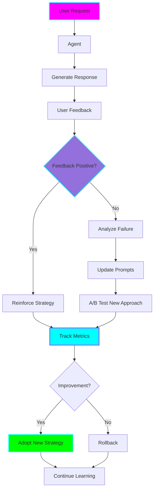
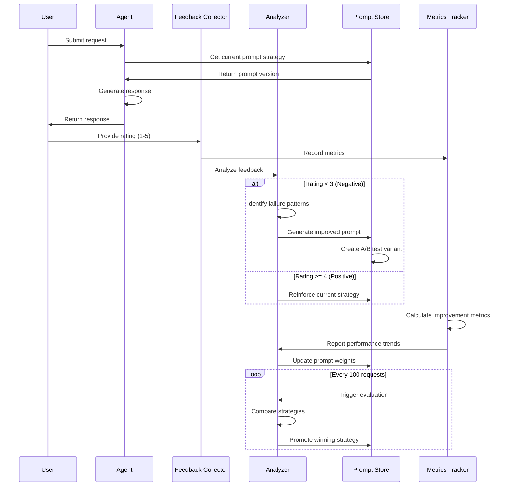
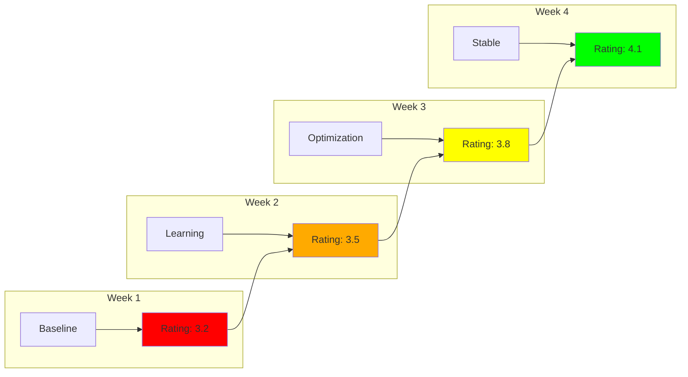

# 🧠 Self-Improving Agent

**Status:** 🧪 Experimental

**Tech Stack:** Python 3.11+, LangGraph, LangChain, OpenAI API

**Purpose:** An AI agent that learns from user feedback, measures its own performance, and continuously improves its prompts and strategies over time.

## Architecture Overview



## Learning Loop Diagram



## Features

### 1. Feedback Collection
- **User ratings:** 1-5 star ratings on responses
- **Explicit feedback:** Text comments on what went wrong/right
- **Implicit signals:** Response time, follow-up questions, task completion
- **Contextual tracking:** Link feedback to specific prompt versions and strategies

### 2. Prompt Evolution
- **Version control:** Track all prompt versions with timestamps
- **A/B testing:** Test multiple prompt strategies simultaneously
- **Automatic optimization:** Adjust prompts based on feedback patterns
- **Rollback capability:** Revert to previous versions if performance degrades

### 3. Strategy Adaptation
- **Multiple approaches:** Maintain pool of different strategies
- **Performance tracking:** Measure success rate per strategy
- **Dynamic selection:** Choose best strategy based on context
- **Continuous experimentation:** Always test new approaches

### 4. Metrics & Evaluation
- **Accuracy improvement:** Track accuracy over time
- **User satisfaction:** Monitor rating trends
- **Cost efficiency:** Optimize for cost per successful interaction
- **Response quality:** Track response length, clarity, completeness

### 5. Learning Mechanisms
- **Reinforcement learning:** Reward successful strategies
- **Pattern recognition:** Identify what works in different contexts
- **Error analysis:** Deep dive into failure cases
- **Transfer learning:** Apply learnings across similar tasks

## Feedback Mechanisms

### Rating System

```python
class FeedbackRating(IntEnum):
    TERRIBLE = 1    # Completely wrong/unhelpful
    POOR = 2        # Mostly unhelpful
    NEUTRAL = 3     # Somewhat helpful
    GOOD = 4        # Helpful
    EXCELLENT = 5   # Perfect response

# Feedback with context
feedback = {
    "rating": FeedbackRating.GOOD,
    "comment": "Helpful but could be more concise",
    "prompt_version": "v2.3",
    "strategy": "detailed_explanation",
    "context": {...}
}
```

### Implicit Signals

- **Task completion:** Did user achieve their goal?
- **Follow-up questions:** Did user need clarification?
- **Time to acceptance:** How long before user accepted response?
- **Modification rate:** How much did user modify the response?

## Metrics Dashboard

### Key Performance Indicators (KPIs)

| Metric | Description | Target | Current |
|--------|-------------|--------|---------|
| **Average Rating** | Mean user rating (1-5) | > 4.0 | Tracking |
| **Success Rate** | % of ratings >= 4 | > 80% | Tracking |
| **Improvement Rate** | % improvement vs baseline | > 10% | Tracking |
| **Cost per Success** | API cost / successful interaction | Decreasing | Tracking |
| **Response Time** | Average response generation time | < 3s | Tracking |

### Tracking Over Time



## Prompt Evolution Example

### Initial Prompt (v1.0)

```python
INITIAL_PROMPT = """
You are a helpful assistant.
Answer the user's question: {question}
"""
# Performance: 3.2/5 average rating
```

### After 50 Feedbacks (v1.5)

```python
EVOLVED_PROMPT = """
You are a helpful assistant. Provide clear, concise answers.

User question: {question}

Guidelines:
- Be specific and accurate
- Use examples when helpful
- Keep responses focused
"""
# Performance: 3.7/5 average rating (+15%)
```

### After 200 Feedbacks (v2.0)

```python
OPTIMIZED_PROMPT = """
You are a helpful assistant specializing in {domain}.

User question: {question}
User context: {context}

Approach:
1. Understand the core question
2. Provide direct answer first
3. Add supporting details if needed
4. Suggest next steps

Format: {preferred_format}
"""
# Performance: 4.2/5 average rating (+31%)
```

## A/B Testing Framework

### Test Configuration

```python
class PromptVariant:
    """A/B test variant"""
    id: str
    prompt_template: str
    strategy: str
    traffic_percentage: float
    metrics: PerformanceMetrics

# Example A/B test
test = ABTest(
    name="detailed_vs_concise",
    variants=[
        PromptVariant(
            id="detailed",
            strategy="provide_comprehensive_answer",
            traffic_percentage=0.5
        ),
        PromptVariant(
            id="concise",
            strategy="provide_brief_answer",
            traffic_percentage=0.5
        )
    ],
    sample_size=100,
    success_metric="average_rating"
)
```

### Test Results Analysis

```python
# After 100 samples per variant
results = {
    "detailed": {
        "average_rating": 3.8,
        "success_rate": 75%,
        "avg_tokens": 450
    },
    "concise": {
        "average_rating": 4.1,
        "success_rate": 82%,
        "avg_tokens": 200
    }
}
# Winner: concise (higher rating, lower cost)
```

## Environment Setup

### Prerequisites
- Python 3.11+
- OpenAI API key
- Database for storing feedback (SQLite or PostgreSQL)

### Installation

```bash
# Navigate to project
cd /home/user/fantastic-engine/projects/self-improving-agent

# Create virtual environment
uv venv
source .venv/bin/activate

# Install dependencies
pip install -r requirements.txt

# Configure environment
cp .env.example .env
# Edit .env with your configuration

# Initialize database
python -m self_improving_agent.database.init_db
```

### Configuration

Create `.env` file with:

```env
OPENAI_API_KEY=your-api-key-here
MODEL_NAME=gpt-4-turbo-preview
DATABASE_URL=sqlite:///./self_improving_agent.db

# Learning configuration
MIN_FEEDBACK_FOR_UPDATE=20
AB_TEST_SAMPLE_SIZE=100
IMPROVEMENT_THRESHOLD=0.1  # 10% improvement required
ROLLBACK_THRESHOLD=-0.05   # 5% degradation triggers rollback

# Metrics configuration
TRACK_COST=true
TRACK_LATENCY=true
ENABLE_AB_TESTING=true
```

## Usage Examples

### Basic Usage

```python
from self_improving_agent import SelfImprovingAgent

# Initialize agent
agent = SelfImprovingAgent()

# Process request
response = agent.process_request(
    question="How do I deploy a Python application?",
    context={"user_level": "intermediate"}
)

print(response.content)

# Collect feedback
agent.record_feedback(
    response_id=response.id,
    rating=4,
    comment="Very helpful!"
)
```

### Monitor Learning Progress

```python
# Get performance metrics
metrics = agent.get_metrics()

print(f"Current average rating: {metrics['average_rating']}")
print(f"Improvement vs baseline: {metrics['improvement_pct']}%")
print(f"Total feedbacks: {metrics['feedback_count']}")

# Get prompt evolution history
history = agent.get_prompt_history()

for version in history:
    print(f"v{version.number}: {version.avg_rating} "
          f"({version.sample_size} samples)")
```

### Run A/B Test

```python
from self_improving_agent.testing import ABTestRunner

# Create test
test = ABTestRunner(
    name="structured_vs_freeform",
    variants={
        "structured": "Use numbered lists and headers",
        "freeform": "Use natural paragraph format"
    }
)

# Run test for 100 samples
results = test.run(sample_size=100)

print(f"Winner: {results.winner}")
print(f"Confidence: {results.confidence}%")

# Apply winner
agent.apply_strategy(results.winner)
```

### Analyze Failure Patterns

```python
# Get low-rated responses
failures = agent.get_responses_by_rating(max_rating=2)

# Analyze patterns
patterns = agent.analyze_failure_patterns(failures)

for pattern in patterns:
    print(f"Pattern: {pattern.description}")
    print(f"Frequency: {pattern.count}")
    print(f"Suggested fix: {pattern.suggestion}")
```

## Project Structure

```
self-improving-agent/
├── README.md
├── requirements.txt
├── .env.example
├── .python-version
├── self_improving_agent/
│   ├── __init__.py
│   ├── agent.py              # Main agent
│   ├── feedback/
│   │   ├── __init__.py
│   │   ├── collector.py      # Feedback collection
│   │   └── analyzer.py       # Feedback analysis
│   ├── prompts/
│   │   ├── __init__.py
│   │   ├── store.py          # Prompt version control
│   │   ├── optimizer.py      # Prompt optimization
│   │   └── templates.py      # Prompt templates
│   ├── strategies/
│   │   ├── __init__.py
│   │   ├── base.py           # Base strategy
│   │   └── registry.py       # Strategy registry
│   ├── testing/
│   │   ├── __init__.py
│   │   └── ab_test.py        # A/B testing framework
│   ├── metrics/
│   │   ├── __init__.py
│   │   ├── tracker.py        # Metrics tracking
│   │   └── evaluator.py      # Performance evaluation
│   └── database/
│       ├── __init__.py
│       ├── models.py         # Database models
│       └── init_db.py        # Database initialization
├── examples/
│   ├── basic_usage.py
│   ├── ab_testing.py
│   └── analysis.py
└── tests/
    ├── test_agent.py
    ├── test_feedback.py
    └── test_optimization.py
```

## Evaluation Metrics

### Learning Performance
- **Baseline Performance:** Initial average rating before learning
- **Current Performance:** Latest average rating
- **Improvement Rate:** (Current - Baseline) / Baseline
- **Learning Velocity:** Rate of improvement per week

### User Satisfaction
- **Average Rating:** Mean rating across all responses
- **Rating Distribution:** Histogram of ratings
- **Net Promoter Score:** % promoters - % detractors
- **Retention Rate:** % users who return

### Cost Efficiency
- **Cost per Response:** API costs per response
- **Cost per Success:** Cost / successful responses (rating >= 4)
- **Token Efficiency:** Tokens per successful response
- **ROI:** Value gained vs cost of improvement

### A/B Test Metrics
- **Statistical Significance:** p-value of test results
- **Confidence Level:** Confidence in winner selection
- **Sample Size:** Number of samples per variant
- **Test Duration:** Time to reach significance

## Learning Log

### Concepts to Master
- [ ] Reinforcement learning from human feedback (RLHF)
- [ ] A/B testing statistical significance
- [ ] Prompt engineering best practices
- [ ] Multi-armed bandit algorithms
- [ ] Online learning strategies
- [ ] Feedback loop design

### Challenges & Solutions
- **Challenge:** Cold start problem (no feedback initially)
  - **Solution:** Start with baseline prompts, collect initial feedback batch
- **Challenge:** Feedback bias (happy users don't rate)
  - **Solution:** Proactive feedback requests, implicit signals
- **Challenge:** Overfitting to recent feedback
  - **Solution:** Use exponential moving average, maintain diverse test set

### Next Steps
- [ ] Implement basic feedback collection
- [ ] Build prompt version control system
- [ ] Create A/B testing framework
- [ ] Add metrics tracking and dashboard
- [ ] Implement automatic prompt optimization
- [ ] Add rollback mechanism
- [ ] Build analysis tools for failure patterns
- [ ] Create visualization dashboard

## Graduation Criteria

- [ ] Agent successfully collects and stores feedback
- [ ] Prompt optimization shows measurable improvement (>10%)
- [ ] A/B testing framework functional
- [ ] Metrics tracking implemented
- [ ] Rollback mechanism tested and working
- [ ] Documentation includes learning playbook
- [ ] Successfully improved on 3+ different task types
- [ ] Performance stable over 2+ weeks

## Resources

- [RLHF Paper](https://arxiv.org/abs/2203.02155)
- [A/B Testing Guide](https://www.optimizely.com/optimization-glossary/ab-testing/)
- [Prompt Engineering Guide](https://www.promptingguide.ai/)
- [LangChain Evaluation](https://python.langchain.com/docs/guides/evaluation)
- [Multi-Armed Bandits](https://en.wikipedia.org/wiki/Multi-armed_bandit)

## Safety Considerations

### Feedback Quality
- **Filter spam:** Detect and ignore low-quality feedback
- **Prevent gaming:** Detect attempts to manipulate the system
- **Validate ratings:** Ensure ratings match context

### Prompt Safety
- **Safety constraints:** Never remove safety guidelines
- **Harmful content:** Monitor for harmful prompt evolution
- **Bias detection:** Track for emerging biases
- **Human review:** Periodic review of prompt changes

### Rollback Safeguards
- **Automatic rollback:** On significant performance drops
- **Manual override:** Allow human intervention
- **A/B buffer:** Keep running previous version during tests
- **Gradual rollout:** Slowly increase traffic to new versions

## License

MIT

---

**Remember:** Learning from feedback is powerful but requires careful monitoring. Always validate improvements and maintain safety guardrails. 🧠
