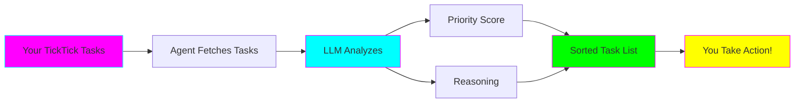
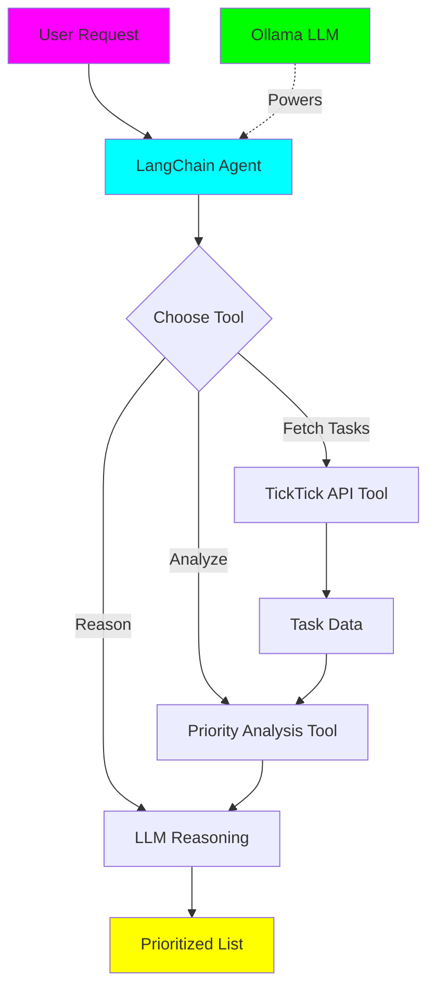

# TickTick Priority Agent

**Status:** 🚧 In Progress

**Tech Stack:** Python 3.12, LangChain, Ollama, TickTick API

**Started:** 2025-11-04

## Overview

An intelligent agent that helps you prioritize your TickTick tasks using AI. This project demonstrates:
- **LangChain Agents** - Building autonomous AI agents
- **Tool Integration** - Connecting LLMs to external APIs
- **Practical AI** - Solving real-world productivity problems

### What Does It Do?

The agent can:
1. 📥 Fetch your tasks from TickTick
2. 🧠 Analyze tasks based on multiple criteria
3. 📊 Prioritize using intelligent reasoning
4. ✅ Suggest which tasks to tackle first
5. 📝 Provide reasoning for its suggestions



## Why Build This?

**Learning Goals:**
- 🤖 Understand how LangChain agents work
- 🔧 Learn to integrate external APIs with LLMs
- 🎯 Practice prompt engineering for agents
- 📚 Explore agent reasoning and tool usage
- 💡 Build something immediately useful!

**Practical Benefits:**
- ⏰ Save time on task prioritization
- 🧠 Get AI-powered insights on your todo list
- 📈 Learn your own productivity patterns
- 🤝 Have an AI productivity coach

## Architecture



### Components

1. **LangChain Agent** 🤖
   - Orchestrates the workflow
   - Decides which tools to use
   - Maintains conversation context

2. **TickTick API Integration** 📥
   - Authenticates with TickTick
   - Fetches tasks, projects, tags
   - Respects rate limits

3. **Priority Analysis Tool** 📊
   - Evaluates deadlines
   - Considers task importance
   - Analyzes dependencies
   - Estimates effort

4. **Ollama LLM** 🧠
   - Provides reasoning capabilities
   - Understands natural language
   - Generates explanations

## Key Concepts You'll Learn

### 1. **LangChain Agents** 🤖

Unlike chains (fixed sequences), agents can:
- Decide which tools to use
- Use tools multiple times
- Adapt based on intermediate results
- Have more flexible workflows

```python
# Chain: Always does A → B → C
chain = A | B | C

# Agent: Decides dynamically
agent = "Should I use tool X or Y? Let me think..."
```

### 2. **Tool Integration** 🔧

Tools are functions that agents can call:
- Must have clear descriptions
- Input/output schemas defined
- Error handling built-in
- LLM decides when to use them

### 3. **Prompt Engineering for Agents** 📝

Agent prompts need:
- Clear role definition
- Tool descriptions
- Examples of reasoning
- Guidelines for tool usage

### 4. **API Integration Patterns** 🔌

Learn to:
- Handle authentication (OAuth 2.0)
- Manage rate limits
- Parse API responses
- Handle errors gracefully

## Environment Setup

This project uses Python 3.12.

### Quick Start

```bash
# Navigate to project
cd projects/ticktick-priority-agent

# Create virtual environment
uv venv
source .venv/bin/activate  # Windows: .venv\Scripts\activate

# Install dependencies
pip install -r requirements.txt

# Setup environment variables
cp .env.example .env
# Edit .env with your TickTick credentials

# Run the agent
python src/priority_agent.py
```

### Prerequisites

1. **TickTick Account** (free tier works!)
   - Sign up at https://ticktick.com

2. **TickTick API Credentials**
   - Go to Settings → Developer
   - Create an application
   - Copy Client ID and Client Secret

3. **Ollama** (for local LLM)
   - Install from https://ollama.ai
   - Pull a model: `ollama pull llama2`

### Environment Variables

Create a `.env` file:

```bash
# TickTick API Credentials
TICKTICK_CLIENT_ID=your_client_id
TICKTICK_CLIENT_SECRET=your_client_secret
TICKTICK_USERNAME=your_email
TICKTICK_PASSWORD=your_password

# Ollama Configuration
OLLAMA_MODEL=llama2
OLLAMA_BASE_URL=http://localhost:11434

# Agent Configuration
AGENT_VERBOSE=true  # Show reasoning steps
MAX_ITERATIONS=5    # Prevent infinite loops
```

## Project Structure

```
ticktick-priority-agent/
├── .python-version         # Python version (3.12)
├── requirements.txt        # Dependencies
├── .env                    # Environment variables (create this)
├── .env.example           # Example environment config
├── README.md              # This file
├── src/
│   ├── priority_agent.py  # Main agent implementation
│   ├── ticktick_tools.py  # TickTick API tools
│   ├── priority_tools.py  # Priority analysis tools
│   ├── agent_config.py    # Agent configuration
│   └── api_client.py      # TickTick API client
├── examples/
│   ├── simple_agent.py    # Minimal agent example
│   ├── custom_prompts.py  # Prompt engineering examples
│   └── analysis_demo.py   # Priority analysis demo
└── tests/
    └── test_tools.py      # Tool testing
```

## Learning Path

### 📚 Step 1: Understand Agents
Read the "Key Concepts" section above and explore:
- What makes agents different from chains?
- How do agents decide which tools to use?
- What is ReAct (Reasoning + Acting)?

### 🔧 Step 2: Run Simple Agent (`examples/simple_agent.py`)
- Basic agent with one tool
- See how agents "think"
- Understand the ReAct loop

**Key Learnings:**
- Agent decision-making process
- Tool description importance
- Thought → Action → Observation cycle

### 🔌 Step 3: TickTick Integration (`src/api_client.py`)
- Authentication flow
- API request patterns
- Error handling

**Key Learnings:**
- OAuth 2.0 flow
- API rate limiting
- Data parsing

### 🤖 Step 4: Full Priority Agent (`src/priority_agent.py`)
- Multi-tool agent
- Complex reasoning
- Real-world usage

**Key Learnings:**
- Agent with multiple tools
- Tool chaining
- Context management

### 🎨 Step 5: Customization
- Write custom priority criteria
- Create new analysis tools
- Tune agent prompts

## TickTick API Basics

### Authentication

TickTick uses OAuth 2.0:

1. **Get Access Token**
   ```python
   POST /oauth/token
   {
       "client_id": "...",
       "client_secret": "...",
       "username": "...",
       "password": "...",
       "grant_type": "password"
   }
   ```

2. **Use Token**
   ```python
   GET /api/v1/tasks
   Headers: {
       "Authorization": "Bearer <access_token>"
   }
   ```

### Key Endpoints

- `GET /api/v1/tasks` - Fetch all tasks
- `GET /api/v1/project/{id}/tasks` - Tasks by project
- `POST /api/v1/task` - Create task
- `PUT /api/v1/task/{id}` - Update task

### Rate Limits

- 120 requests per minute
- Use exponential backoff for retries

## Priority Analysis Criteria

The agent considers multiple factors:

### 1. **Urgency** ⏰
- Due date proximity
- Overdue tasks get highest priority
- Tasks due today vs. this week vs. later

### 2. **Importance** ⭐
- Task priority level (High/Medium/Low)
- Project importance
- User-defined tags

### 3. **Effort** 💪
- Estimated time to complete
- Task complexity
- Quick wins vs. big projects

### 4. **Dependencies** 🔗
- Blocking other tasks
- Prerequisite tasks
- Project relationships

### 5. **Context** 🎯
- Current energy level (time of day)
- Available time
- Recent completion patterns

## Agent Prompting Strategies

### System Prompt Template

```
You are a productivity assistant that helps prioritize tasks.

Your goal: Analyze the user's TickTick tasks and suggest an optimal order
to complete them, considering deadlines, importance, and effort.

Available Tools:
1. fetch_tasks - Get tasks from TickTick
2. analyze_priority - Calculate priority scores
3. explain_reasoning - Provide detailed reasoning

Process:
1. Fetch current tasks
2. Analyze each task
3. Generate prioritized list
4. Explain your reasoning

Be concise but thorough in your explanations.
```

### Few-Shot Examples

Include examples of good reasoning:

```
Example:
Q: "What should I work on next?"
Thought: I need to fetch the user's tasks first.
Action: fetch_tasks
Observation: Found 10 tasks, 3 are overdue.
Thought: I should prioritize the overdue tasks...
```

## Common Patterns & Solutions

### Q: Agent keeps using the wrong tool?

**Solution:**
- Improve tool descriptions
- Add examples in system prompt
- Reduce number of tools
- Make tool names more descriptive

### Q: Agent gets stuck in loops?

**Solution:**
- Set `max_iterations` limit
- Add early stopping conditions
- Improve error handling
- Simplify the task

### Q: Priority scores don't match expectations?

**Solution:**
- Tune scoring weights
- Add more criteria
- Collect user feedback
- A/B test different algorithms

### Q: API rate limiting errors?

**Solution:**
- Implement caching
- Batch requests
- Add exponential backoff
- Cache task data locally

## Advanced Features (Optional)

### 1. **Learning from Feedback** 📈
- Track which suggestions you follow
- Adjust scoring based on patterns
- Personalized prioritization

### 2. **Smart Scheduling** 📅
- Suggest specific times to work on tasks
- Consider calendar availability
- Respect energy levels throughout day

### 3. **Project-Level Analysis** 📊
- Prioritize across projects
- Identify project bottlenecks
- Suggest project sequencing

### 4. **Natural Language Task Entry** ✍️
- "Add task: Call dentist tomorrow at 2pm"
- Parse and create tasks from natural language
- Extract due dates, tags, priorities

## Learning Log

### What I'll Learn
- [ ] LangChain agent architecture
- [ ] Tool integration patterns
- [ ] OAuth 2.0 authentication
- [ ] Prompt engineering for agents
- [ ] Agent reasoning strategies

### Challenges
- Understanding agent vs. chain difference
- Getting tool descriptions right
- Handling API authentication
- Tuning priority algorithm

### Next Steps
- [ ] Implement basic TickTick API client
- [ ] Create simple agent with one tool
- [ ] Add priority analysis logic
- [ ] Build full multi-tool agent
- [ ] Add personalization based on history

## Graduation Criteria

Before moving to its own repository:
- [ ] Successfully authenticates with TickTick
- [ ] Fetches and displays tasks
- [ ] Provides reasonable prioritization
- [ ] Handles errors gracefully
- [ ] Works with Ollama locally
- [ ] Documentation complete with examples
- [ ] User testing with real task lists

## References

### LangChain Agents
- [LangChain Agents Documentation](https://python.langchain.com/docs/modules/agents/)
- [ReAct Paper](https://arxiv.org/abs/2210.03629)
- [Building Agents Tutorial](https://python.langchain.com/docs/tutorials/agents/)

### TickTick API
- [TickTick Open API Docs](https://developer.ticktick.com/api)
- [OAuth 2.0 Guide](https://oauth.net/2/)

### Priority Algorithms
- [Eisenhower Matrix](https://en.wikipedia.org/wiki/Time_management#The_Eisenhower_Method)
- [Getting Things Done (GTD)](https://gettingthingsdone.com/)

### AI Agent Design
- [Autonomous Agents Survey](https://arxiv.org/abs/2308.11432)
- [Tool-Augmented LLMs](https://arxiv.org/abs/2302.04761)

---

**Remember:** Agents are more complex than chains. Start simple, understand each component, then build up! 🚀
