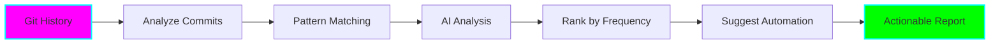
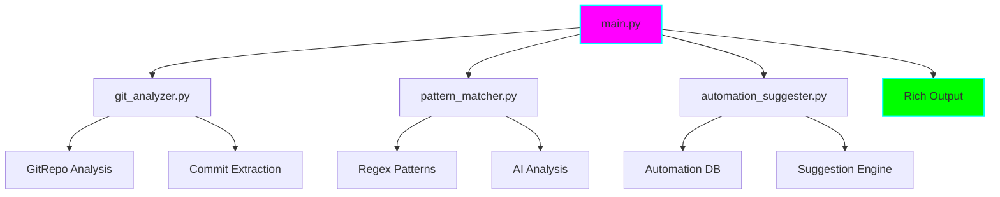

# 🤖 Toil Automation Identifier

**Status:** 🧪 Experimental
**Tech Stack:** Python 3.11, OpenAI/Ollama, Git, Rich CLI
**Purpose:** Analyze git commit history to identify repetitive tasks that should be automated

## The Problem

Developers spend countless hours on repetitive tasks:
- "fix linting errors"
- "update dependencies"
- "run formatter"
- "fix typos in docs"
- "regenerate lockfile"

These tasks (called "toil") are manual, repetitive, and automatable. But which ones should you automate first?

## The Solution



This tool:
1. Analyzes your git commit messages (last N commits)
2. Uses regex + AI to identify repetitive patterns
3. Ranks toil tasks by frequency and time waste
4. Suggests specific automation strategies (GitHub Actions, pre-commit hooks, scripts)
5. Outputs an actionable report showing what to automate next

## Features

- **Git History Analysis** - Scans commit messages across branches
- **Pattern Detection** - Regex + AI-powered pattern matching
- **Toil Classification** - Categorizes repetitive tasks
- **Frequency Ranking** - Identifies highest-impact automations
- **Automation Suggestions** - Specific tools and approaches for each pattern
- **Rich CLI Output** - Beautiful, readable tables and charts
- **Multiple AI Backends** - Supports OpenAI, Ollama, or regex-only mode

## Installation

```bash
# Navigate to project
cd projects/toil-automation-identifier

# Create virtual environment (using uv - recommended)
uv venv
source .venv/bin/activate  # On Windows: .venv\Scripts\activate

# Or using standard Python
python -m venv .venv
source .venv/bin/activate

# Install dependencies
pip install -r requirements.txt

# Configure (optional - for AI analysis)
cp .env.example .env
# Edit .env with your API keys
```

## Usage

### Basic Analysis (Regex Only)

```bash
# Analyze last 100 commits in current repo
python main.py

# Analyze specific number of commits
python main.py --commits 500

# Analyze specific repository
python main.py --repo /path/to/repo --commits 200
```

### AI-Enhanced Analysis

```bash
# Using OpenAI
python main.py --ai openai --commits 200

# Using Ollama (local, free)
python main.py --ai ollama --model llama2 --commits 200

# Specify output format
python main.py --format json > toil-report.json
```

## Example Output

```
╭─────────────────────────────────────────────────────────────────╮
│                  Toil Analysis Report                            │
│             Analyzed 200 commits from main branch                │
╰─────────────────────────────────────────────────────────────────╯

┏━━━━━┳━━━━━━━━━━━━━━━━━━━━━━━━━┳━━━━━━━━━━━┳━━━━━━━━━━━━━━━━━━━━━━━━┓
┃ Rank┃ Toil Pattern             ┃ Count     ┃ Suggested Automation    ┃
┡━━━━━╇━━━━━━━━━━━━━━━━━━━━━━━━━╇━━━━━━━━━━━╇━━━━━━━━━━━━━━━━━━━━━━━━┩
│  1  │ Fix linting/formatting   │ 47 (24%)  │ pre-commit hooks        │
│  2  │ Update dependencies      │ 32 (16%)  │ Dependabot/Renovate     │
│  3  │ Fix typos                │ 28 (14%)  │ Spell checker in CI     │
│  4  │ Regenerate files         │ 19 (10%)  │ GitHub Actions          │
│  5  │ Update copyright year    │ 12 (6%)   │ Automated script        │
└─────┴──────────────────────────┴───────────┴─────────────────────────┘

💡 Estimated time saved if automated: 15-20 hours/year

Top Priority: Fix linting/formatting (47 occurrences)
├─ Tools: pre-commit, black, prettier, eslint
├─ Setup: Add .pre-commit-config.yaml
└─ Example: https://pre-commit.com/
```

## Architecture



### Components

| File | Purpose |
|------|---------|
| `main.py` | CLI interface, orchestration, output rendering |
| `git_analyzer.py` | Git repository analysis, commit extraction |
| `pattern_matcher.py` | Regex + AI pattern detection and classification |
| `automation_suggester.py` | Maps patterns to automation strategies |
| `requirements.txt` | Python dependencies |
| `.env.example` | Configuration template |

## Common Toil Patterns Detected

The tool identifies these common patterns:

| Pattern | Examples | Automation |
|---------|----------|------------|
| **Linting/Formatting** | "fix lint", "run prettier", "format code" | pre-commit hooks |
| **Dependency Updates** | "update deps", "bump version", "npm audit fix" | Dependabot, Renovate |
| **Documentation Fixes** | "fix typo", "update docs", "fix spelling" | Spell checker, CI |
| **Code Generation** | "regenerate", "rebuild", "update generated" | GitHub Actions |
| **Version Bumps** | "bump version", "update changelog" | Semantic release |
| **Test Fixes** | "fix flaky test", "update snapshot" | Better test practices |
| **Merge Conflicts** | "resolve conflict", "merge main" | Rebase strategy |

## Configuration

Create `.env` from `.env.example`:

```bash
# AI Provider (optional)
AI_PROVIDER=openai  # or 'ollama' or 'none'

# OpenAI Settings
OPENAI_API_KEY=sk-...
OPENAI_MODEL=gpt-4o-mini

# Ollama Settings (if using local AI)
OLLAMA_HOST=http://localhost:11434
OLLAMA_MODEL=llama2

# Analysis Settings
MIN_PATTERN_COUNT=3  # Minimum occurrences to report
COMMITS_TO_ANALYZE=200  # Default number of commits
```

## Graduation Criteria

- [x] Core git analysis working
- [x] Pattern matching with regex
- [ ] AI integration (OpenAI + Ollama)
- [ ] Rich CLI output with tables
- [ ] JSON/CSV export formats
- [ ] Tested on 3+ real repositories
- [ ] Documentation complete
- [ ] CI/CD for testing
- [ ] Published as PyPI package

## Learning Log

### Challenges
- Parsing diverse commit message formats
- Balancing regex vs AI for pattern detection
- Categorizing edge cases
- Suggesting actionable automations

### Next Steps
1. Add AI integration for better pattern detection
2. Build automation strategy database
3. Add time estimation for toil impact
4. Create interactive mode for filtering
5. Add support for analyzing multiple repos

## Tech Stack Details

- **Python 3.11** - Modern async support
- **GitPython** - Git repository interaction
- **OpenAI API** - AI-powered pattern analysis (optional)
- **Ollama** - Local AI alternative (optional)
- **Rich** - Beautiful CLI output
- **Click** - CLI framework
- **python-dotenv** - Environment configuration

## Contributing

This is an experimental project. Feedback and improvements welcome!

## License

MIT

---

**Remember:** The best automation is the one you actually implement. Start small, automate the biggest pain point first! 🚀
