# 📊 Ultralearning Tracker

**Status:** 🧪 Experimental
**Tech Stack:** Python 3.11, Rich, Plotly
**Purpose:** Track progress across all ultralearning projects with visual dashboards

---

## Problem

When working on multiple learning projects:
- 📉 **Hard to see overall progress** - Which projects are moving?
- ⏰ **Time allocation unclear** - Where is time actually going?
- 🎯 **Milestones invisible** - Are you on track for weekly goals?
- 📈 **No velocity tracking** - Are you accelerating or slowing down?
- 🧠 **ADHD difficulty** - Hard to maintain big-picture view

**You need:** A single dashboard showing progress across all learning projects.

---

## Solution

A tracking system that:
1. **Parses** ultralearning markdown files in this repo
2. **Extracts** progress metrics (checkboxes, time logs)
3. **Calculates** completion %, velocity, time spent
4. **Generates** terminal dashboard or HTML report
5. **Tracks** weekly milestones and deadlines

```mermaid
graph LR
    A[📁 Ultralearning Projects] --> B[Scan Markdown Files]
    B --> C[Parse Checkboxes]
    B --> D[Extract Time Logs]
    C --> E[Calculate Progress %]
    D --> F[Calculate Time Spent]
    E --> G[📊 Dashboard]
    F --> G
    G --> H{Output Format}
    H -->|Terminal| I[Rich Console]
    H -->|HTML| J[Interactive Report]
    H -->|JSON| K[API Export]

    style A fill:#ff00ff,stroke:#00ffff,stroke-width:2px
    style G fill:#00ffff,stroke:#ff00ff,stroke-width:2px
    style I fill:#00ff00,stroke:#ff00ff,stroke-width:2px
```



---

## Features

### Core Features
- ✅ **Automatic Parsing** - Reads markdown files for progress
- ✅ **Completion Tracking** - Calculates % done from checkboxes
- ✅ **Time Tracking** - Extracts time spent from logs
- ✅ **Velocity Charts** - Shows progress over time
- ✅ **Terminal Dashboard** - Beautiful Rich console output
- ✅ **HTML Report** - Interactive web dashboard

### Advanced Features
- 📅 **Weekly Milestones** - Track weekly goals
- 🎯 **Burndown Charts** - Visualize remaining work
- 📈 **Trend Analysis** - Predict completion dates
- 🔔 **Notifications** - Alert when behind schedule
- 📊 **Comparison View** - Compare project velocities

---

## Architecture

```mermaid
flowchart TD
    A[Start] --> B[Scan Projects Directory]
    B --> C{Find MD Files}
    C -->|Found| D[Parse Frontmatter]
    C -->|None| Z[Done]
    D --> E[Extract Metadata]
    E --> F[Count Checkboxes]
    F --> G{Has Time Logs?}
    G -->|Yes| H[Parse Time Entries]
    G -->|No| I[Skip Time]
    H --> J[Calculate Metrics]
    I --> J
    J --> K[Store in Memory]
    K --> C
    Z --> L[Aggregate All Projects]
    L --> M[Calculate Totals]
    M --> N[Generate Visualizations]
    N --> O{Output Mode?}
    O -->|Terminal| P[Render Rich Tables]
    O -->|HTML| Q[Generate Plotly Charts]
    O -->|JSON| R[Export JSON]
    P --> S[✅ Display]
    Q --> S
    R --> S

    style J fill:#00ffff,stroke:#ff00ff,stroke-width:2px
    style N fill:#ff00ff,stroke:#00ffff,stroke-width:2px
    style S fill:#00ff00,stroke:#ff00ff,stroke-width:2px
```



### Components

| Component | Purpose | Technology |
|-----------|---------|------------|
| **Markdown Parser** | Parse project files | python-frontmatter |
| **Progress Analyzer** | Calculate completion % | Regex / custom |
| **Time Parser** | Extract time logs | dateutil / regex |
| **Metrics Engine** | Calculate velocity, trends | pandas / numpy |
| **Dashboard Renderer** | Terminal UI | Rich |
| **Report Generator** | HTML reports | Plotly + Jinja2 |

---

## Installation

### Prerequisites
- Python 3.11
- Ultralearning projects in `/projects/` directory

### Setup

```bash
# Navigate to project
cd /home/user/fantastic-engine/projects/ultralearning-tracker

# Create virtual environment
python -m venv .venv
source .venv/bin/activate  # On Windows: .venv\Scripts\activate

# Install dependencies
pip install -r requirements.txt

# Copy environment template
cp .env.example .env

# Edit .env if needed
nano .env
```

### Configuration

Edit `.env`:

```bash
# Project Settings
PROJECTS_ROOT=/home/user/fantastic-engine/projects
INCLUDE_PROJECTS=  # Empty = all, or comma-separated list
EXCLUDE_PROJECTS=shared-utils,graduated

# Parsing Settings
PROGRESS_INDICATOR_REGEX=- \[(x| )\]  # Checkbox format
TIME_LOG_FORMAT=YYYY-MM-DD HH:MM  # Time entry format

# Dashboard Settings
DEFAULT_OUTPUT=terminal  # terminal, html, json
TERMINAL_WIDTH=120
SHOW_VELOCITY_CHART=true
SHOW_BURNDOWN=true

# Milestone Settings
WEEKLY_GOAL_HOURS=10
WARN_IF_BEHIND=true

# HTML Report
HTML_OUTPUT_PATH=./reports/dashboard.html
AUTO_OPEN_BROWSER=true

# Logging
LOG_LEVEL=INFO
```

---

## Usage

### 1. Terminal Dashboard

```bash
# Show dashboard
python -m src.tracker

# Refresh every 60 seconds
python -m src.tracker --watch 60

# Specific projects only
python -m src.tracker --projects personal-knowledge-rag,pr-review-agent
```

**Output:**
```
╭─────────────────────────────────────────────────────────────────────────────╮
│                    📊 Ultralearning Progress Dashboard                      │
│                         Last Updated: 2025-11-16 14:30                      │
╰─────────────────────────────────────────────────────────────────────────────╯

╭─ Overall Statistics ──────────────────────────────────────────────────────╮
│ Total Projects: 5                                                          │
│ Overall Progress: ████████████░░░░░░░░░░ 58%                              │
│ Total Time: 47.5 hours                                                     │
│ This Week: 8.2 hours (82% of goal)                                        │
│ Avg Velocity: 2.3 tasks/day                                               │
╰────────────────────────────────────────────────────────────────────────────╯

╭─ Project Details ──────────────────────────────────────────────────────────╮
│ Project                    Progress  Time    Velocity  Status             │
├────────────────────────────────────────────────────────────────────────────┤
│ personal-knowledge-rag     ████░░    35%     12.5h     1.8/day   🟡 Active │
│ pr-review-agent            ██████░   58%     8.3h      2.1/day   🟢 On Track│
│ cicd-monitor-agent         ████░░    42%     6.7h      1.5/day   🟡 Active │
│ flashcard-generator        ███████░  72%     11.2h     3.2/day   🟢 Fast   │
│ ultralearning-tracker      ██░░░░    18%     8.8h      0.9/day   🔴 Slow   │
╰────────────────────────────────────────────────────────────────────────────╯

╭─ Weekly Milestones ────────────────────────────────────────────────────────╮
│ Week Starting  Goal         Actual      Status                             │
├────────────────────────────────────────────────────────────────────────────┤
│ Nov 11        10.0h        8.2h        ⚠️  Behind                          │
│ Nov 4         10.0h        12.5h       ✅ Exceeded                         │
│ Oct 28        10.0h        9.8h        ✅ Met                              │
╰────────────────────────────────────────────────────────────────────────────╯

╭─ Velocity Chart (Last 7 Days) ────────────────────────────────────────────╮
│                                                                             │
│  5 │                                                    ●                   │
│  4 │                                    ●                                   │
│  3 │                  ●                                                     │
│  2 │        ●                                                               │
│  1 │  ●                                                                     │
│  0 └─────────────────────────────────────────────────────────────────────  │
│     Mon   Tue   Wed   Thu   Fri   Sat   Sun                               │
╰────────────────────────────────────────────────────────────────────────────╯

💡 Insights:
  • flashcard-generator is moving fastest (3.2 tasks/day)
  • ultralearning-tracker needs attention (0.9 tasks/day)
  • You're 82% toward this week's goal - keep going!
```

### 2. HTML Report

```bash
# Generate HTML report
python -m src.tracker --html

# Custom output path
python -m src.tracker --html --output ./my-report.html
```

**Opens in browser with:**
- Interactive Plotly charts
- Progress bars for each project
- Burndown charts
- Time distribution pie chart
- Velocity trends
- Milestone tracking

### 3. JSON Export

```bash
# Export as JSON
python -m src.tracker --json

# Save to file
python -m src.tracker --json > progress.json
```

**JSON Structure:**
```json
{
  "generated_at": "2025-11-16T14:30:00",
  "overall": {
    "total_projects": 5,
    "overall_progress": 0.58,
    "total_time_hours": 47.5,
    "this_week_hours": 8.2,
    "avg_velocity": 2.3
  },
  "projects": [
    {
      "name": "personal-knowledge-rag",
      "progress": 0.35,
      "time_hours": 12.5,
      "velocity": 1.8,
      "status": "active",
      "tasks_completed": 15,
      "tasks_total": 43,
      "last_updated": "2025-11-15T10:20:00"
    }
  ],
  "weekly_milestones": [...]
}
```

### 4. Python API

```python
from src.ultralearning_tracker import UltralearningTracker

# Initialize
tracker = UltralearningTracker(
    projects_root="/home/user/fantastic-engine/projects"
)

# Scan projects
tracker.scan_projects()

# Get overall metrics
metrics = tracker.get_overall_metrics()
print(f"Overall progress: {metrics.progress_percent}%")
print(f"Total time: {metrics.total_hours}h")

# Get project details
for project in tracker.get_all_projects():
    print(f"{project.name}: {project.progress_percent}%")

# Generate HTML report
tracker.generate_html_report("dashboard.html")
```

---

## Project File Format

For tracking to work, ultralearning project README files should follow this format:

```markdown
# Project Name

**Status:** 🧪 Experimental
**Time Spent:** 12.5 hours
**Last Updated:** 2025-11-15

## Learning Log

### Checklist
- [x] Setup project structure
- [x] Write README
- [ ] Implement core features
- [ ] Add tests
- [ ] Documentation

### Time Logs
- 2025-11-15 10:00-12:30: Initial setup (2.5h)
- 2025-11-14 14:00-16:00: Research (2h)
- 2025-11-13 09:00-17:00: Implementation (8h)

### Weekly Goals
- Week of Nov 11: Complete setup ✅
- Week of Nov 18: Core features 🔄
```

---

## Examples

### Example 1: Track Single Project

```bash
python -m src.tracker --projects personal-knowledge-rag

# Output:
# ╭─ personal-knowledge-rag ─────────────────╮
# │ Progress: ████████░░ 35%                 │
# │ Time Spent: 12.5 hours                   │
# │ Velocity: 1.8 tasks/day                  │
# │ Tasks: 15/43 completed                   │
# │ Last Updated: 2025-11-15                 │
# ╰───────────────────────────────────────────╯
```

### Example 2: Compare Projects

```bash
python -m src.tracker --compare

# Shows side-by-side comparison of:
# - Progress %
# - Time invested
# - Velocity
# - Completion date predictions
```

### Example 3: Weekly Report

```bash
# Generate weekly summary
python -m src.tracker --weekly

# Output:
# ╭─ Week of Nov 11-17 ──────────────────────╮
# │ Goal: 10 hours                            │
# │ Actual: 8.2 hours (82%)                   │
# │ Tasks Completed: 16                       │
# │ Active Projects: 5                        │
# │                                           │
# │ Top Performers:                           │
# │   1. flashcard-generator (4.2h)          │
# │   2. pr-review-agent (2.1h)              │
# │   3. personal-knowledge-rag (1.9h)       │
# ╰───────────────────────────────────────────╯
```

---

## Project Structure

```
ultralearning-tracker/
├── README.md
├── requirements.txt
├── .env.example
├── .python-version
├── src/
│   ├── __init__.py
│   ├── ultralearning_tracker.py  # Main tracker class
│   ├── markdown_parser.py         # Parse project files
│   ├── metrics_calculator.py      # Calculate metrics
│   ├── dashboard_renderer.py      # Terminal dashboard
│   ├── html_generator.py          # HTML report generator
│   ├── tracker.py                 # CLI
│   └── templates/
│       └── dashboard.html         # HTML template
├── reports/
│   └── dashboard.html             # Generated reports
└── tests/
    └── test_metrics.py
```

---

## Metrics Explained

### Progress Percentage
```
progress = (completed_tasks / total_tasks) * 100
```

### Velocity (tasks/day)
```
velocity = completed_tasks / days_since_start
```

### Time Spent
Sum of all time log entries from markdown files.

### Burndown
```
remaining_tasks = total_tasks - completed_tasks
estimated_days = remaining_tasks / velocity
completion_date = today + estimated_days
```

---

## Learning Log

### What I Learned
- [ ] Markdown parsing for structured data
- [ ] Rich library for terminal UIs
- [ ] Plotly for interactive charts
- [ ] Progress tracking methodologies
- [ ] Data visualization best practices

### Challenges
- [ ] Parsing varied markdown formats
- [ ] Handling missing data gracefully
- [ ] Real-time updates (watch mode)
- [ ] Cross-project time allocation
- [ ] ADHD-friendly visualization

### Next Steps
- [ ] Add goal setting and tracking
- [ ] Integration with time tracking apps (Toggl, RescueTime)
- [ ] Slack/Discord notifications for milestones
- [ ] Predictive analytics (when will I finish?)
- [ ] Gamification (streaks, achievements)
- [ ] Mobile-friendly HTML dashboard

---

## Graduation Criteria

- [ ] Successfully tracks 5+ projects
- [ ] Real-time terminal dashboard works
- [ ] HTML report is visually appealing
- [ ] Accurate time and progress tracking
- [ ] Weekly milestone tracking functional
- [ ] ADHD-friendly and motivating
- [ ] Documentation complete

---

## Resources

- [Rich Documentation](https://rich.readthedocs.io/)
- [Plotly Python](https://plotly.com/python/)
- [Burndown Charts Explained](https://www.atlassian.com/agile/tutorials/burndown-charts)
- [Progress Tracking Best Practices](https://todoist.com/productivity-methods/personal-kanban)

---

**Last Updated:** 2025-11-16
**Maintainer:** You (ADHD-friendly version)
