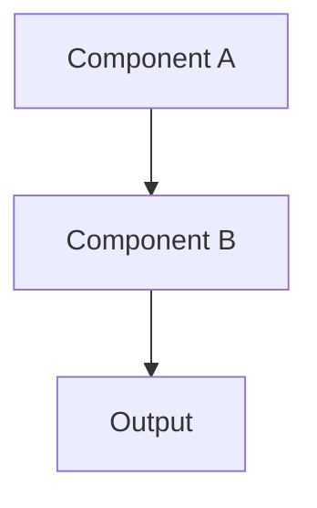

# {PROJECT_NAME}

**Status:** 🧪 Experimental | 🚧 In Progress | ✅ Stable | 📦 Graduated

**Tech Stack:** {LANGUAGE/FRAMEWORK}

**Started:** {DATE}

## Overview

Brief description of what this project does and why you created it.

## Architecture



## Environment Setup

This project uses the following environment configuration:

- **Language/Runtime:** {e.g., Node.js, Python, Deno, Rust}
- **Version:** {e.g., 20.x, 3.12, 1.40}
- **Environment File:** {e.g., .nvmrc, .python-version, rust-toolchain.toml}

### Quick Start

```bash
# Setup environment (auto-detected from environment files)
# For Node.js: nvm use (reads .nvmrc)
# For Python: uv venv (reads .python-version)
# For Deno: deno run (auto-detects version)

# Install dependencies
{INSTALL_COMMAND}

# Run
{RUN_COMMAND}
```

## Dependencies

{DEPENDENCY_FILE} - See project dependencies

## Learning Log

### What I Learned

-

### Challenges

-

### Next Steps

-

## Graduation Criteria

Before moving to its own repository:
- [ ] Core functionality working
- [ ] Tests written and passing
- [ ] Documentation complete
- [ ] Ready for production/sharing

## References

- [Link to docs/tutorials used]
